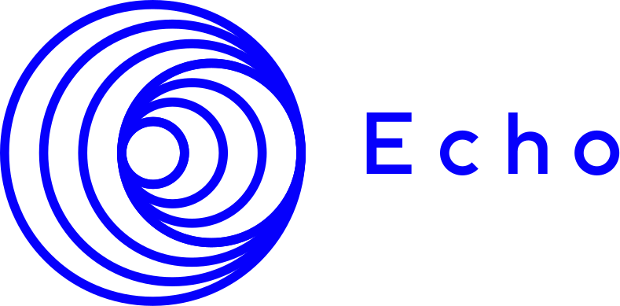

# Introduction

Welcome to the Echo Docs!

Please note that the current version of the documentation is not final and will change soon.

## What is Echo?

Echo is a generalized smart contract protocol that enables efficient
decentralized computing. It provides the infrastructure and developer
tooling necessary to build and deploy scalable, high-performing
decentralized applications.

Echo includes several main modules on which work is built:

### PoWR Consensus 

Fast, final and scalable BFT consensus using proof of weighted
randomness (PoWR) also known as EchoRand. EchoRand uses a verifiable
random function (VRF) to randomly select a pool of block producers and
block verifiers based on their stake to validate each new set of
transactions.

### x64 Virtual Machie & EVM 

Integrated virtual machines allow you to use smart contracts on the Echo
network. Contracts can be written both in Solidity and in more familiar
and convenient languages, such as C, C++, Rust, Go and other.

### Bitcoin and Ethereum Sidechains

The sidechain mechanism integrated into the protocol allows you to use
Ethereum and Bitcoin within the Echo network and even realize the
connection between these two currencies.

## What is available right now?

The project is currently under active development and testing.

Therefore, at this moment in time, not all the functionality is
available on the testnet. In turn, you can now do the following:

- register an account and get assets for it
- be a consensus participant
- transfer Assets
- create and issue new Assets and use it
- create and call contracts written in Solidity using EVM
- create and call contracts written in С++ using x64 VM
- create and use account addresses
- launch your node and use its API to communicate with the blockchain

## How to start?

To get acquainted with how to start using Echo, you can visit the `How
to` section and find the corresponding resource depending on which
particular blockchain usage interests you.

## Technology Details

You can read more about how the Echo works and how it works from the
inside. You can follow the links below:

- PoWR EchoRand
  - [In a nutshell](technologies/echorand/in-a-nutshell) - a brief description of the principles of consensus
  - [Overview](technologies/echorand/overview) - detailed description of the mechanism with all the subtleties and nuances
  - [Architecture](technologies/echorand/architecture) - low-level detailed description of exactly how the idea was implemented in the code
    
## How to use?

You can start using Echo right now. It all depends on how you are going
to use it. For starters, you can use wallets to create an account and
manage assets on it. The following wallets are currently available:

- Echo Desktop Wallet
- Blip
- Echo Bridge Extension

Keep track of the blocks and transactions you can on the block explorer:

- Echo Explorer - [https://explorer.echo.org](https://explorer.echo.org)

To interact with the blockchain at the code level, you have the
following libraries and SDKs at your disposal: 

- [echojs-lib](https://github.com/echoprotocol/echojs-lib) - A javascript Echo library for node.js and browsers
- [echopy-lib](https://github.com/echoprotocol/echopy-lib) - Python Library for Echo Blockchain 
- [echo-unity-lib](https://github.com/echoprotocol/echo-unity-lib) - Unity library for Echo 
- [echo-ios-framework](https://github.com/echoprotocol/echo-ios-framework) - Pure Swift Echo framework for iOS
- [echo-android-framework](https://github.com/echoprotocol/echo-android-framework) - Pure Kotlin Echo framework for Android
