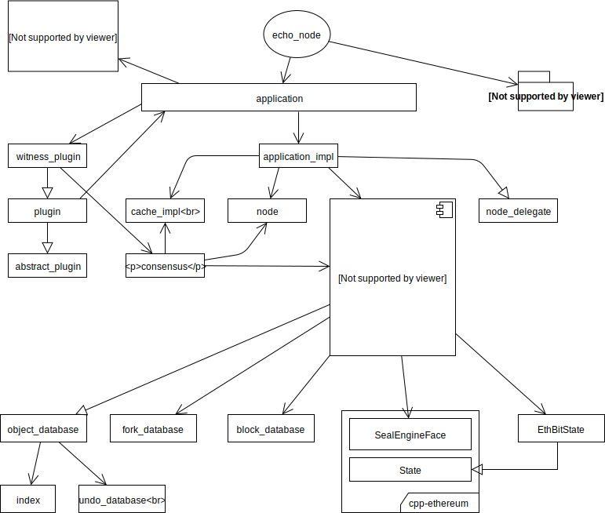

Доступный для редактирования [документ](https://drive.google.com/file/d/1XQjrcPBdh1Lor3TuYHYkHEngEY88JQkM/view)

На диаграмме названия представленны в виде классов, поэтому все можно посмотреть через `doxygen` по ссылке: https://dev-doc.myecho.app/classes.html

Исполняемый файл `echo_node` описывается файлом `programs/echo_node/main.cpp`, в котором инициализируются необходимые плагины и передаются в `application`.

Модуль `fc` представляет из себя быстро компилируемую библиотеку c++, предоставляющую набор утилит, полезных для разработки асинхронных библиотек, располагается в `libraries/fc`

Класс `application` предоставляет интерфейс для обработки конфигурационных файлов, аргументов командной строки, подключает плагины. Содержит private implementation поле класса `application_impl`, который наследуется от `node_delegate`. Класс `node_delegate` необходим для обработки сообщений, принимаемых `node`, так же содержит методы, с помощью которых клиент может получать данные. `node` обеспечивает независимую от приложения p2p-связь между узлами в сети: распространение сообщений, синхронизацию данных.

`database` - god-класс, предоставляющий всевозможные методы для работы с блокчейном. Так же находится в отношениях ассоциации с `EthBitState` и `SealEngineFace`, с помощью которых обеспечивается связь с модулем `cpp-ethereum`, из которого используется EVM.

`database` реализуется в файлах:
1. `db_init.cpp` - отвечает за инициализацию базы данных
2. `db_management.cpp` - размещает в себе методы открытия, закрытия базы данных, реинициализации
3. `db_block.cpp` - реализует функционал для принятия и валидации блоков, обработки транзакций и операций внутри них
4. `db_witness_scedule.cpp` - предоставляет методы для получения сетов проверяющих, времени блока и блока по времени
5. `db_maint.cpp` - файл в котором расположены методы, которые необходимы для обслуживания сети
6. `db_balance.cpp` - содержит в себе методы для работы с балансами
7. `db_market.cpp` - реализует методы-помощники для работы с внутренней биржей, кототрые вызываются при выполнении операций: создание заказа, размещение ставки и прочих.

Класс `fork_database` необходим для решения проблем при разветвлении цепочки блоков.

Класс `block_database` - хранит всю цепочку блоков на диске, а последние 1024 блоков кэширует в оперативной памяти, для оптимизации. Если необходимо получить блоки, которые были удалены из кэша в оперативной памяти, то они считываются с диска.

Класс `object_database`, от которого наследуется `database`, необходим для обслуживания набора индексируемых объектов:
* хранение данных в памяти
* сохранение на диск
* загрузка с диска

Класс `cache_impl`:
* хранит сообщения EchoRand (блоки и голоса)
* реализует методы для поиска лучшего блока, получения голосов

Внутри `witness_plugin` работает `consensus`, так же плагин содержит и предоставляет инструменты необходимые для его работы. В виде поля содержит в себе `consensus`, реализующий этап `gc` из `echorand`.