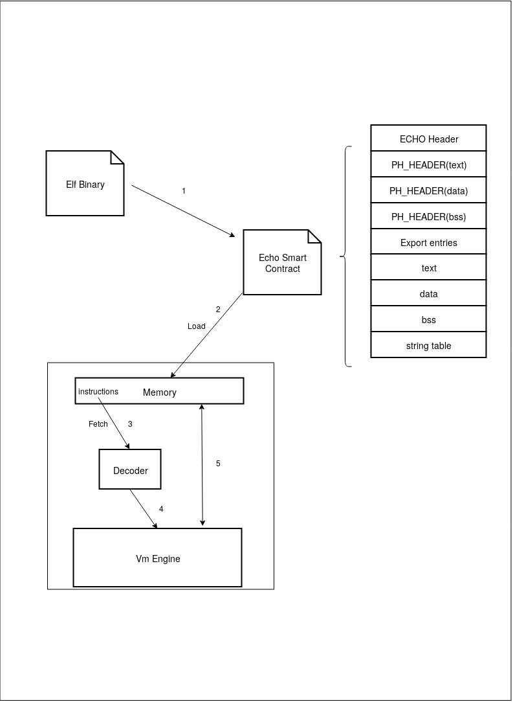

### Архитектура проекта ECHO-VM



Рис 1: Архитектура проекта ECHO-VM.<br>

### Структура проекта ECHO-VM

Folder: x86/include/vm  
   
Файл : **CpuState.h**   
   
Класс ```CpuState``` предоставляет доступ к основным регистрам вирутальной машины x86. Сокращение gpr - General Purpose Registers.   
Регистры, которые относятся в выше приведенное аббревиатуре:
- EAX   
- ECX   
- EDX   
- EBX   
- ESP   
- EBP   
- ESI   
- EDI

Специальные регистры, которые содержатся в x86:
- ESP : stack pointer   
Указатель на низ стека   

- EBP : base  pointer   
Хранит некторое значение адреса стека, относительно которого ведется адресация в стеке
- EIP : instruction pointer   
В данный момент он назван PC (program counter), но суть его та же -- указывать на следующую инструкцию, которая должна быть выполнена. Должен будет переименоваться в EIP
- CIR : current instruction register   
Регистр содержит в себе текущий байт инструкции, которая декодируется

Переменная ```default_reg_size``` используется для обработки префикса 0x66, который меняет размер текущей исполняемой команды с 32 бит на 16 бит. Если значение ```false```, то берется значение из 16 битных регистров. Структура, отображающая структуру самого регистра:   
<pre>
       union Register
       {
           struct
           {
               uint8_t  r8l;
               uint8_t  r8h;
           } r8;
     
           uint16_t r16;
           uint32_t r32;
       };
</pre>
<pre>
       r8l -- младшая часть 16 битного регистра
       r8h -- старшая часть 16 битного регистра
</pre>

Также содержит указатель на класс Memory (public временно), для доступа к данным хранящимся в памяти.

Файл : **Decoder.h**<br/>

Класс ```Decoder``` предназначен для декодирования байткода, предоставляемого компилятором. (основа понимания этого класса -- дебаг)   
   
Значения следующих атрибутов определяют то, какой режим адресации используется в x86 :    
-  REGULAR____ARG   
    
-  DIRECT_ADDRESS   
Эта константа используется при таком типе адресации: _add [0x1000], eax_ ; используется непосредственное значение адреса в памяти.   

-  DIRECT___INDEX    
Пример адресации :_add[4*ebx], ebx_ ; используется непосредственный индекс 4.    
    
-  IMM___UNSIGNED   
Константа означает, что в качестве одного из операндов находится непосредственное значение.   
Пример адресации : _add eax, 0x3_ ; здесь 0x3 является imm    

-  IMM_____SIGNED    
Константа означает, что в качестве одного из операндов находится непосредственное знаковое значение.   

-  WITH___ADDRESS   
Пример адресации : _add word[ebp + ecx*4 + 15], bx_ ;   

-  WITH_____INDEX   
Пример адресации : _add dword[ebx + ecx], ebx_ ;   

-  WITH____OFFSET    
Пример адресации : _add dword[eax + 0xf], eax_ ;   

Для того, чтобы извлечь значения тех регистров, индексов умножения, и константных смещений, нужно произвести разбор упaкованной константы следующий образом (на примере инструкции формата _add word[ebp + ecx*4 + 15]_):   
В результате декодирования у нас в классе ```CpuInstruction``` в поле ```first__arg``` лежит значение 0x0602101e, которое означает следующее:   
- 06 - WITH__ADDRESS (сам формат инструкции);
- 02 - то число, которое умножает регистр (см ниже таблицу с индексами для умножения);
- 10 - умножаемый регистр, то есть ecx;
- 1e - регистр ebp (значение из безымянного enum в Decode.h);
<pre>
       class CpuInstruction
       {
       public:
           inline  CpuInstruction(const uint32_t CMD, const uint32_t ARG_1, const uint32_t ARG_2, const uint32_t VALUE, const uint16_t CMD_ATTR);
           inline ~CpuInstruction(      void                                                                          );
       
                   uint32_t command   ;
                   uint32_t first__arg;
                   uint32_t second_arg;
           mutable uint32_t third__arg;
                   uint16_t cmd_attr;
       
                   ImmediateValue first__val;
                   ImmediateValue second_val;
       };
</pre>

| Индекс  | Коэффициент умножения  |
|---------|------------------------|
|    0    |           1            |
|    1    |           2            |
|    2    |           4            |
|    3    |           8            |

Также смотри http://www.c-jump.com/CIS77/CPU/x86/lecture.html (секция -- SIB (Scaled Index Byte) Layout ))   
   
Битовая маска атрибутов декодера имеет следующий вид (переменные REG1_BIT; REG2_BIT; MEM1_BIT ...)

<pre>
     | r1 | r2 | m1 | m2 | imm | addr1 | addr2 | s1_8 | s1_16 | s1_32 | s2_8 | s2_16 | s2_32 | scale | disp | sc_reg |
</pre>

- r1     : левый операнд операции -- регистр   
- r2     : правый операнд операции -- регистр   
- m1     : левый операнд операции -- память   
- m2     : правый операнд операции -- память   
- imm    : используется непосредственное значение в качестве одного из операндов   
- addr1  : поле не используется   
- addr2  : поле не используется   
- s1_8   : размер левого операнда 8b   
- s1_16  : размер левого операнда 16b   
- s1_32  : размер левого операнда 32b   
- s2_8   : размер правого операнда 8b   
- s2_16  : размер правого операнда 16b   
- s2_32  : размер правого операнда 32b   
- scale  : используется такой режим адресации, при котором значение регистра может умножаться на одно из значний (0,1,2,4) (пример (ebx+eax*0/1/2/4+disp))   
- disp   : используется такой режим адресации, при котором к регистру добавляется какое-то смещение [ebx + disp]   
- sc_reg : используется такой режим адресации, [eax*2 + 0], где eax -- scaled register (видимо этот бит немного избыточен, потому что scale применяется только к регистрам)   
   
Пример комбинации такого режима адресации: ***mov eax,[eax + 4] == r1 + (m2+r2+disp)***, также смотри тесты для декодера, там показаны все комбинации.   
    
Класс ```CpuInstruction``` содержит в себе следующее:
- саму исполняемую команду в виде безымянного enum'a
- первый операнд команды (```first__arg```)
- второй операнд -- (```second_arg```)
- если в команде есть третий аргумент, то он представлен (```third__arg```)
- маска атрибутов (```cmd_attr```)
- первое непосредственное значения команды
- второе непосредственное значения команды

 При этом, если в команде используется непосредственное значение в качестве правого операнда, то значение в second_arg будет равно ```IMM___UNSIGNED```, а в second_val уже будет находиться само непосредственное значение. Если в левом операнде у нас, к примеру, лежит (_add word[ebp + ecx*4 + 15], bx_) такой тип адресации, то в ```first__arg``` будет находиться разобранное выше выражение 0x0602101e, тип которого ```WITH___ADDRESS```.   
   
Класс ```ImmediateValue``` предназначен для аккумулирования непосредственного значения операнда из байтов инструкции.   
   
Структура ```RootDecodeEntry``` содержит в себе два типа обработчика команд (```root_dispatcher```, ```main_dispatcher```). ```root_dispatcher``` может быть следующим в зависимости от выполняемой команды:
1. ```Fixed_Command```, -- инструкция, в которой в качестве операндов может использоваться как регистр--регистр, так и регистр--память и память--регистр. (root_dispatcher == Fixed_Command).
2. ```TinyInstruction```, -- самая простая инструкция, содержится в своей таблице инструкций (```OPCODE_TABLE_L0```), имеется только один обработчик (root_dispatcher == TinyInstruction).
3. ```SnapInstruction```, -- отличается от Tinyinstruction тем, что операндом является непосредственное значение, вся обработка происходит в обработчике SnapInstruction, а вторым обратчиком будет ```ArgNAccumulator```, предназначенный для аккумулирования байт в непосредственное значение (root_dispatcher == SnapInstruction, тогда main_dispatcher == ArgNAccumulator).
4. ```Mixed_Command``` -- самая сложная для обработки инструкция, сложна тем, что на один опкод замаплена группа команд (http://www.sandpile.org/x86/opc_1.htm, смотреть ячейки с пометкой group, формат инструкций x86 смотреть здесь http://www.c-jump.com/CIS77/CPU/x86/lecture.html, сами команды и их описание смотреть здесь https://c9x.me/x86/, также мануал intel).   
   
Для двубайтовых инструкций используется таблица ```DECODE_TABLE_L3```, на данный момент есть поддержка опкодов B6, B7. Условные двухбайтовые команды также поддерживаются, но в эту таблицу не занесены, а используются те, которые есть в ```DECODE_TABLE``` (см. метод CondDispatcher и первое условие, в котором условные двухбайтовые опкоды мапятся на ```DECODE_TABLE```).     
Основой декодирования команд является исследование битов первого и второго байтов инструкции. (http://www.c-jump.com/CIS77/CPU/x86/lecture.html)   
   
Файлы : **Memory.h**, **heap_memory.h**, **stack_memory.h**   
   
Класс ```Memory```, представляет собой структуру виртуальной памяти. Загрузка кода, данных и неинициализированных данных осуществляется соответственно в вектора байт с назнаваниями text, code, bss. Стек и куча представлены соответственно классами ```Stack_mem```, ```Heap_mem```.   
Основная идея того, каким образом выделяются адреса для стека и кучи: адреса для кода, данных и неинициализированных данных определяются линковщиком, далее у нас остаются промежутки свободных адресов на линейном адресном пространстве размером 4гб. Выглядит это следующим образом:
 
          0                                                                                                                    2^32-1
          |_____________|  text  |______|  data  |______|  bss  |________________________________________________________________|

На данный момент стек смарт контракта ограничен размером в 180мб, куча в 220мб (см. класс Memory). Соответственно, в оставшихся свободных промежутках адресов, находятся непрерывные адреса, которые могут быть заняты стеком и кучей, при этом стек будет находиться у старших адресов (то есть скорее всего начало стека попадает на последний адрес, при этом его рост направлен в вниз (влево), и после этого будет искаться место куда встанет куча).  
Выглядит следующим образом:

          0                                                                                                                    2^32-1
          |_____________|  text  |______|  data  |______|  bss  |_____|          heap --->            ||      <---   stack       |

При этом возможна ситуация, когда стек и куча не расположены рядом.   
Метод, в котором происходит поиск свободных блоков памяти --  ```Memory::find_free_blocks()```. Его принцип заключается в следующем: на основании структуры ```std::vector<std::pair<uint32_t, uint32_t>> addrs_sizes``` класса ```Memory```, в ```addrs_sizes``` содержатся содержатся адреса и размеры секций известных после компиляции и линковки (text,data,bss). Далее эти данные сортируются в порядке возрастания адресов для того, чтобы корректно найти все оставшиеся свободные адреса в диапазоне [0, 2^32 -1]. Сам поиск происходит предельно просто: первой итераций в структуру ```std::vector<std::pair<uint32_t, uint32_t>> free_mem_blocks; //<address, size>``` класса ```Memory``` заносится первый адрес, то есть 0x00000000 в качестве address, и первый адрес из отсортированных ```addrs_sizes``` в качестве size, что будет соответствовать первому свободному блоку -- [free_block][1_section].
Второй итерацией находится следующий свободный блок между первой и второй секциями -- [free_block][1_section][free_block][2_section]. Третья итерация -- [free_block][1_section][free_block][2_section][fre_block]. Четвертая итерация -- [free_block][1_section][free_block][2_section][fre_block][3_section][free_block]. Если вторым параметром в паре free_mem_blocks является 0, то это нормально (это означает, что размер этого свободного блока 0).   
Это первая реализация, тут желательно быть внимательным к тому моменту, когда не все секции в бинарном  файле и возможно неправильное определение свободных блоков, когда одна из секций отсутствует. При этом, если одна из секций отсутствует (data либо bss либо обе сразу), размер addrs_sizes все равно должен быть равен 3, недостающие секции заполнены парами <0,0>. Метод ```set_stack_addr``` старается найти такой свободный блок, который подходит для размера в 180мб и адрес которого будет наибольший, поиск адреса стека производится перед поиском адреса кучи. Поиск адреса для кучи соответствует тем же требованиям. Пометка TODO в ```set_heap_addr``` означает то, что возможна такая ситуация, когда останется подходящий свободный блок, начинающийся с адреса 0x00000000. Нулевая страница должна быть свободной, поэтому в алгоритме без проверки(имеется в виду TODO) присваивается ```first_avail_page``` со значением 0x2000. Опять же это первые реализации и здесь на начальных этапах нужно быть внимательным к тому, как будут выделены эти адреса. Отличие в назначении начальных адресов стека и кучи, является то, что для стека из свободного блока идет присвоение в качестве начального адреса стека последнего адреса из найденного свободного блока (стек растет вниз), в то время как для кучи такое ограничение не накладывается, поэтому там присваивается первый начальный адрес из найденного свободного блока.   
Метод ```uint8_t* Memory::get_address_from_section(uint32_t v_addr)``` возвращает адрес той ячейки вектора, в котором хранится искомое значение, либо куда надо будет занести какое-либо значение. При этом в качестве аргумента функции, принимается адрес самой виртуальной x86, а возвращается уже виртуальный адрес страницы компьютера.

Файл : **stack_memory.h** <br/>
Основной идеей того, как выделяется память под стек, является анализ изменения значения регистра Esp (stack_pointer), сама память стека хранится в структуре page_list:<br/>
<pre>
struct Stack_page
{
    std::unique_ptr<std::vector<uint8_t>> page;
    uint32_t addr;
    uint32_t size;
};
std::vector<Stack_page> page_list;
</pre>

После того, как esp смещается в сторону увеличения размера стека, в ```page_list``` будет добавлен очередной указатель на вектор, в котором должны будут храниться данные. Если esp смещается в сторону уменьшения размера, то некоторые страницы на основании того, насколько умельшился этот размер, будут удалены из вектора ```page_list```. Само добавление, либо удаление производится в методе ```uint8_t* Stack_mem::get_stack_addr(uint32_t v_addr, uint32_t esp, uint32_t& mem_cur_addr)```. Иными словами, если какая-то команда обращается к новуму адресу в памяти, которого нет в ```page_list``` и который входит в диапазон, выделенный указателем стека, то будет создана новая "страница" стека. Если же, какая-то команда обращается по адресу и указатель стека уменьшил используемый размер, то в таком случае ненужные более страницы будут удалены, и методом вернется виртуальным адрес страницы, в котором располагается сам вектор. Для отслеживания текущего указателя стека в классе Memory, по ссылке передается поле этого класса ```stack_cur_addr```.    

Файл : **heap_memory.h** <br/>

Основная идея того, как производится работа по выделению памяти на куче: сначала выделяются запрашиваемые страницы одна за другой до тех пор, пока для выделения не будет превышен лимит 220мб, который задан в классе ```Memory```. Во время выделения, либо удаления страниц собирается статистика этих самых страниц. При удалении, либо разбиение страниц на несколько других, свободные страницы склеиваются. То есть, до тех пор, пока нужные страницы могут быть выделены из 220мб, работает первое условие в методе ```allocate_new_page```, далее будет отрабатывать второе условие. Метод возвращает виртульный адрес машины x86, в последствии этот адрес будет заноситься в регистр eax. Заметка: когда будут написаны api для векторов и строк, память в куче для этих структур данных должна быть продолжительная, также метод ```find_free_page``` помечен как optimize вследствие того, что когда алгоритм выполняет второе условие, он будет перебирать все страницы и при большом кол-ве страниц это будет занимать некоторое время. Опять же это все первые реализации, поэтому в дальнейшем потребуется на это больше тестов и дополнение логики. 

Файл **VmBackend.h**<br>

В файле содержатся номера опкодов (OP_ADD, OP_XOR, PR_DEC, ...), которые являются индексами обработчиков в таблицах (PTABLE08, PTABLE16, OTABLE32, ...), из названия видно, что таблица PTABLE08 содержит обработчики 8 битных команд, PTABLE16 - 16 битных, OTABLE32 - 32 битных. Команды ExecuteN (где N, 08, 16, 32) используются для операций с регистровыми операндами, либо регистр и непосредственное значение. Команды Execute с сокращением M_RI означает то, что левый операнд находится в памяти, правый -- может быть как значением регистра, так и непосредственным значением (immediate value). Команды Execute с сокращением R_M означают, что левый операнд -- регистр, правый -- память. Методы GetAF, GetCF и т.д возвращают значения флагов из регистра флагов (смотреть x86 EFLAGS). 

Файл **Executor.h**

Класс ```Executor``` содержит в себе все вышеперечисленные классы. На момент написания, класс инициализировал класс ```Memory``` содержимым класса ```esc_object``` (в esc_object находится данные, которые были получены из смарт контракта), инициализировал начальное состояние класса ```CpuState```, далее путем декодирования байтов из секции кода и получая инструкцию, выполнял ее в методе exec_cmd. На изображении 1 по сути представлен весь этот цикл.
Для инициализации класса памяти вм требуются:
- точка входа программы (адрес метода apply)
- адреса секций и их размеры (text, data, bss)
- данные этих секций (байты)

В методе ```execute``` происходит инициализация классов ```Memory```,```CpuState```. Далее выполняется цикл из методов ```fetch_decode```,```exec_cmd```. Первый метод извлекает из памяти байты, декодирует их, далее декодированная команда исполняется во втором методе на основании атрибута команды. Выполнение продолжается до тех пор, пока не встретиться системный вызов с номером 1.