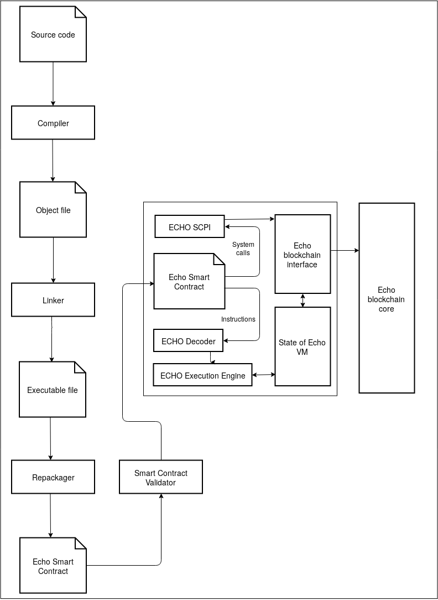

 <h1> ECHO-VM </h1> 

### Abstract

This paper provides a brief introduction into design and ideas behind ECHO VM system. 
It contains the description of an approach taken that allows to implement an efficient virtual machine accompanied by well-developed and well-supported ecosystem with minimal effort investment in development and support.

### 1 Introduction

The first generation of blockchains was focused and, in a nutshell, based solely on one component – protocols of consensus. 
Initially Bitcoin, the first blockchain, appeared as a result of invention of Proof-of-Work consensus protocol, the first to solve “double spending” problem [Nak08]. 
Six years later a second generation of blockchains has appeared with introduction of Ethereum [Vit13], which added the second major component – virtual machine – to blockchain. Ethereum is built around a decentralized Turing-complete virtual machine called Ethereum Virtual Machine (EVM) [WOO14]. 

Introduction of EVM to blockchain led to the concept of Smart Contracts and Decentralized Autonomous Organization (DAO). This brought blockchain to a whole new level of a full-featured digital economics platform.
Currently most of the design and development in the domain of blockchains focus on improvements to these two major components of the system – consensus protocol and virtual machine. 
This paper sheds light on the novel virtual machine design, that allows to solve a number of currently existing problems.

### 2 Motivation

Virtual machine design, described in this paper, aims to solve three conceptual issues with currently existing solutions: 
* Lack of efficiency
* Lack of well-developed and well-supported ecosystem for Smart Contract development
* Massive effort, required to design, develop and support a new Smart Contract enforcement en- vironment 

Efficiency of a virtual machine in a blockchain environment directly affects the amount of computation power, and, by extension, resources spent globally by the entire network. The same Smart Contract has to be executed multiple times within the same blockchain network - as each node executes it to verify the results of a transaction claimed in the new proposed block. Thus, amount of computational resources involved in single Smart Contract execution equals T ∗ N, where T is an amount of computational resources required for Smart Contract execution on a single node and N is the number of nodes in the network. Considering that N can equal tens of thousands in the popular networks, even insignificant reduction of T through improvement of virtual machine efficiency will be magnified by N and save significant amounts of computational power across the entire network. 

Furthermore, virtual machine efficiency directly affects network throughput. All Smart Contracts, called or deployed within a block, are executed to evaluate changes that need to be applied to account balances whenever a new block is proposed. Thus, the time taken by Smart Contract execution directly affects the time required to generate a new block. Considering the fact that block generation is globally serialized, the time required to generate a new block defines the entire network’s throughput. Therefore, virtual machine efficiency improvement directly leads to improvement of the whole network’s throughput. 

Another problem with EVM is consequential to it being created from scratch. EVM has its own original virtual computer architecture with its own original bytecode. Furthermore, EVM relies on its own dedicated Smart Contract-oriented programming language called Solidity. The drawback of this approach is EVM’s lack of a well-developed and well-supported ecosystem, including such tools as compilers, linkers, libraries, code analyzers and verifiers, integrated developed environments etc. All these tools should be created from scratch and then supported. 

Finally, a common approach taken by other appearing blockchain projects to mitigate the problem of efficiency is to propose their own virtual machines, programming languages and compilers. While this approach allows to improve Smart Contract execution efficiency, design and implementation of the minimal required set of tools call for investment of huge amounts of effort. This gives rise to skepticism about feasibility of the promises made by most project teams. Compilers and linkers are examples of extremely complex software, therefore design and development of high-quality optimizing bug-free compilers is a challenging task. Furthermore, support and development of these tools (built from the ground up) will require further investments of significant effort.
The approach and design of ECHO VM aim to resolve all of the above described challenges. It is based on an original idea of reusing the existing ecosystems.

### 3 Background

The concept of a virtual machine is a well-known solution that appeared in the 1960s. Since then it has proved itself as the right solution to a number of problems. Virtual machines are most widely used by programming language designers and developers. A number of programming languages use virtual machines as a means of giving executable binaries, produced by compilers, x-plat capability (Java and C# being the most notable examples). Another common application of virtual machines is its inclusion in interpreted programming languages like Lua or Python. Such languages use virtual machines as a means of program execution performance improvement. Interpretation of the program compiled into low-level bytecode can be much more efficient than direct interpretation of the same program in the form of text written using high-level programming language. Finally, virtual machines found their application in the domain of emulation. In this case, virtualization is used to execute programs, developed for one hardware platform, on other hardware platforms, and for the purpose of deep dynamic analysis of the program under execution. 

ECHO VM proposes a novel idea of reverse virtualization system consisting of two major components: virtual machine and repackager of binaries of your local system. This technology is referred to as reverse virtualization because, in contrast to common virtualization approach, where the target hardware platform is virtualized to run applications developed for that platform in the host environment with another architecture, our approach virtualizes target platform for developers, allowing them to reuse software development ecosystems of target platforms for creation of applications, which will be executed on a completely different host. In contrast to hardware emulation systems, the virtual machine and its bytecode, in case of a reverse vitrualization system, are designed with a focus on efficient interpretation, while emulation systems are focused on precious reproduction of behavior of the emulated hardware. At the same time, in contrast to the programming language virtual machines, reverse virtualization does not require dedicated software development toolchains (compilers, linkers, libraries) and reuses existing software development ecosystems created for actual hardware platforms.
In summary, reverse virtualization system provides the following set of benefits:
* Ability to execute application code on different hardware platforms.
* High application code interpretation perfor- mance.
* High level of security through total isolation of the application code in the sandbox of virtual machine.
* Reuse of the existing software development ecosystems.

### 4 ECHO VM

There are existing, well-developed and well-supported software development ecosystems. The best of them is IA-32 architecture ecosystem – the most widespread, tried and true processor for desktop computers. This ecosystem provides a wide array of various tools: programming languages, compilers, linkers, code analyzers and verifiers, integrated developed environments, disassemblers, libraries, etc. There is a wide variety of tools, many of them well-developed and well-supported, and which will be supported in future by already existing communities forced by demands of the big market of desktop computer systems. If the bytecode of a blockchain virtual machine fully reproduces IA-32 architecture than that VM will have IA-32 ecosystem automatically inherited. But the problem with this approach is that IA-32 is a CISC ISA designed for hardware and it has a huge burden of legacy stuff required solely for reverse compatibility with outdated software systems. For example, real mode, segmentation addressing model and some instructions are completely rejected in modern software systems, but are still supported by IA-32-compatible CPUs. However, the idea to create an original ecosystem, dedicated solely to ECHO VM, has been rejected. New programming languages, compilers and linkers are not proposed within ECHO VM. Instead ECHO VM inherits IA-32 ecosystem though special bridge introduced as a part of ECHO VM reverse virtualization system. This bridge is a special tool, which performs checking of IA-32-executable binaries and repackaging into ECHO VM Smart Contract files. Additionally, internal ECHO VM removes all burden of legacy stuff from IA-32, leaving just the functionality actually used by modern software. 

Figure 1: Architecture of ECHO VM system and Smart Contract workflow. 

Figure 1 depicts the architecture of ECHO VM system and Smart Contract workflow. As can be seen on Figure 1, ECHO VM system consists of just three separate components: virtual machine, repackager, echo smart contract validator. Virtual machine is located on the blockchain node while repackager and validator is located on the side of a Smart Contract developer. VM and Smart Contract are linked by bytecode and specification of Smart Contract’s format.
ECHO repackager not only creates a bridge between two separate computer architectures, but also performs  early error detection by checking links of original binary with user operating system and links with shared libraries. Before Smart contract became loaded into blockchain there are another checks executed by validator: unsupported, prohibited instructions or set of POSIX system calls of input code. For example, system instructions are eligible in IA-32 code, but their will ultimately lead to general security failure during execution of respective smart contract.

ECHO VM not just emulates virtual processor, but reproduces a complete environment similar to the environment in which user mode process is executed in a typical operating system like Linux. ECHO VM emulates its own operating system ECHO OS, which actually plays a role of Smart Contract Programming Interface (SCPI). Traditional set of POSIX system calls is not supported to completely isolate Smart Contract code from the host system and therefore protect host system from potentially malicious third-party code embedded into a Smart Contract. Interpretation allows the VM to fully control each step of Smart Contract execution and thus assure isolation of smart contract sandbox from the host operating system. The next features of IA-32 architecture are supported:

* Only protected mode is supported
* Only protection ring 3 is supported
* Segmentation memory model was rejected and eliminated. Flat memory model is used as the only one available.
* All available x86 addressing modes are available in ECHO VM.
* A bunch of legacy and rarely used instructions was removed. Some of them are completely unsupported, some of them are ignored as valueless in ECHO VM environment and some of them are emulated through series of ECHO VM opcodes.
* Multiprocessor support is removed.

### 5 Conclusion

We have introduced and briefly described the approach taken in design of ECHO Virtual Machine. The main problems of the currently existing EVMs were outlined. It was demonstrated how ECHO VM solves all these problems and what advantages it has compared competitive VM projects. Solid experience and deep knowledge in such spheres as operating systems, IA-32 architecture, compilers and virtual machines allows ECHO project team to create high-quality virtual machine for ECHO VM platform in reasonable time. The team has already designed and implemented world-fastest software decoder for IA-32, which outperforms Intel XED [Int17] by a factor of 3-4 in pure decoding and and more than ten-fold in disassembling scenario.