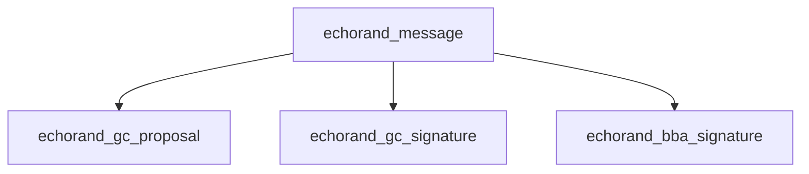
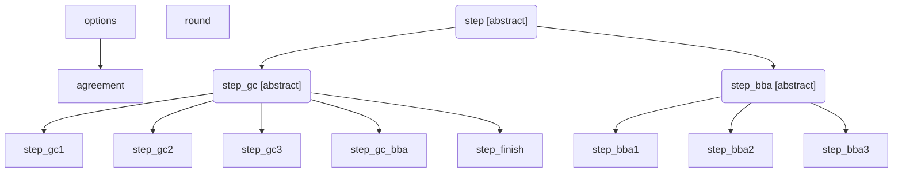
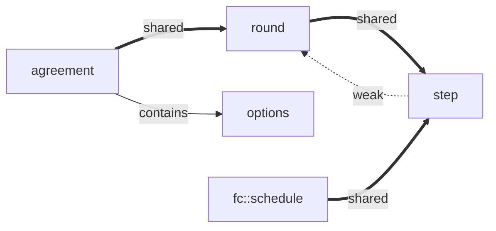

# Архитектура EchoRand

В документе описано предложение по архитектуре для алгоритма echorand проекта **Echo**. Презентация проекта: ([ECHO: A Next Generation Blockhain Platform For Smart Economics][echo-wp]).

## Общее описание

|Класс|Роль|
|---|---|
|Шаг (step)|реализация шага алгоритма|
|Раунд (round)|менеджер шагов в пределах раунда алгоритма|
|Алгоритм (agreement)|менеджер раундов и внешний интерфейс алгоритма|
|Параметры алгоритма (options)|начальные параметры алгоритма|
|Классы сетевых сообщений|передача сообщений между узлами сети|

### Алгоритм

Класс `agreement` представляет собой основной класс реализации алгоритма - интерфейс для использования извне.

Класс реализует следующую функциональность:
* хранение параметров конфигурации, таких как:
  * параметры для работы алгоритма (максимальное количество шагов, таймауты и так далее);
  * стартовое значение **Q(r-1)** (случайная величина из последнего блока);
  * стартовое значение **HB(r-1)** ([SHA-256][] хеш последнего блока);
  * интерфейс доступа к публичным ключам исполнителей для проверки подписи;
  * интерфейс проверки блока на корректность;
  * приватные ключи исполнителей на данном узле.
* изменения параметров конфигурации;
* запуск остановка работы алгоритма вцелом.

В рамках работы алгоритма:
* запуск раундов;
* хранение ссылок на раунды;
* остановка раунда и внесение нового блока в базу данных [blockchain][];
* первичный прием сообщений из сети и их передача в соответствующие раунды;
* предоставление раундам ссылок на конкретные интерфейсы, через реализацию адаптера.

### Раунд

Все шаги алгоритма выполняются в контексте определенного раунда.

Каждый раунд имеет свой номер.

Функциональность:
* владеет всеми своими шагами и разделяемыми данными. Шаги алгоритма генерируют разделяемые данные,
сохраняют и обмениваются ими при необходимости через раунд;
* получает сетевые сообщения от `agreement` и передает их в соответствующий шаг алгоритма;
* пересылает сетевые сообщения другим узлам сети в соответствии с алгоритмом, описанным в
[техническом описании](echorand/tech);
* запускает шаги алгоритма;
* ждет уведомления об остановке шага и принимает решение о запуске следуюшего шага или о конце раунда;
* уведомляет `agreement` о своей остановке.

Раунд можно завершить только из шагов `bba`.

Результатом завершенного раунда является подпись нового блока и, опционально, сам блок.

Если раунд завершен без блока, то начинается новый раунд, а текущий раунд ожидает прихода
блока запуская специальный шаг `step_finish`. Решение об этом принимает `agreement`, анализируя
результаты работы раунда, который послал уведомление об остановке.

Следует отметить, что теоретически может случиться ситуация, когда в `step_finish` находятся несколько
раундов и, соответственно, несколько блоков. И по сети может поступить блок **n**, когда блок **n-1**
еще находится в `step_finish` - фрагментация хвоста [blockchain][]. Такую ситуацию следует предусмотреть
в классе `agreement`. К примеру, ввести переменную состояния раунда, которая принимает следующие значения:
* выполняется;
* ожидает блок;
* ожидает внесение в [blockchain][].

### Шаги

Каждый шаг алгоритма должен выполняться асинхронно, реагируя одновременно и на события таймера
и на события от сети, такие как приход сетевых сообщений.

Каждый шаг алгоритма имеет свой номер.

Все шаги алгоритма подразделяются на группы `gc`, `gc-bba` и `bba`, каждая из которых имеет
принципиально разное поведение.

Шаги группы `gc` стартуют все вместе при старте раунда и работают одновременно.

Единственный шаг группы `gc-bba` стартует после окончания последнего шага группы `gc`.

>Тут имеется в виду последний шаг по номеру, а не последний закончившийся шаг.
>
>Однако, таймауты на работу шагов выбираются таким образом, чтобы последний закончившийся шаг группы
`gc` и был последним шагом по номеру.

Шаги группы `bba` стартуют сразу после завершения шага `gc-bba` и работают последовательно, один за другим
до окончания раунда, либо до достижения некоторого предела шагов. Предел шагов для группы `bba`
задается из-вне реализации алгоритма, как параметр конфигурации.

### Вспомогательная функциональность

#### Параметры алгоритма

Структура, которая используется при инициализации класса `agreement` и последующего
хранения параметров внутри этого класса. В целом, никто не мешает унаследовать `agreement`
от этой структуры приватно.

#### Интерфейс рассылки сообщений

Можно реализовать отдельным интерфейсом.

Также, при наличии базового класса для всех сетевых сообщений, можно реализовать и
через простую передачу функтора в класс `agreement`. Где-то так:

```cpp
using network_sender_t = std::function<bool (const graphene::net::echorand_message&)>;
network_sender_t _send_message;
bool send_message(graphene::net::echorand_message& msg) { _send_message(msg); }
```

#### Интерфейс создания нового блока

В конце раунда класс `agreement` должен добавить новый блок в локальную базу данных.

Для взаимодействия с `Graphene API` можно предусмотреть такой же механизм, как и с
интерфейсом рассылки сообщений.

```cpp
using block_handler_t = std::function<bool (const graphene::chain::signed_block&)>;
void send_message(const graphene::net::echorand_message& msg) const noexcept;
```

#### Интерфейс проверки блока на корректность

В процессе работы алгоритма, требуется проверить пришедший блок на корректность. Фактически проверить
его транзакции средствами `Graphene API`.

Такой интерфейс тоже может быть реализован подобно интерфейсу создания нового блока из предыдущего пункта.

```cpp
using block_handler_t = std::function<bool (const graphene::chain::signed_block&)>;
void check_block(const graphene::chain::signed_block& block) const noexcept;
```

#### Интерфейс получения информации об исполнителях

На старте раунда, и в процессе старта последующих серий шагов этапа `bba` потребуется получать
список текущих исполнителей с их ключами. Для локальных исполнителей на сетевом узле требуется
пара ключей - приватный и публичный, для удаленных требуется только публичный.

Такой интерфейс тоже может быть реализован, как в предыдущем пункте.

```cpp
using witness_getter_t = std::function<witnesses_t (unsigned, unsigned)>;
witnesses_t get_witnesses(unsigned round_id, unsigned step_id) const noexcept;
```

#### Классы сетевых сообщений

Реализуются отдельно в рамках соответствующих модулей `Graphene API`.

Если позволит `Graphene API`, классы сообщений желательно реализовать в виде иерархии:



### Инициализация

С помощью структуры `echo::randopt` в конструкторе класса `graphene::app::application` создается объект `agreement`.

Класс `graphene::app::application` управляет включением/выключением раундов алгоритма `agreement` в зависимости
от активности процесса синхронизации блоков. При необходимости, меняет **Q(r-1)** и **HB(r-1)** в параметрах
класса `agreement` перед запуском алгоритма после синхронизации.

Класс `graphene::app::application` передает все приходящие по сети `echorand_message` в класс `agreement`.

Требуется также предусмотреть изменение приватных ключей исполнителей на данном узле в параметрах класса `agreement`.

В силу использования интерфейса `fc::schedule` все раунды и шаги должны создаваться, как `std::shared_ptr`, наследоваться
от `std::enable_shared_from_this<...>` и при планировании события от таймера использовать схему:

```cpp
auto pThis = shared_from_this();
fs::schedule( [pThis, this](){ onTimer(); }, timeout );
```

что и будет сделано в базовом классе шага, для реализации функциональности таймера.

### Функционирование

После старта, класс `agreement` создает раунд. Раунд создает в конструкторе три шага: `step_gc1`, `step_gc2`, `step_gc3`.

Шаги запускаются автоматически, раундом. В своих конструкторах, если это необходимо, они производят необходимые
предварительные расчеты и планируются на таймеры.

Алгоритм получает от приложения сетевые сообщения и передает их в соответствующий раунд, по номеру. Раунд передает
их в заданный шаг, в соответствии с номером шага в сообщении.

Как только в результате сообщения от сети или срабатывания таймера какой-то шаг решает завершится,
он сохраняет результаты своей работы в раунд. После этого шаг помечает внутри себя, что он закончился
и сообщает об этом раунду. Раунд удаляет этот шаг из своей коллекции.

Наиболее вероятно, что окончание шага произойдет по событию от сети. В этом случае, событие на таймере
будет все еще зарегистрировано и, следовательно, будет держать этот шаг в памяти. К сожалению,
в `Graphene API` функторы по таймеру нельзя отменить и они срабатывают всегда. После срабатывания таймера,
в этом случае, событие обработки увидит, что шаг помечен как оконченный и просто выйдет. В результате шаг
будет удален из памяти.

Еще один из вариантов это остановка алгоритма. В этом случае, библиотека приложений `Graphene App` вызывает
метод остановки алгоритма. Этот метод удалит все раунды. Раунды удалят все шаги, помечая их как оконченные.
Если какие-то шаги остались зарегистрироваными на таймерах, то через некоторое время они будут удалены
из памяти, как было описано выше.

## Схемы

### Схема наследования



### Схема владения



## Описание классов

Все классы объявлены в пространстве имен `echo::rand`.

Показаны только базовые классы архитектуры.

### echo::rand::options

```cpp
/// configuration options for echorand protocol
struct options
{
    using network_sender_t = std::function<bool (const message&)>;
    using block_producer_t = std::function<payset_t (const block_context_t&)>;
    using block_handler_t = std::function<bool (const block_t&)>;
    using verifiers_getter_t = std::function<verifiers_t (uint64_t, unsigned, unsigned)>;

    unsigned            _time_net_1mb   = 0;    ///< timeout in mills for 1Mb message spreads over the network
    unsigned            _time_net_256b  = 0;    ///< timeout in mills for 256b message spreads over the network
    unsigned            _creator_count  = 0;    ///< number of max block creators for this node
    unsigned            _verifier_count = 0;    ///< number of max block verifiers for this node
    unsigned            _ok_threshold   = 0;    ///< threshold to made ok decision, recommended eq. 0.69 * _creator_count
    unsigned            _max_bba_steps  = 0;    ///< max number of BBA steps
    fc::sha256          _last_rand;             ///< Q(r-1) of last block
    fc::sha256          _last_block_hash;       ///< hash of last block
    uint64_t            _last_round     = 0;    ///< last number of round
    bool                _bba_enabled    = true; ///< enables BBA part, otherwise runs onlyy GC part
    block_handler_t     _save_block;            ///< saver for new blocks into chain db
    network_sender_t    _send_message;          ///< sender for network messages
    block_handler_t     _check_block;           ///< checker for received blocks
    verifiers_getter_t  _get_verifiers;         ///< get info about all verifiers scheduled for given round/step
    block_producer_t    _produce_block;         ///< producer of new block for echorand algorithm
};
```

### echo::rand::agreement

```cpp
/// declaration of echorand agreement instance
class agreement : private options
{
public:
    using rounds = std::map<uint64_t, std::shared_ptr<round>>;

    /// constructs echorand instance from options structure and
    /// automatically starts new round
    agreement(const options& arg);

    /// stops running rounds and stops echorand instance
    ~agreement();

    unsigned time_net_1mb() const noexcept;       ///< timeout in mills for 1Mb message spreads over the network
    unsigned time_net_256b() const noexcept;      ///< timeout in mills for 256b message spreads over the network
    unsigned creator_count() const noexcept;      ///< number of max block creators for this node
    unsigned verifier_count() const noexcept;     ///< number of max block verifiers for this node
    unsigned ok_threshold() const noexcept;       ///< threshold to make ok decision, recommended eq. 0.69 * _creator_count
    unsigned max_bba_steps() const noexcept;      ///< max number of BBA steps
    const fc::sha256& last_rand() const noexcept; ///< Q(r-1) of last block
    const fc::sha256& last_block_hash() const noexcept;    ///< hash of last block
    uint64_t last_round() const noexcept;         ///< last number of round

    bool bba_enabled() const noexcept;            ///< enables BBA part, otherwise runs onlyy GC part

    rounds::const_iterator begin() const noexcept;   ///< returns an iterator to the first round
    rounds::const_iterator end() const noexcept;     ///< returns an iterator past the last round

    const round& get(uint64_t round_id) const;       ///< get round by its number/id,
                                                        ///< @throws std::out_of_range if not found

    /// event handler for echorand messages from network,
    /// make decision to forward message using send_message
    /// as a result of internal call to round::handle_message
    void dispatch_message(const message& msg);

    /// broadcast echorand message to network
    void send_message(const message& msg) const;

    /// produce new block at local echo node
    payset_t produce_block(const block_context_t& ctx) const;

    /// check given block
    bool check_block(const block_t& block) const;

    /// get info about all verifiers scheduled for given round/step
    verifiers_t get_verifiers(uint64_t round_id, unsigned step_id) const;

    /// finishes round with certificate
    void finish(uint64_t round_id, const certificate_t& cert);

    /// finishes round with block
    void finish(uint64_t round_id, const block_t& block);

private:
    rounds      _rounds;

    round& start_next_round();
};
```

### echo::rand::round

```cpp
/// represents single round of echorand algorithm
class round : public std::enable_shared_from_this<round>
{
private:
    /// starts first three steps of GC
    round(uint64_t round_id, agreement& a);

public:
    using steps = std::unordered_map<unsigned,std::shared_ptr<step>>;

    /// starts new round of echorand algorithm
    static std::shared_ptr<round> start(uint64_t round_id, agreement& a);

    /// finishes and destroys all steps (if any)
    ~round();

    agreement& parent() const;               ///< parent class
    uint64_t id() const;                     ///< id of round
    const fc::sha256& prev_rand() const;         ///< Q(r-1) of last block
    const fc::sha256& prev_block_hash() const;   ///< hash of last block
    steps::const_iterator begin() const;     ///< begin iterator to active steps
    steps::const_iterator end() const;       ///< end iterator to active steps

    const step& get(unsigned step_id) const; ///< get step by its number/id,
                                                ///< @throws std::out_of_range if not found

    /// get typed step by its number/id
    ///< @throws std::out_of_range if not found
    ///< @throws std::bad_cast on case of wrong type
    template<typename _Step>
    const _Step& get(unsigned step_id = 0) const
    {
        if(step_id == 0)
            return dynamic_cast<const _Step&>(get(resolve_id_t<_Step>::id));
        else
            return dynamic_cast<const _Step&>(get(step_id));
    }

    /// broadcast echorand message to network and to related steps
    template<typename _Msg>
    void send_message(const _Msg& msg)
    {
        if(send_message_internal(msg))
            return;
        _messages.emplace_back(std::make_unique<_Msg>(msg));
    }

    /// dispatch received echorand message to steps
    result_t dispatch_message(const message& msg);

    /// finish step, start next if required
    void finish(unsigned step_id);

    /// finish step with certificate
    void finish(unsigned step_id, const certificate_t& cert);

    /// finish step with block
    void finish(unsigned step_id, const block_t& b);

    /// generated certificate
    const certificate_t* certificate() const;

    /// generated block
    const block_t* const block() const;

    /// empty block for this round
    const block_t& empty_block() const;

    /// empty block hash for this round
    const fc::sha256& empty_block_hash() const;

private:
    using certificate_ptr = std::unique_ptr<certificate_t>;
    using block_ptr = std::unique_ptr<block_t>;
    using block_hash_ptr = std::unique_ptr<fc::sha256>;
    using messages = std::deque<std::unique_ptr<message>>;

    const uint64_t      _id;          ///< id of round, initialized from a.last_round() + 1
    const fc::sha256    _prev_rand;   ///< Q(r-1) of last block
    const fc::sha256    _prev_block_hash;   ///< hash of last block
    agreement&          _parent;      ///< parent class
    steps               _steps;       ///< collection of active steps
    certificate_ptr     _certificate; /// certificate for block, generated at this round
    block_ptr           _block;       ///< block generated at this round
    messages            _messages;    ///< message cache for dispatching to the next step at this node

    mutable block_ptr      _empty_block;      ///< empty block for this round
    mutable block_hash_ptr _empty_block_hash; ///< hash of empty block

    /// broadcast echorand message to network and to related steps
    /// @returns true - if message was successfully dispatched to next local step
    bool send_message_internal(const message& msg);

    /// start step with specified id
    void start(unsigned step_id);

    /// wait block, start finish step at the place of GC2 step
    void wait_block();
};
```

### echo::rand::step

```cpp
/// base for all steps of echorand algorithm
class step : public std::enable_shared_from_this<step>
{
protected:
    /// initialize base instance
    step(std::shared_ptr<round> r, unsigned step_id);

public:
    virtual ~step(); ///< destruct virtually, do nothing

    std::shared_ptr<round> parent() const; ///< parent round
    unsigned round_id() const;             ///< round id
    unsigned id() const;                   ///< step id, fixed for gc and gc_bba, variable for bba steps
    bool finished() const;                 ///< indicates this step is already finished

    /// fired when echorand message received from network
    virtual result_t handle_message(const message& msg);

    /// finish this step by setting finished only
    void set_finished();

protected:
    /// step initialization
    virtual void init() {}

    /// sets timer_expired event to fire in specified number of milliseconds
    void set_timer(unsigned mills, const char* desc = nullptr);

    /// timer event handler
    virtual void timer_expired() {}

    /// finish this step by setting finished and
    /// try to signal parent round about this step is finished
    void finish();

    /// finish step with certificate
    void finish(const certificate_t& cert);

    /// finish step with block
    void finish(const block_t& b);

    /// @return verifiers for this step
    verifiers_t verifiers(bool local = true) const;

    /// setup common message header and sign message
    void prepare_message(message& m, unsigned producer) const;

private:
    const unsigned                _round_id;            ///< round id
    const unsigned                _id;                  ///< id of this step
    const std::weak_ptr<round>    _parent;              ///< ptr to parent round
    bool                          _finished = false;    ///< this step finished?
    verifiers_t                   _step_verifiers;      ///< verifiers for this step
    verifiers_t                   _msg_verifiers;       ///< verifiers for network messages (prev step)

    void timer_handler();
};

/// factory class to start steps with automatic initialization
template<typename _Step>
class step_t final : public _Step
{
protected:
    template<typename ..._Args>
    step_t(_Args&&... args)
    :   _Step(std::forward<_Args>(args)...)
    {}

public:
    using type = step_t<_Step>;
    using shared_ptr = std::shared_ptr<type>;

    /// factory method to start steps
    template<typename ..._Args>
    static shared_ptr start(_Args&&... args)
    {
        auto s = shared_ptr(new type(std::forward<_Args>(args)...));
        s->init();
        if(s->finished())
            return {};
        return s;
    }
};
```

[blockchain]: https://ru.wikipedia.org/wiki/Блокчейн
[algorand-v9]: https://drive.google.com/file/d/1dohyg2LMNxHFzzTc5VpUwm_qjegBPKe2
[echo-wp]: https://drive.google.com/file/d/1JBCYt4QKBVK59MWstI0mIJkFUAc9Dy9O
[SHA-256]: https://en.wikipedia.org/wiki/SHA-2
