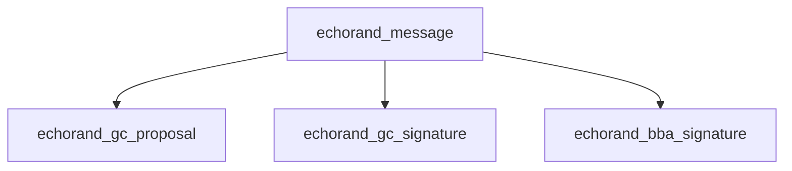
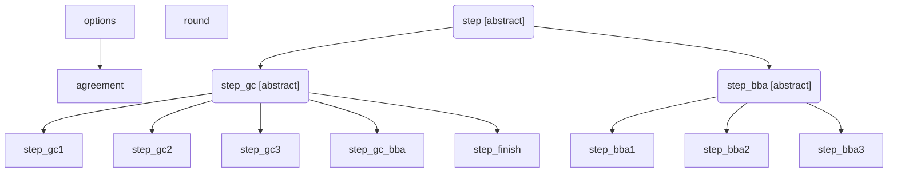
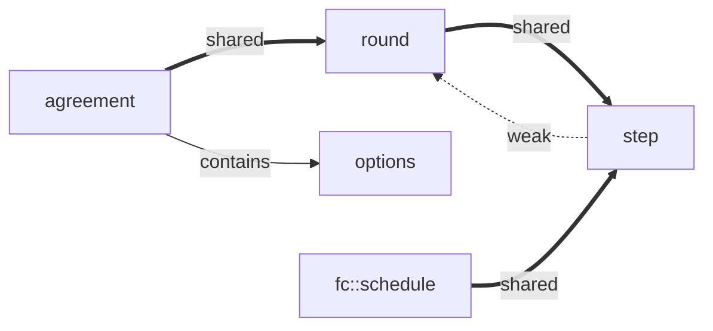

# EchoRand Architecture

The document contains the description of an architecture proposal for the echorand algorithm of the project **Echo**. Project presentation: ([ECHO: A Next Generation Blockсhain Platform For Smart Economics][echo-wp]).

## General description

|Class|Role|
|---|---|
|Step|algorithm implementation step|
|Round|step manager within the algorithm round|
|Agreement|round manager and the front-end of the algorithm|
|Options|initial parameters of the algorithm|
|Network message classes|communication links between network nodes|

### Algorithm

`agreement` class is the main algorithm implementation class - an interface for external use.

The class implements the following functionality:

* storage of configuration parameters, such as:
  * parameters for the algorithm operation (maximum number of steps, timeouts, etc.);
  * **$Q (r-1)$** initial value (random variable from the previous block);
  * **$HB (r-1)$** initial value ([SHA-256] [] hash address of the previous block);
  * access interface to public keys of the relevant parties for verifying the signature;
  * block validation interface;
  * each party's private keys on the node.
* configuration settings;
* start-up and shutdown of the algorithm operation as a whole.

As part of the algorithm operation:

* start of rounds;
* storing links to the rounds;
* suspension of a round to add a new block to the database blockchain;
* initial reception of network messages and their transfer to the corresponding rounds;
* providing the rounds with links to specific interfaces, through the adapter implementation.

### Round

All steps of the algorithm are implemented within the context of a particular round.

Each round has its own number.

Functionality:

* owns all its steps and shared data. Algorithm steps generate the shared data, save and exchange them, where necessary, through the round;
* receives network messages from `agreement` and transfers them to the corresponding step of the algorithm;
* forwards network messages to the other nodes in accordance with the algorithm described in the [technical description](echorand / tech);
* runs the steps of the algorithm;
* waits for the notification of a step suspension and decides on the start of the next step or the end of the round;
* notifies `agreement` about its suspension.

The round can be ended only from the `bba` steps.

The result of the ended round is the new block's signature and, optionally, the new block itself.

If the round is ended without a block, a new round starts, while the ongoing round is waiting for a new block to arrive
launching a specific  `step_finish` step. The decision is made by `agreement`,
analyzing the operation results of the round that sent the notification of suspension.

It should be noted that theoretically there might be a situation where there are several
rounds in `step_finish`, and thus several blocks. Via the network there can arrive the block **n**, while the block **n-1**
is still in `step_finish` - tail fragmentation blockchain. Such a situation should be foreseen
in the `agreement` class. For example, by entering a variable of the state of the round, which takes the following values:

* gets implemented;
* waits for a block;
* waits to be added to blockchain.

### Steps

Each step of the algorithm must be implemented asynchronously, responding simultaneously to the timer events
and events of the network, such as network messages arrival.

Each step of the algorithm has its own number.

All steps of the algorithm are divided into groups: `gc`, `gc-bba` and `bba`, each of which shows
significantly different behavior.

The steps of the `gc` group start all together with the start of the round and work simultaneously.

The only `gc-bba` group step starts after the end of the last step of the `gc` group.

>This refers to the last step by number, not the last step that was ended.
>
>However, the timeouts for the steps are chosen in such a way that the last step by number
actually becomes the last ended step of the group `gc`.

The steps of the `bba` group start immediately after the end of the `gc-bba` step and work sequentially, one after the other
till the end of the round, or till reaching a certain step limit. The step limit for the group `bba`
is set from the outside of the algorithm implementation, as a configuration parameter.

### Auxiliary functionality

#### Algorithm parameters

The structure used during the initialization of the `agreement` class and for the subsequent
storing of parameters inside the class. In general, it's always possible to get the `agreement`
from the structure privately.

#### Messaging Interface

It can be implemented as a separate interface.

Also, if you have a base class for all network messages, it can be also implemented
through a simple transfer of a functor to the `agreement` class. Pretty much like this:

```cpp
using network_sender_t = std::function<bool (const graphene::net::echorand_message&)>;
network_sender_t _send_message;
bool send_message(graphene::net::echorand_message& msg) { _send_message(msg); }
```

#### Interface for creating a new block

At the end of the round `agreement` class should add a new block to the local database.

For interacting with the `Graphene API`, the same mechanism
as with the messaging interface can be envisaged.

```cpp
using block_handler_t = std::function<bool (const graphene::chain::signed_block&)>;
void send_message(const graphene::net::echorand_message& msg) const noexcept;
```

#### Interface for the block validation check

During the operation of the algorithm, it's necessary to check the validation of the arrived block. Basically it means
to check its transactions using the `Graphene API`.

Such an interface can also be implemented like the interface for creating a new block described in the previous point.

```cpp
using block_handler_t = std::function<bool (const graphene::chain::signed_block&)>;
void check_block(const graphene::chain::signed_block& block) const noexcept;
```

#### Interface for getting information about the involved parties

At the start of the round, and at the start of the following series of the `bba` steps, you will need to receive
a list of the involved parties with their keys. Local parties on the network node need
a pair of keys - a private and a public one, for remoted parties only a public key is required.

Such an interface can also be implemented like the one described in the previous point.

```cpp
using witness_getter_t = std::function<witnesses_t (unsigned, unsigned)>;
witnesses_t get_witnesses(unsigned round_id, unsigned step_id) const noexcept;
```

#### Network message classes

Get implemented separately within the corresponding `Graphene API` modules.

If `Graphene API` allows, it's better to implement the message classes as a hierarchy:



### Initialization

The object `agreement` is created in the `graphene::app::application` class constructor using the `echo::randopt` structure.

The `graphene::app::application` class controls the switching on and off function of the `agreement` algorithm rounds depending on
the block synchronization process activity. If necessary, it changes **Q(r-1)** и **HB(r-1)** in the parameters of `agreement`
after synchronization before running the algorithm.

`graphene::app::application` class transfers all the messages coming through the `echorand_message` network to the `agreement` class.

It's also required to consider modifications of the private keys of the involved parties on the node in the `agreement` class parameters.

Since the `fc::schedule` interface is used, all the rounds and steps should be created like the `std::shared_ptr`, must be inherited
from `std::enable_shared_from_this<...>` and, when scheduling an event from the timer, must use the following scheme:

```cpp
auto pThis = shared_from_this();
fs::schedule( [pThis, this](){ onTimer(); }, timeout );
```

which will be done in the base class of the step, for the timer functionality implementation.

### Functioning

After the start, the `agreement` class creates a round. In the constructor the round creates three steps: `step_gc1`, `step_gc2`, `step_gc3`.

The steps are run automatically, by a round. In their corresponding constructors, if necessary, they produce the necessary
preliminary calculations and become scheduled for the timers.

The algorithm receives network messages from the application and sends them to the corresponding round with their relevant number. The round sends
them to the specified step, in accordance with the step number in the message.

As soon as a result of a network message or when the timer goes off a step decides to end,
it saves the results of its work in a round. After this, the step marks the fact that it's over inside itself
and reports this to the round. Then, the round removes this step from its collection.

Most likely, the end of the step will be a result of a network message. In this case,
the event will still be recorded on the timer and, therefore, will keep the step in memory. Unfortunately,
in the `Graphene API` the timer functors cannot be canceled and they always work. In this case,
after the timer goes off, the processing event will see that the step is marked as completed
and will simply exit. As a result, the step will be removed from memory.

Another option is to stop the algorithm. In this case, the `Graphene App` application library calls a method of ending the algorithm. This method will remove all the rounds. The rounds will remove all the steps, marking them as completed. In case some steps remain registered on the timers, after a while they will be removed from memory, as it is described above.

## Schemes

### Inheritance schemes



### Ownership scheme



## Class descriptions

All classes are mentioned in the `echo::rand` namespace.

Only basic architecture classes are demonstrated.

```cpp
/// configuration options for echorand protocol
struct options
{
    using network_sender_t = std::function<bool (const message&)>;
    using block_producer_t = std::function<payset_t (const block_context_t&)>;
    using block_handler_t = std::function<bool (const block_t&)>;
    using verifiers_getter_t = std::function<verifiers_t (uint64_t, unsigned, unsigned)>;

    unsigned            _time_net_1mb   = 0;    ///< timeout in mills for 1Mb message spreads over the network
    unsigned            _time_net_256b  = 0;    ///< timeout in mills for 256b message spreads over the network
    unsigned            _creator_count  = 0;    ///< number of max block creators for this node
    unsigned            _verifier_count = 0;    ///< number of max block verifiers for this node
    unsigned            _ok_threshold   = 0;    ///< threshold to made ok decision, recommended eq. 0.69 * _creator_count
    unsigned            _max_bba_steps  = 0;    ///< max number of BBA steps
    fc::sha256          _last_rand;             ///< Q(r-1) of last block
    fc::sha256          _last_block_hash;       ///< hash of last block
    uint64_t            _last_round     = 0;    ///< last number of round
    bool                _bba_enabled    = true; ///< enables BBA part, otherwise runs onlyy GC part
    block_handler_t     _save_block;            ///< saver for new blocks into chain db
    network_sender_t    _send_message;          ///< sender for network messages
    block_handler_t     _check_block;           ///< checker for received blocks
    verifiers_getter_t  _get_verifiers;         ///< get info about all verifiers scheduled for given round/step
    block_producer_t    _produce_block;         ///< producer of new block for echorand algorithm
};
```

### echo::rand::agreement

```cpp
/// declaration of echorand agreement instance
class agreement : private options
{
public:
    using rounds = std::map<uint64_t, std::shared_ptr<round>>;

    /// constructs echorand instance from options structure and
    /// automatically starts new round
    agreement(const options& arg);

    /// stops running rounds and stops echorand instance
    ~agreement();

    unsigned time_net_1mb() const noexcept;       ///< timeout in mills for 1Mb message spreads over the network
    unsigned time_net_256b() const noexcept;      ///< timeout in mills for 256b message spreads over the network
    unsigned creator_count() const noexcept;      ///< number of max block creators for this node
    unsigned verifier_count() const noexcept;     ///< number of max block verifiers for this node
    unsigned ok_threshold() const noexcept;       ///< threshold to make ok decision, recommended eq. 0.69 * _creator_count
    unsigned max_bba_steps() const noexcept;      ///< max number of BBA steps
    const fc::sha256& last_rand() const noexcept; ///< Q(r-1) of last block
    const fc::sha256& last_block_hash() const noexcept;    ///< hash of last block
    uint64_t last_round() const noexcept;         ///< last number of round

    bool bba_enabled() const noexcept;            ///< enables BBA part, otherwise runs onlyy GC part

    rounds::const_iterator begin() const noexcept;   ///< returns an iterator to the first round
    rounds::const_iterator end() const noexcept;     ///< returns an iterator past the last round

    const round& get(uint64_t round_id) const;       ///< get round by its number/id,
                                                        ///< @throws std::out_of_range if not found

    /// event handler for echorand messages from network,
    /// make decision to forward message using send_message
    /// as a result of internal call to round::handle_message
    void dispatch_message(const message& msg);

    /// broadcast echorand message to network
    void send_message(const message& msg) const;

    /// produce new block at local echo node
    payset_t produce_block(const block_context_t& ctx) const;

    /// check given block
    bool check_block(const block_t& block) const;

    /// get info about all verifiers scheduled for given round/step
    verifiers_t get_verifiers(uint64_t round_id, unsigned step_id) const;

    /// finishes round with certificate
    void finish(uint64_t round_id, const certificate_t& cert);

    /// finishes round with block
    void finish(uint64_t round_id, const block_t& block);

private:
    rounds      _rounds;

    round& start_next_round();
};
```

### echo::rand::round

```cpp
/// represents single round of echorand algorithm
class round : public std::enable_shared_from_this<round>
{
private:
    /// starts first three steps of GC
    round(uint64_t round_id, agreement& a);

public:
    using steps = std::unordered_map<unsigned,std::shared_ptr<step>>;

    /// starts new round of echorand algorithm
    static std::shared_ptr<round> start(uint64_t round_id, agreement& a);

    /// finishes and destroys all steps (if any)
    ~round();

    agreement& parent() const;               ///< parent class
    uint64_t id() const;                     ///< id of round
    const fc::sha256& prev_rand() const;         ///< Q(r-1) of last block
    const fc::sha256& prev_block_hash() const;   ///< hash of last block
    steps::const_iterator begin() const;     ///< begin iterator to active steps
    steps::const_iterator end() const;       ///< end iterator to active steps

    const step& get(unsigned step_id) const; ///< get step by its number/id,
                                                ///< @throws std::out_of_range if not found

    /// get typed step by its number/id
    ///< @throws std::out_of_range if not found
    ///< @throws std::bad_cast on case of wrong type
    template<typename _Step>
    const _Step& get(unsigned step_id = 0) const
    {
        if(step_id == 0)
            return dynamic_cast<const _Step&>(get(resolve_id_t<_Step>::id));
        else
            return dynamic_cast<const _Step&>(get(step_id));
    }

    /// broadcast echorand message to network and to related steps
    template<typename _Msg>
    void send_message(const _Msg& msg)
    {
        if(send_message_internal(msg))
            return;
        _messages.emplace_back(std::make_unique<_Msg>(msg));
    }

    /// dispatch received echorand message to steps
    result_t dispatch_message(const message& msg);

    /// finish step, start next if required
    void finish(unsigned step_id);

    /// finish step with certificate
    void finish(unsigned step_id, const certificate_t& cert);

    /// finish step with block
    void finish(unsigned step_id, const block_t& b);

    /// generated certificate
    const certificate_t* certificate() const;

    /// generated block
    const block_t* const block() const;

    /// empty block for this round
    const block_t& empty_block() const;

    /// empty block hash for this round
    const fc::sha256& empty_block_hash() const;

private:
    using certificate_ptr = std::unique_ptr<certificate_t>;
    using block_ptr = std::unique_ptr<block_t>;
    using block_hash_ptr = std::unique_ptr<fc::sha256>;
    using messages = std::deque<std::unique_ptr<message>>;

    const uint64_t      _id;          ///< id of round, initialized from a.last_round() + 1
    const fc::sha256    _prev_rand;   ///< Q(r-1) of last block
    const fc::sha256    _prev_block_hash;   ///< hash of last block
    agreement&          _parent;      ///< parent class
    steps               _steps;       ///< collection of active steps
    certificate_ptr     _certificate; /// certificate for block, generated at this round
    block_ptr           _block;       ///< block generated at this round
    messages            _messages;    ///< message cache for dispatching to the next step at this node

    mutable block_ptr      _empty_block;      ///< empty block for this round
    mutable block_hash_ptr _empty_block_hash; ///< hash of empty block

    /// broadcast echorand message to network and to related steps
    /// @returns true - if message was successfully dispatched to next local step
    bool send_message_internal(const message& msg);

    /// start step with specified id
    void start(unsigned step_id);

    /// wait block, start finish step at the place of GC2 step
    void wait_block();
};
```

### echo::rand::step

```cpp
/// base for all steps of echorand algorithm
class step : public std::enable_shared_from_this<step>
{
protected:
    /// initialize base instance
    step(std::shared_ptr<round> r, unsigned step_id);

public:
    virtual ~step(); ///< destruct virtually, do nothing

    std::shared_ptr<round> parent() const; ///< parent round
    unsigned round_id() const;             ///< round id
    unsigned id() const;                   ///< step id, fixed for gc and gc_bba, variable for bba steps
    bool finished() const;                 ///< indicates this step is already finished

    /// fired when echorand message received from network
    virtual result_t handle_message(const message& msg);

    /// finish this step by setting finished only
    void set_finished();

protected:
    /// step initialization
    virtual void init() {}

    /// sets timer_expired event to fire in specified number of milliseconds
    void set_timer(unsigned mills, const char* desc = nullptr);

    /// timer event handler
    virtual void timer_expired() {}

    /// finish this step by setting finished and
    /// try to signal parent round about this step is finished
    void finish();

    /// finish step with certificate
    void finish(const certificate_t& cert);

    /// finish step with block
    void finish(const block_t& b);

    /// @return verifiers for this step
    verifiers_t verifiers(bool local = true) const;

    /// setup common message header and sign message
    void prepare_message(message& m, unsigned producer) const;

private:
    const unsigned                _round_id;            ///< round id
    const unsigned                _id;                  ///< id of this step
    const std::weak_ptr<round>    _parent;              ///< ptr to parent round
    bool                          _finished = false;    ///< this step finished?
    verifiers_t                   _step_verifiers;      ///< verifiers for this step
    verifiers_t                   _msg_verifiers;       ///< verifiers for network messages (prev step)

    void timer_handler();
};

/// factory class to start steps with automatic initialization
template<typename _Step>
class step_t final : public _Step
{
protected:
    template<typename ..._Args>
    step_t(_Args&&... args)
    :   _Step(std::forward<_Args>(args)...)
    {}

public:
    using type = step_t<_Step>;
    using shared_ptr = std::shared_ptr<type>;

    /// factory method to start steps
    template<typename ..._Args>
    static shared_ptr start(_Args&&... args)
    {
        auto s = shared_ptr(new type(std::forward<_Args>(args)...));
        s->init();
        if(s->finished())
            return {};
        return s;
    }
};
```

[algorand-v9]: https://drive.google.com/file/d/1dohyg2LMNxHFzzTc5VpUwm_qjegBPKe2
[echo-wp]: https://drive.google.com/file/d/1JBCYt4QKBVK59MWstI0mIJkFUAc9Dy9O
[SHA-256]: https://en.wikipedia.org/wiki/SHA-2
