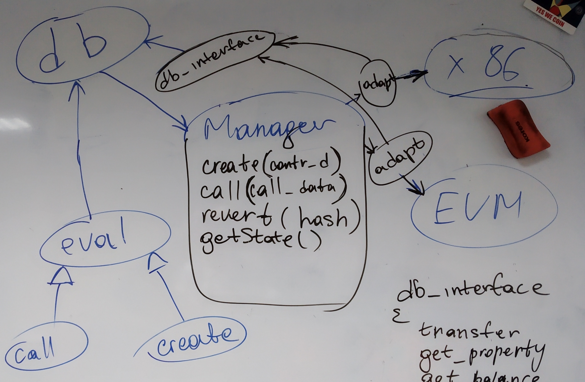

# Интеграция

## Используемые структуры

```cpp
    struct contract_data
    {
        id_type caller;
        asset value;
        uint64_t gas;
        string code;
    }
```

```cpp
    struct call_data : contract_data
    {
        id_type callee;
    }
```

## Фото доски с приблизительной схемой



## manager

Класс, с помощью которого прозводится доступ к виртуальным машинам через адаптеры. Определяет и вызывает необходимую виртуальную машину. Реализует общий набор методов для работы с виртуальной машиной:

```cpp
    manager(fc::path _datadir, db_interface& _db);
    contract_result_id_type create(contract_data cd);
    contract_result_id_type call(call_data cd);
    void revert(std::string);
    std::string get_root();
    result_t get_result(contract_result_id_type id);
```

## generic_adapter

Интерфейс для адаптеров. Имеет тот же набор методов, что и менеджер. Адаптер для каждой виртуальной машины должен быть унаследован от этого класса. Адаптер хранит состояние, реализует логику, специфическую для виртуальной машины(парсинг строки кода на параметры, например).

## chain_adapter

Адаптер к `echo_database`, реализующий необходимые для виртуальных машин методы: получение баланса объектов и т.д. С его помощью избавляемся от прямой зависимости виртуальных машин от базы данных
