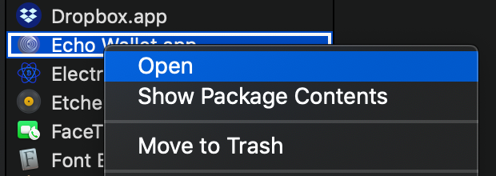
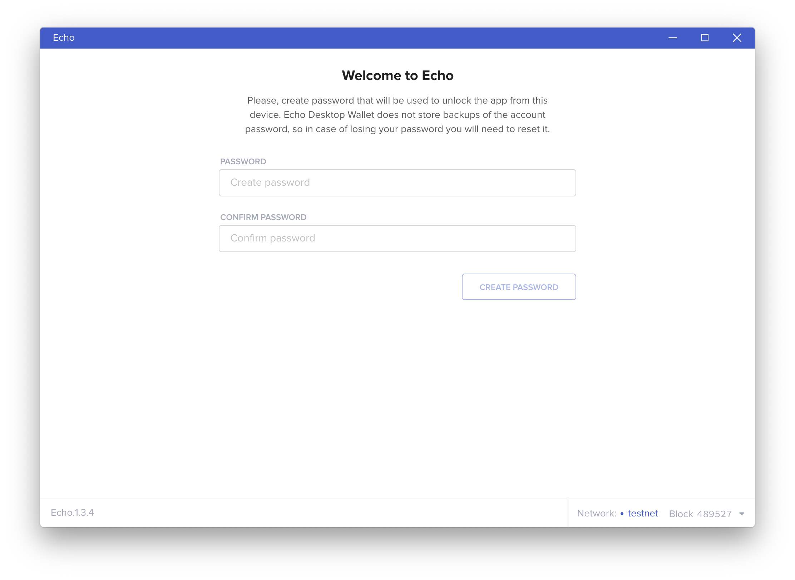
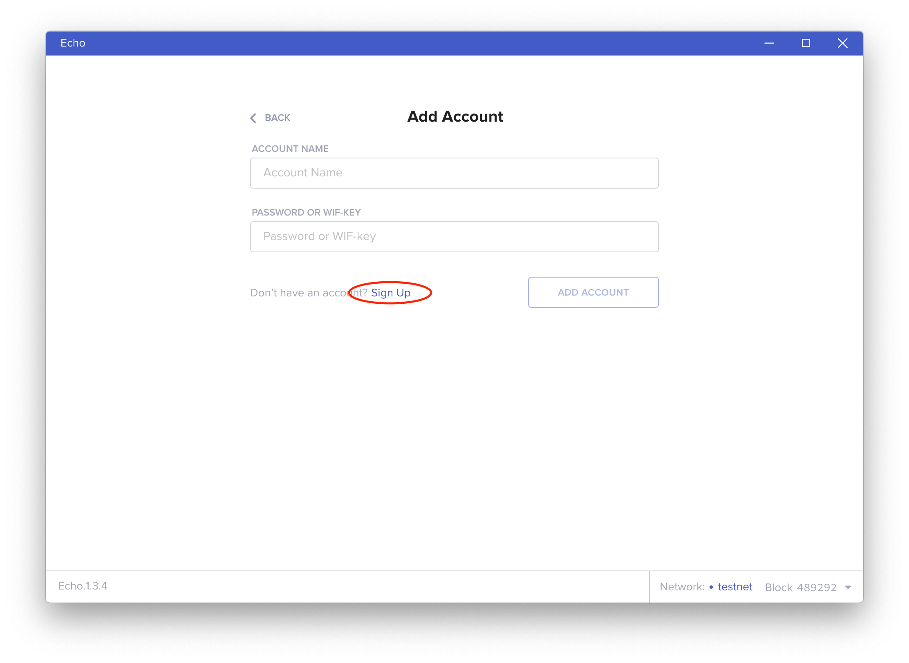
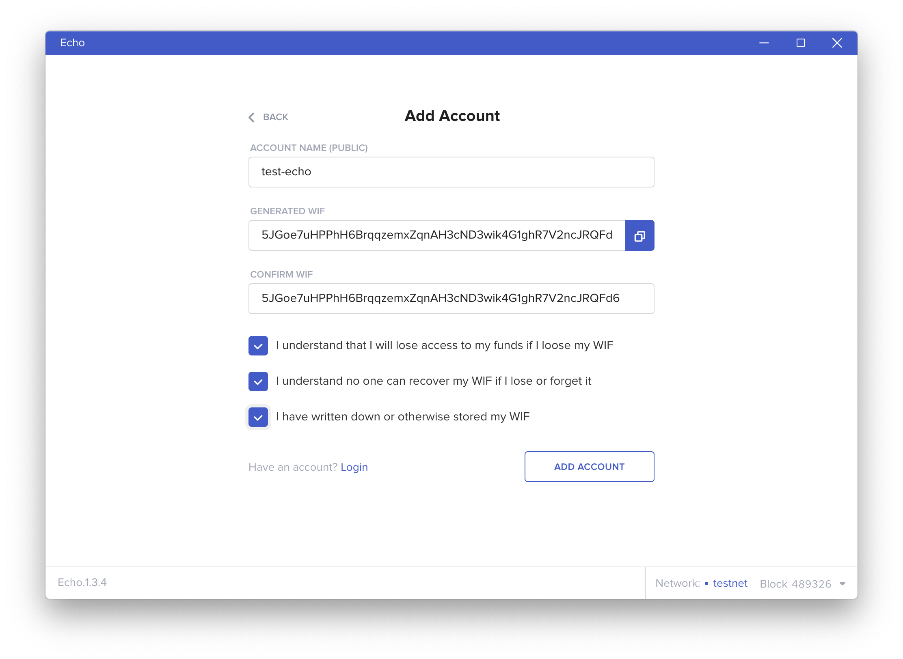
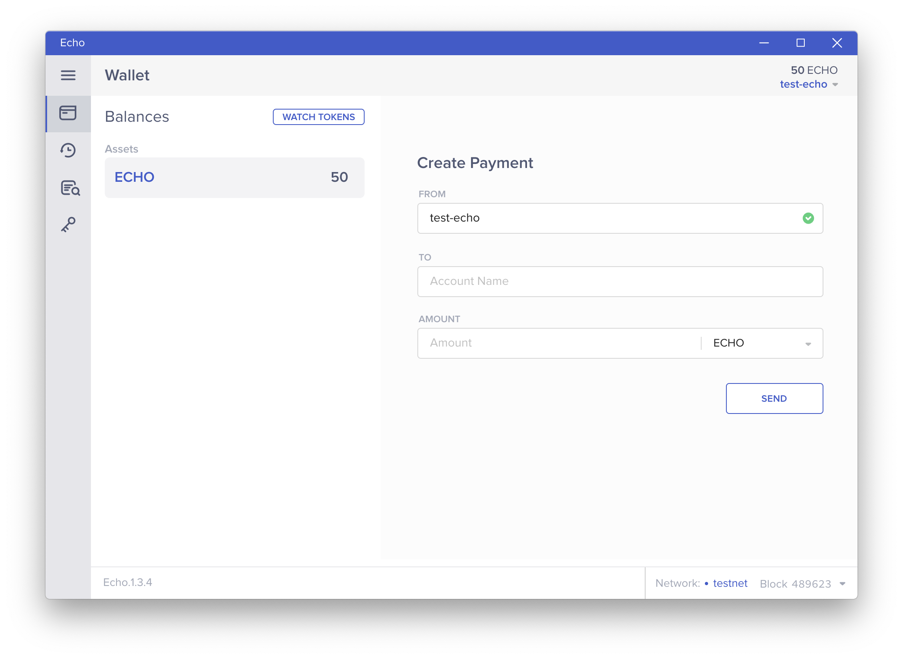

# Download an Echo Wallet

## Desktop

1. View the available releases for the Echo desktop wallet: [https://github.com/echoprotocol/echo-wallet/releases](https://github.com/echoprotocol/echo-wallet/releases)
2. Download the appropriate installation file for your operating system \(e.g. `.dmg` for MacOS 
3. Follow the installation steps for your operating system \(e.g. open the `.dmg` file and drag the Echo Wallet application to the `Applications` folder on MacOS.
4. Open the newly installed application!


If you run into the error message "Echo Wallet can't be opened because it is from an unidentified developer" on MacOS, you can still open the application by holding the control`^` key while clicking on the application icon and selecting "Open" from the context menu. Then click "Open" again to confirm.



### Creating an Account

You'll be asked to input an account name, which is a publicly-available identifier that anyone can use to send you transactions on the Echo network - think of it as a human-readable version of your public key. It cannot be changed after creation.


A valid account name must:

* Begin with a letter
* Contain lowercase only
* Contain only letters, numbers or hyphens
* End with a letter or number
* Be less than 63 characters long


At this step, you'll also be shown a WIF key for your account. This is an Echo version of a private key and is generated one-time, locally on your computer.


DANGER! Be sure to store your WIF key somewhere safe, preferably on a piece of paper or offline. Anyone who has this key can steal all your Echo assets and this key can never be recovered if you lose it.


### Receive some ECHO

ECHO is the native asset of the Echo network and is used to pay transaction \(gas\) fees, as well as to choose and reward the block producers and verifiers in the Echo PoWR consensus mechanism. On the current testnet, a faucet will send you 50 ECHO upon successfully creating an account to use for testing.

