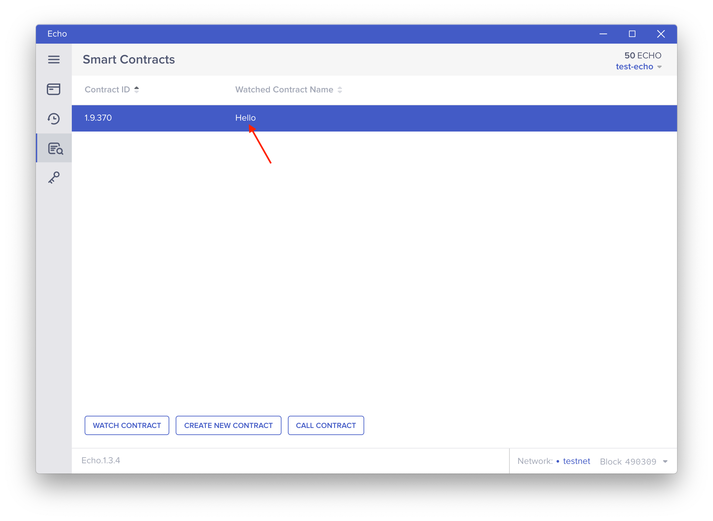
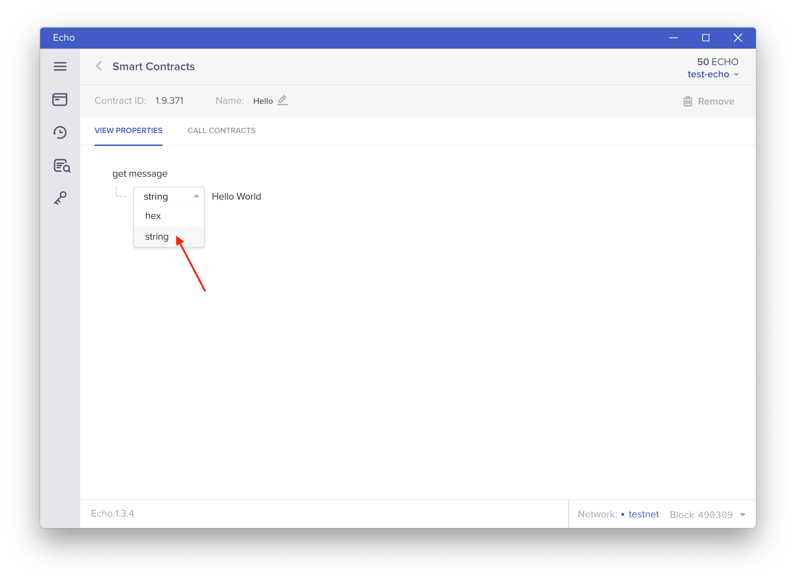
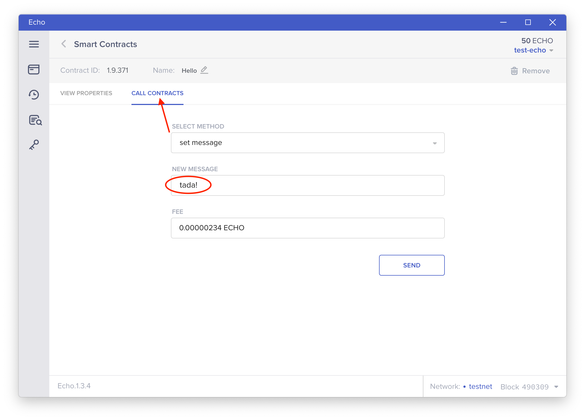
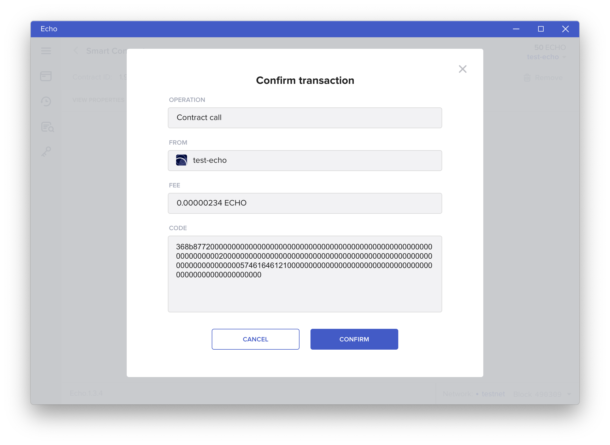
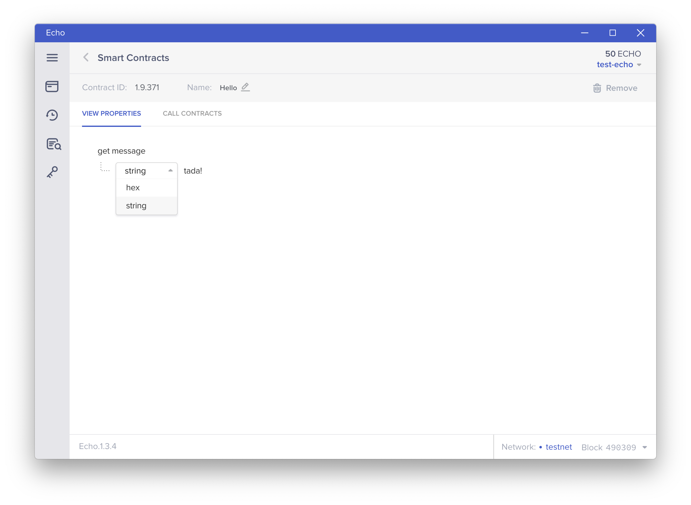

# Interact with a Smart Contract

After deploying the PiggyBank contract, we can interact with it and send it some ECHOs. If you haven't deployed the contract already, follow the first tutorial.



First, click on the name of the contract you want to interact with from your watch list - `Hello` in this case.

After navigating to the contract,  you have two options for interacting with the contract:

* View Properties: Read from the contract without changing data
* Call Contracts: Send an Echo transaction to invoke a contract function

In this case, we can read the output of the `getMessage()` function, which returns the string `Hello World` \(also represented by the hex `0x48656c6c6f20576f726c64000000000000000000000000000000000000000000`\). 

To change the message, switch to the `Call Contracts` tab and enter the new message in form, with the `set message` method selected. The transaction fee for this contract call \(denominated in ECHO\) will automatically populate.

Send this transaction by entering your password again and confirming the transaction details.

After the transaction is broadcast to the network and included in a block \(approximately 10-30 seconds\), you can return to the `Smart Contracts` tab and view the properties of the `Hello` contract again. This time, you should see your new message!

