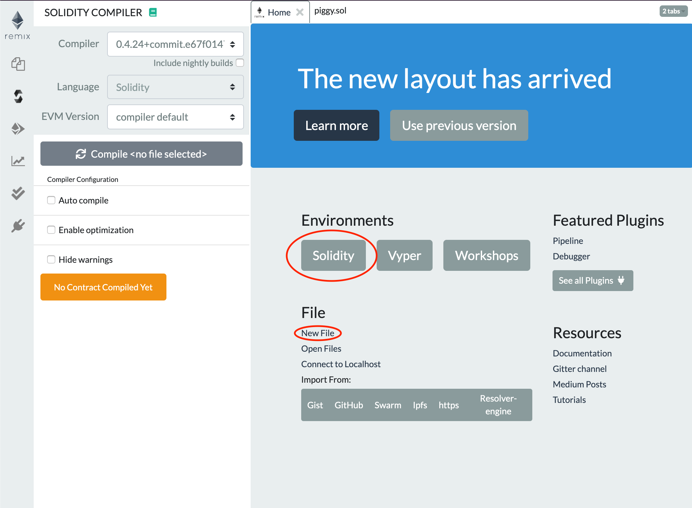
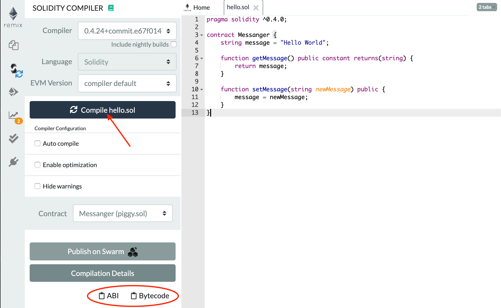
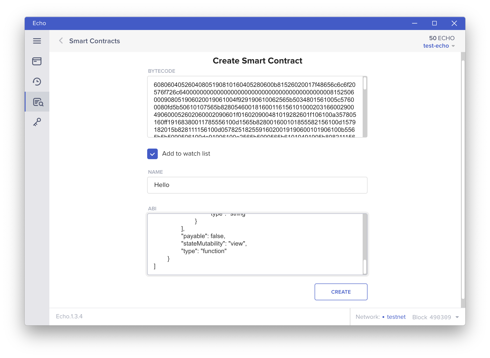
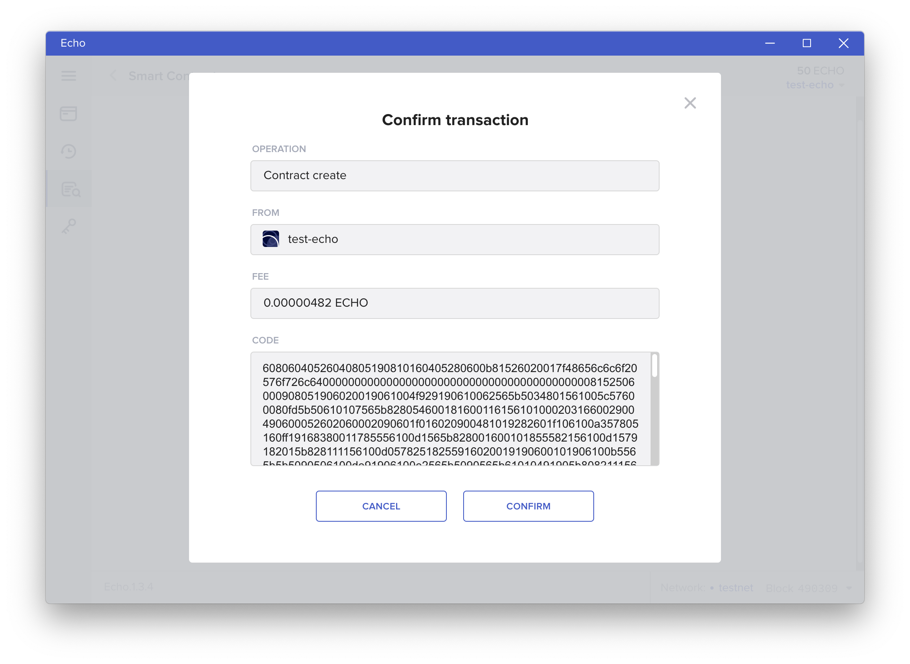
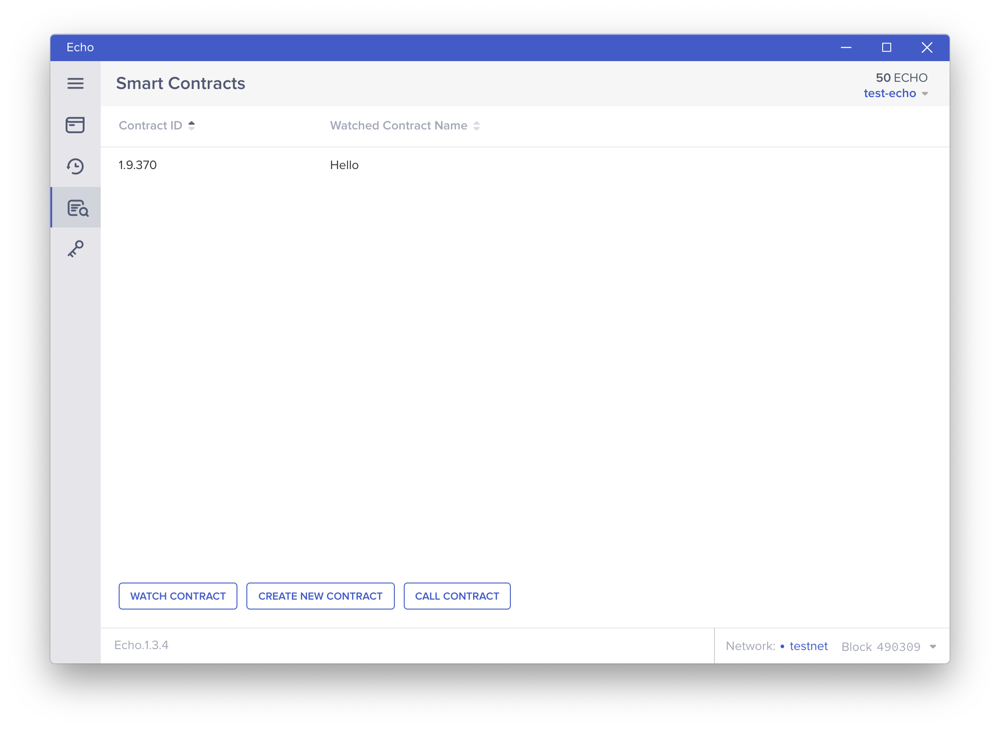
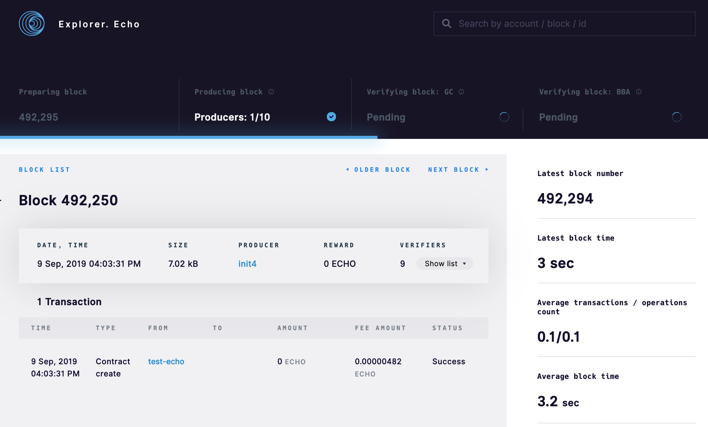

# How to: Deploy a Solidity Contract

Echo implements the Ethereum Virtual Machine \(EVM\) and supports smart contracts written in Solidity natively. In this example, we'll create, deploy, and call a contract on the Echo network written in Solidity.

For this tutorial, we will use the `hello.sol` contract. This is a simple contract that returns a message string when `getMessage()` is called. The default message is `Hello World` but it can be updated \(by anyone!\) by calling the `setMessage()` function.



```javascript
pragma solidity ^0.4.0;
    
// A simple smart contract
contract MessageContract {
    string message = "Hello World";
    
    function getMessage() public constant returns(string) {
        return message;
    }
    
    function setMessage(string newMessage) public {
        message = newMessage;
    }
}
```



To begin, we need to compile this Solidity contract to a bytecode and function hashes we can deploy to the Echo network. To do this we'll use [Remix](https://remix.ethereum.org/#optimize=false&evmVersion=null&version=soljson-v0.4.24+commit.e67f0147.js), an online Solidity compiler and IDE. To get started, visit [Remix](https://remix.ethereum.org/#optimize=false&evmVersion=null&version=soljson-v0.4.24+commit.e67f0147.js), select the `Solidity` environment and create a new file and name it `hello.sol`.



Next, copy the Solidity code into the new file `hello.sol` and then compile the contract and copy the resulting bytecode.



 Then switch back to the Echo wallet application and navigate to the `Smart Contracts` tab on the sidebar. Select `Create New Contract` and paste the bytecode output from Remix. The bytecode output from Remix is an object of the form:

```text
{
	"linkReferences": {},
	"object": "60806040526040805190810160405280600b81526020017f48656c6c6f20576f726c640000000000000000000000000000000000000000008152506000908051906020019061004f929190610062565b5034801561005c57600080fd5b50610107565b828054600181600116156101000203166002900490600052602060002090601f016020900481019282601f106100a357805160ff19168380011785556100d1565b828001600101855582156100d1579182015b828111156100d05782518255916020019190600101906100b5565b5b5090506100de91906100e2565b5090565b61010491905b808211156101005760008160009055506001016100e8565b5090565b90565b6102d7806101166000396000f30060806040526004361061004c576000357c0100000000000000000000000000000000000000000000000000000000900463ffffffff168063368b877214610051578063ce6d41de146100ba575b600080fd5b34801561005d57600080fd5b506100b8600480360381019080803590602001908201803590602001908080601f016020809104026020016040519081016040528093929190818152602001838380828437820191505050505050919291929050505061014a565b005b3480156100c657600080fd5b506100cf610164565b6040518080602001828103825283818151815260200191508051906020019080838360005b8381101561010f5780820151818401526020810190506100f4565b50505050905090810190601f16801561013c5780820380516001836020036101000a031916815260200191505b509250505060405180910390f35b8060009080519060200190610160929190610206565b5050565b606060008054600181600116156101000203166002900480601f0160208091040260200160405190810160405280929190818152602001828054600181600116156101000203166002900480156101fc5780601f106101d1576101008083540402835291602001916101fc565b820191906000526020600020905b8154815290600101906020018083116101df57829003601f168201915b5050505050905090565b828054600181600116156101000203166002900490600052602060002090601f016020900481019282601f1061024757805160ff1916838001178555610275565b82800160010185558215610275579182015b82811115610274578251825591602001919060010190610259565b5b5090506102829190610286565b5090565b6102a891905b808211156102a457600081600090555060010161028c565b5090565b905600a165627a7a723058207f42e049259483170b9842f7794ec94e14ba2f88f7ff6ea3004a866480155eb60029",
	"opcodes": "PUSH1 0x80 PUSH1 0x40 MSTORE PUSH1 0x40 DUP1 MLOAD SWAP1 DUP2 ADD PUSH1 0x40 MSTORE DUP1 PUSH1 0xB DUP2 MSTORE PUSH1 0x20 ADD PUSH32 0x48656C6C6F20576F726C64000000000000000000000000000000000000000000 DUP2 MSTORE POP PUSH1 0x0 SWAP1 DUP1 MLOAD SWAP1 PUSH1 0x20 ADD SWAP1 PUSH2 0x4F SWAP3 SWAP2 SWAP1 PUSH2 0x62 JUMP JUMPDEST POP CALLVALUE DUP1 ISZERO PUSH2 0x5C JUMPI PUSH1 0x0 DUP1 REVERT JUMPDEST POP PUSH2 0x107 JUMP JUMPDEST DUP3 DUP1 SLOAD PUSH1 0x1 DUP2 PUSH1 0x1 AND ISZERO PUSH2 0x100 MUL SUB AND PUSH1 0x2 SWAP1 DIV SWAP1 PUSH1 0x0 MSTORE PUSH1 0x20 PUSH1 0x0 KECCAK256 SWAP1 PUSH1 0x1F ADD PUSH1 0x20 SWAP1 DIV DUP2 ADD SWAP3 DUP3 PUSH1 0x1F LT PUSH2 0xA3 JUMPI DUP1 MLOAD PUSH1 0xFF NOT AND DUP4 DUP1 ADD OR DUP6 SSTORE PUSH2 0xD1 JUMP JUMPDEST DUP3 DUP1 ADD PUSH1 0x1 ADD DUP6 SSTORE DUP3 ISZERO PUSH2 0xD1 JUMPI SWAP2 DUP3 ADD JUMPDEST DUP3 DUP2 GT ISZERO PUSH2 0xD0 JUMPI DUP3 MLOAD DUP3 SSTORE SWAP2 PUSH1 0x20 ADD SWAP2 SWAP1 PUSH1 0x1 ADD SWAP1 PUSH2 0xB5 JUMP JUMPDEST JUMPDEST POP SWAP1 POP PUSH2 0xDE SWAP2 SWAP1 PUSH2 0xE2 JUMP JUMPDEST POP SWAP1 JUMP JUMPDEST PUSH2 0x104 SWAP2 SWAP1 JUMPDEST DUP1 DUP3 GT ISZERO PUSH2 0x100 JUMPI PUSH1 0x0 DUP2 PUSH1 0x0 SWAP1 SSTORE POP PUSH1 0x1 ADD PUSH2 0xE8 JUMP JUMPDEST POP SWAP1 JUMP JUMPDEST SWAP1 JUMP JUMPDEST PUSH2 0x2D7 DUP1 PUSH2 0x116 PUSH1 0x0 CODECOPY PUSH1 0x0 RETURN STOP PUSH1 0x80 PUSH1 0x40 MSTORE PUSH1 0x4 CALLDATASIZE LT PUSH2 0x4C JUMPI PUSH1 0x0 CALLDATALOAD PUSH29 0x100000000000000000000000000000000000000000000000000000000 SWAP1 DIV PUSH4 0xFFFFFFFF AND DUP1 PUSH4 0x368B8772 EQ PUSH2 0x51 JUMPI DUP1 PUSH4 0xCE6D41DE EQ PUSH2 0xBA JUMPI JUMPDEST PUSH1 0x0 DUP1 REVERT JUMPDEST CALLVALUE DUP1 ISZERO PUSH2 0x5D JUMPI PUSH1 0x0 DUP1 REVERT JUMPDEST POP PUSH2 0xB8 PUSH1 0x4 DUP1 CALLDATASIZE SUB DUP2 ADD SWAP1 DUP1 DUP1 CALLDATALOAD SWAP1 PUSH1 0x20 ADD SWAP1 DUP3 ADD DUP1 CALLDATALOAD SWAP1 PUSH1 0x20 ADD SWAP1 DUP1 DUP1 PUSH1 0x1F ADD PUSH1 0x20 DUP1 SWAP2 DIV MUL PUSH1 0x20 ADD PUSH1 0x40 MLOAD SWAP1 DUP2 ADD PUSH1 0x40 MSTORE DUP1 SWAP4 SWAP3 SWAP2 SWAP1 DUP2 DUP2 MSTORE PUSH1 0x20 ADD DUP4 DUP4 DUP1 DUP3 DUP5 CALLDATACOPY DUP3 ADD SWAP2 POP POP POP POP POP POP SWAP2 SWAP3 SWAP2 SWAP3 SWAP1 POP POP POP PUSH2 0x14A JUMP JUMPDEST STOP JUMPDEST CALLVALUE DUP1 ISZERO PUSH2 0xC6 JUMPI PUSH1 0x0 DUP1 REVERT JUMPDEST POP PUSH2 0xCF PUSH2 0x164 JUMP JUMPDEST PUSH1 0x40 MLOAD DUP1 DUP1 PUSH1 0x20 ADD DUP3 DUP2 SUB DUP3 MSTORE DUP4 DUP2 DUP2 MLOAD DUP2 MSTORE PUSH1 0x20 ADD SWAP2 POP DUP1 MLOAD SWAP1 PUSH1 0x20 ADD SWAP1 DUP1 DUP4 DUP4 PUSH1 0x0 JUMPDEST DUP4 DUP2 LT ISZERO PUSH2 0x10F JUMPI DUP1 DUP3 ADD MLOAD DUP2 DUP5 ADD MSTORE PUSH1 0x20 DUP2 ADD SWAP1 POP PUSH2 0xF4 JUMP JUMPDEST POP POP POP POP SWAP1 POP SWAP1 DUP2 ADD SWAP1 PUSH1 0x1F AND DUP1 ISZERO PUSH2 0x13C JUMPI DUP1 DUP3 SUB DUP1 MLOAD PUSH1 0x1 DUP4 PUSH1 0x20 SUB PUSH2 0x100 EXP SUB NOT AND DUP2 MSTORE PUSH1 0x20 ADD SWAP2 POP JUMPDEST POP SWAP3 POP POP POP PUSH1 0x40 MLOAD DUP1 SWAP2 SUB SWAP1 RETURN JUMPDEST DUP1 PUSH1 0x0 SWAP1 DUP1 MLOAD SWAP1 PUSH1 0x20 ADD SWAP1 PUSH2 0x160 SWAP3 SWAP2 SWAP1 PUSH2 0x206 JUMP JUMPDEST POP POP JUMP JUMPDEST PUSH1 0x60 PUSH1 0x0 DUP1 SLOAD PUSH1 0x1 DUP2 PUSH1 0x1 AND ISZERO PUSH2 0x100 MUL SUB AND PUSH1 0x2 SWAP1 DIV DUP1 PUSH1 0x1F ADD PUSH1 0x20 DUP1 SWAP2 DIV MUL PUSH1 0x20 ADD PUSH1 0x40 MLOAD SWAP1 DUP2 ADD PUSH1 0x40 MSTORE DUP1 SWAP3 SWAP2 SWAP1 DUP2 DUP2 MSTORE PUSH1 0x20 ADD DUP3 DUP1 SLOAD PUSH1 0x1 DUP2 PUSH1 0x1 AND ISZERO PUSH2 0x100 MUL SUB AND PUSH1 0x2 SWAP1 DIV DUP1 ISZERO PUSH2 0x1FC JUMPI DUP1 PUSH1 0x1F LT PUSH2 0x1D1 JUMPI PUSH2 0x100 DUP1 DUP4 SLOAD DIV MUL DUP4 MSTORE SWAP2 PUSH1 0x20 ADD SWAP2 PUSH2 0x1FC JUMP JUMPDEST DUP3 ADD SWAP2 SWAP1 PUSH1 0x0 MSTORE PUSH1 0x20 PUSH1 0x0 KECCAK256 SWAP1 JUMPDEST DUP2 SLOAD DUP2 MSTORE SWAP1 PUSH1 0x1 ADD SWAP1 PUSH1 0x20 ADD DUP1 DUP4 GT PUSH2 0x1DF JUMPI DUP3 SWAP1 SUB PUSH1 0x1F AND DUP3 ADD SWAP2 JUMPDEST POP POP POP POP POP SWAP1 POP SWAP1 JUMP JUMPDEST DUP3 DUP1 SLOAD PUSH1 0x1 DUP2 PUSH1 0x1 AND ISZERO PUSH2 0x100 MUL SUB AND PUSH1 0x2 SWAP1 DIV SWAP1 PUSH1 0x0 MSTORE PUSH1 0x20 PUSH1 0x0 KECCAK256 SWAP1 PUSH1 0x1F ADD PUSH1 0x20 SWAP1 DIV DUP2 ADD SWAP3 DUP3 PUSH1 0x1F LT PUSH2 0x247 JUMPI DUP1 MLOAD PUSH1 0xFF NOT AND DUP4 DUP1 ADD OR DUP6 SSTORE PUSH2 0x275 JUMP JUMPDEST DUP3 DUP1 ADD PUSH1 0x1 ADD DUP6 SSTORE DUP3 ISZERO PUSH2 0x275 JUMPI SWAP2 DUP3 ADD JUMPDEST DUP3 DUP2 GT ISZERO PUSH2 0x274 JUMPI DUP3 MLOAD DUP3 SSTORE SWAP2 PUSH1 0x20 ADD SWAP2 SWAP1 PUSH1 0x1 ADD SWAP1 PUSH2 0x259 JUMP JUMPDEST JUMPDEST POP SWAP1 POP PUSH2 0x282 SWAP2 SWAP1 PUSH2 0x286 JUMP JUMPDEST POP SWAP1 JUMP JUMPDEST PUSH2 0x2A8 SWAP2 SWAP1 JUMPDEST DUP1 DUP3 GT ISZERO PUSH2 0x2A4 JUMPI PUSH1 0x0 DUP2 PUSH1 0x0 SWAP1 SSTORE POP PUSH1 0x1 ADD PUSH2 0x28C JUMP JUMPDEST POP SWAP1 JUMP JUMPDEST SWAP1 JUMP STOP LOG1 PUSH6 0x627A7A723058 KECCAK256 PUSH32 0x42E049259483170B9842F7794EC94E14BA2F88F7FF6EA3004A866480155EB600 0x29 ",
	"sourceMap": "29:246:0:-;;;54:30;;;;;;;;;;;;;;;;;;;;;;;;;;;;;;;:::i;:::-;;29:246;8:9:-1;5:2;;;30:1;27;20:12;5:2;29:246:0;;;;;;;;;;;;;;;;;;;;;;;;;;;;;;;;;;;;;;;;;;;;;;;;;;;;;;;;;;;;;;;;;;;;;;;;;;;;;;;;;;;;;;;;;;;;;;;;;:::i;:::-;;;:::o;:::-;;;;;;;;;;;;;;;;;;;;;;;;;;;:::o;:::-;;;;;;;"
}
```

For the Echo network, we just need the bytecode object. Copy only the string beginning with `6080...` without any quotation marks and paste that in the Echo wallet. Then check the box `Add to watch list`, name the contract, and copy the ABI from Remix.

The full compiled bytecode:

```text
60806040526040805190810160405280600b81526020017f48656c6c6f20576f726c640000000000000000000000000000000000000000008152506000908051906020019061004f929190610062565b5034801561005c57600080fd5b50610107565b828054600181600116156101000203166002900490600052602060002090601f016020900481019282601f106100a357805160ff19168380011785556100d1565b828001600101855582156100d1579182015b828111156100d05782518255916020019190600101906100b5565b5b5090506100de91906100e2565b5090565b61010491905b808211156101005760008160009055506001016100e8565b5090565b90565b6102d7806101166000396000f30060806040526004361061004c576000357c0100000000000000000000000000000000000000000000000000000000900463ffffffff168063368b877214610051578063ce6d41de146100ba575b600080fd5b34801561005d57600080fd5b506100b8600480360381019080803590602001908201803590602001908080601f016020809104026020016040519081016040528093929190818152602001838380828437820191505050505050919291929050505061014a565b005b3480156100c657600080fd5b506100cf610164565b6040518080602001828103825283818151815260200191508051906020019080838360005b8381101561010f5780820151818401526020810190506100f4565b50505050905090810190601f16801561013c5780820380516001836020036101000a031916815260200191505b509250505060405180910390f35b8060009080519060200190610160929190610206565b5050565b606060008054600181600116156101000203166002900480601f0160208091040260200160405190810160405280929190818152602001828054600181600116156101000203166002900480156101fc5780601f106101d1576101008083540402835291602001916101fc565b820191906000526020600020905b8154815290600101906020018083116101df57829003601f168201915b5050505050905090565b828054600181600116156101000203166002900490600052602060002090601f016020900481019282601f1061024757805160ff1916838001178555610275565b82800160010185558215610275579182015b82811115610274578251825591602001919060010190610259565b5b5090506102829190610286565b5090565b6102a891905b808211156102a457600081600090555060010161028c565b5090565b905600a165627a7a723058207f42e049259483170b9842f7794ec94e14ba2f88f7ff6ea3004a866480155eb60029
```



After hitting `Create` , the Echo wallet will prompt you to input the password you setup when initially installing the application. 



After confirming, the transaction will be broadcast to the Echo network. Congrats! You just deployed your first Solidity contract with Echo.



You should also be able to see your contract creation transaction contained in a recent block in the [Echo block explore](https://explorer.echo.org/)r.


