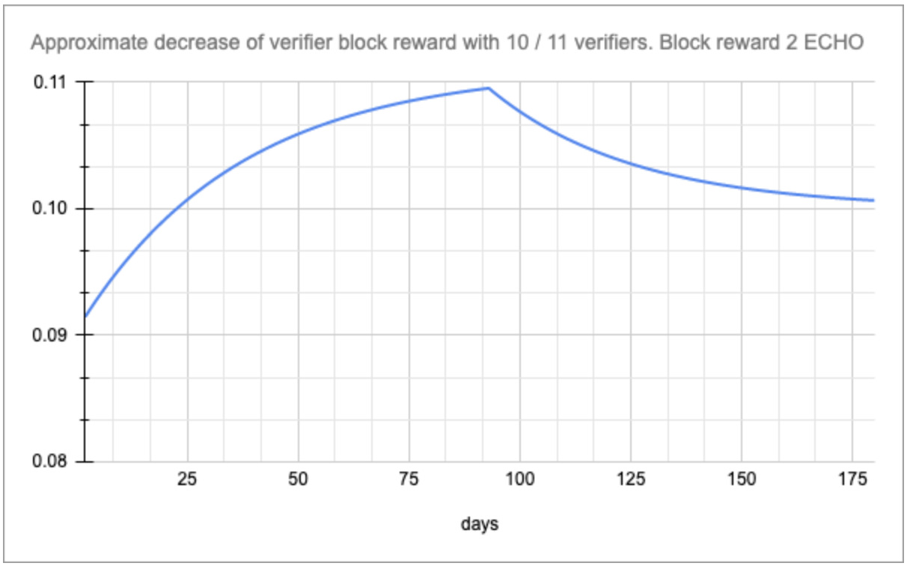
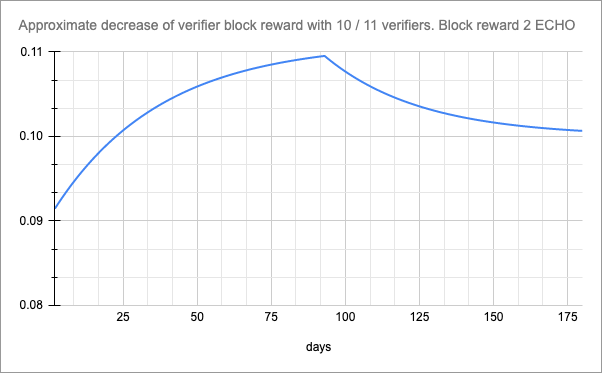

# ECHO Financial model

## Distribution of the block award:

The award means the issuing of new coins plus commission for transactions included in the
block.

Distribution of the award among the parties:

- 50% Producer
- 50% Certificate Verifiers.

**The producer** is a member of consensus, whose offer of the block was the best in the round
(offer became the basis of the released block), selected at a certain round as a potential block
producer.

**Certificate Verifiers** are participants of the consensus, selected at the final step of block
formation, whose signatures will be included in the so-called certificate of the block as a set
of signatures for the final step of voting.

The award to each of the verifiers is defined as:

$$
\frac{Block\ Reward\ *\ 50\%}{Verifiers\ threshold}
$$

Let's assume that:

- Emission per block - 20 ECHO
- Commission for transactions in the block - 2 ECHO
- Number of verifiers at step - 15 (correspondingly threshold value - 15 × 2 / 3 + 1 =
11).

Awards distribution:

$$
\frac{(20 + 2) * 50\%}{11} = 1\ ECHO\ receives\ each\ of\ the\ verifiers\ included\ in\ the\ certificate;
$$

$$
(20 + 2) * 50\% = 11\ ECHO\ receives\ the\ producer.
$$

## Distribution in case of incomplete certificate:

An incomplete certificate is possible only when during the block formation the signatures of
the required number of verifiers were not received and votes for them were sent by the
committee. Only original verifiers receive the award in the same size as for the full certificate.
The rest of the award is not distributed and is sent to the pool of commissions.

## Commission pool and its distribution:

The commission pool is replenished in the following cases:

- In case of the incomplete certificate (award to absent participants is sent to the pool);
- In the case of missed blocks, the potential emission for this block also goes to the pool
(every network service is calculated).

In case of non-zero balance on the commission pool, the total reward for each block is increased
by the amount equal to **Fee Pool Balance / 30 / Count blocks per day**.

The award increments and pool are recalculated every block.

The graph illustrates the increase of the verifier's award for each block with participation in the
certificate of 9 out of 11 verifiers. The growth in 90 days is about 20%.
Increasing the number of verifiers in the certificate to 10 will lead to a gradual reduction of the
award to the state of the original award + 10%.

If, however, after three months of operation of the network with the 9/11 certificate, the
connection of new members will lead to a permanent completion of the certificate (11/11), the
network will need about three months to return the award to its original state.

## Frozen funds:

Any participant can freeze the funds in order to increase the probability of getting on the list of
verifiers. During freezing the user can choose one of three options:

|**Minimum freezing period**|**Increasing coefficient**|
|---|---|
|90 days|1.1|
|182 days|1.3|
|365 days|1.5|

In other words, if a user has a balance of 1000 and 500 of them was frozen for 3 months, while
building the interval tree for selecting verifiers the protocol will perceive the user's balance as
(500 + 500)× 1.1.

It is worth mentioning that the freezing interval is the minimum period during which the user
cannot withdraw funds. At the end of this period, the user will still have an increased coefficient
until he requests a withdrawal.

The withdrawal request is a procedure that allows the user to unlock frozen funds. After the
request is made, the funds stop participating in the increased ratio and can be withdrawn by the
user not earlier than 7 days after the request. As a result, the minimum freezing period is 3
months + 7 days.

*The dates above are given in days for illustrative purposes, but in fact the calculation will be
based on the number of network services, which should take place once a day on average.*
