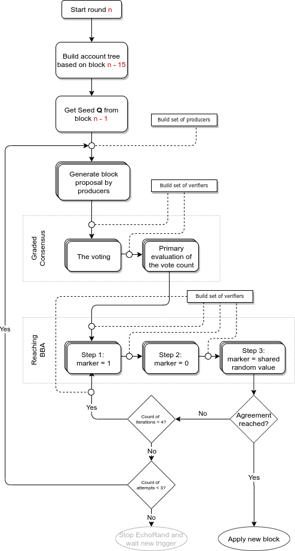

# Architecture

## General description

| Class | Role |
| :--- | :--- |
| Step | algorithm implementation step |
| Round | step manager within the algorithm round |
| Agreement | round manager and the front-end of the algorithm |
| Options | initial parameters of the algorithm |
| Network message classes | communication links between network nodes |

### Algorithm

`agreement` class is the main algorithm implementation class - an interface for external use.

The class implements the following functionality:

* Storage of configuration parameters, such as:
  * Parameters for the algorithm operation \(maximum number of steps, timeouts, etc.\);
  * $$Q \(r-1\)$$ initial value \(random variable from the previous block\);
  * $$HB \(r-1\)$$ initial value \([SHA-256](https://en.wikipedia.org/wiki/SHA-2) hash address of the previous block\);
  * Access interface to public keys of the relevant parties for verifying the signature;
  * Block validation interface;
  * Each party's private keys on the node.
* Configuration settings;
* Start-up and shutdown of the algorithm operation as a whole.

As part of the algorithm operation:

* Start of rounds;
* Storing links to the rounds;
* Suspension of a round to add a new block to the database blockchain;
* Initial reception of network messages and their transfer to the corresponding rounds;
* Cache network messages for upcoming rounds;
* Providing the rounds with links to specific interfaces, through the adapter implementation.

### Round

All steps of the algorithm are implemented within the context of a particular round.

Each round has its own number.

Functionality:

* Owns all its steps and shared data. Algorithm steps generate the shared data, save and exchange them, where necessary, through the round;
* Receives network messages from `agreement` and transfers them to the corresponding step of the algorithm;
* Forwards network messages, generated by steps, to other nodes;
* Runs steps of the algorithm;
* Waits for the notification of a step suspension and decides on the start of the next step or the end of the round;
* Notifies `agreement` about its suspension.

The round can be ended only from the `bba` steps.

The result of the ended round is the new block's signature and, optionally, the new block itself.

If the round is ended without a block, a new round starts, while the ongoing round is waiting for a new block to arrive, launching a specific `step_finish` step. The decision is made by `agreement`, analyzing the operation results of the round that sent the notification of suspension.

It should be noted that theoretically there might be a situation where there are several rounds in `step_finish`, and thus several blocks. Via the network there can arrive the block **n**, while the block **n-1** is still in `step_finish` - tail fragmentation blockchain. Such a situation is foreseen in the `agreement` class.

### Steps

Each step of the algorithm is implemented asynchronously, responding simultaneously to the timer events and events of the network, such as network messages arrival.

Each step of the algorithm has its own number.

All steps of the algorithm are divided into groups: `gc`, `gc-bba` and `bba`, each of which shows significantly different behavior.

The steps of the `gc` group start all together with the start of the round and work simultaneously.

The only `gc-bba` group step starts after the end of the last step of the `gc` group.

> This refers to the last step by number, not the last step that was ended. However, the timeouts for the steps are chosen in such a way that the last step by number actually becomes the last ended step of the group `gc`.

The steps of the `bba` group start immediately after the end of the `gc-bba` step and work sequentially, one after the other till the end of the round, or till reaching a certain step limit. The step limit for the group `bba` is set from the outside of the algorithm implementation, as a configuration parameter.

### Auxiliary functionality

#### Algorithm parameters

The structure used during the initialization of the `agreement` class and for the subsequent storing of parameters inside the class.

#### Messaging Interface

Public methods in `agreement` class to send outgoing network messages and receive incoming ones.

```cpp
        void dispatch_message(const message& msg);
        void send(const message& msg) const;
        void send_notification(const notification& msg) const;
        void send_block_notification(const message& msg);
```

During its construction, `agreement` should be connected to outside application network layer by using appropriate functors in configuration options structure.

```cpp
        using network_sender_t = std::function<bool (const message&)>;
        using notification_sender_t = std::function<void (const notification&)>;

        network_sender_t    _send_message;          ///< sender for network messages
        notification_sender_t _send_notification;   ///< sender for notification messages
```

Incoming network messages should be passed to `agreement::dispatch_message` public method.

#### Interface for creating a new block

At the end of the round `agreement` class should add a new block to the local database.

For interacting with the `Graphene API`, the same mechanism as with the messaging interface should be used.

```cpp
        using block_producer_t = std::function<blockinfo_t (const block_context_t&)>;
        block_producer_t    _produce_block;         ///< producer of new block for echorand algorithm
```

#### Interface for the block validation check

During the operation of the algorithm, it's necessary to check the validation of the arrived block. Basically, it means to check its transactions using the `Graphene API`.

It must be implemented like the interface for creating a new block described in the previous section.

```cpp
        using block_handler_t = std::function<bool (const graphene::chain::signed_block&)>;
        void check_block(const graphene::chain::signed_block& block) const noexcept;
```

#### Interface for getting information about the involved parties

At the start of the round, and at the start of the following series of the `bba` steps, you will need to receive a list of the involved parties with their keys. Local parties on the network node need a pair of keys - a private and a public one, for remote parties only a public key is required.

Such an interface can also be implemented like the one described in the previous section.

```cpp
        /// set of verifiers (verifier id => verifier information)
        using verifiers_t = std::map<unsigned, verifier_t>;

        using verifiers_getter_t = std::function<verifiers_t (rand_t, uint64_t, unsigned, unsigned)>;
        verifiers_getter_t  _get_verifiers;         ///< get info about all verifiers scheduled for given round/step
```

#### Interface for backup parties

Algorithm can generate backup messages on behalf of given verifier, signed with given private keys of another account.

Such an interface can also be implemented like the one described in the previous section.

```cpp
        /// set of verifiers (verifier_id => backup_id)
        using backup_map = std::unordered_map<unsigned, unsigned>;

        using backup_map_getter_t = std::function<backup_map (const verifiers_t&)>;
        backup_map_getter_t _backup_map_getter;     ///< calculate mapping of [verifier_id, backup_id] for given set of verifiers
        verifiers_t         _backup;                ///< committee board ids and public/private keys aka backup verifiers
```

#### Network message classes

Each network message implemented as separate class. Algorithm network data messages are inherited from the same base class, helper notification messages are not.

* **message** - base class for echorand algorithm network messages;
  * **gc_block** - contains message with new chain block, generated at the node and proposed over Echo network;
  * **gc_signature** - short message with information about new chain block, proposed over Echo network. This message is sent in a pair with `gc_block` one;
  * **gc_proposal** - information about block, selected at the node at `gc` stage;
  * **bba_signature** - information about block, selected at the node at `bba` stage.
* **round_info** - notification about node finished another round;
* **notification** - base class for other notification messages;
  * **round_started** - notifies, that node started new EchoRand round;
  * **block_produced** - notifies, that node produced new block;
  * **gc_started** - notifies, that node started `gc` stage;
  * **bba_started** - notifies, that node started `bba` stage.

### Initialization

The object `agreement` is created in the `echo::rand::plugin` class constructor using the `echo::rand::options` structure.

The `echo::rand::plugin` class controls the switching on and off function of the `agreement` algorithm rounds depending on the block synchronization process activity, maintenance activity and incoming `round_info` messages. If necessary, it changes **Q\(r-1\)** и **HB\(r-1\)** in the parameters of `agreement` before restarting the algorithm.

`echo::rand::plugin` class transfers all the messages coming from network to the `agreement` class. It caches network messages when `agreement` is stopped or re-creating and dispatches them just after EchoRand instance is ready.

Since the `fc::schedule` interface is used, all the rounds and steps is created dynamically and wrapped into `std::shared_ptr`.

### Functionality

After the start, `agreement` class creates a round. In the `round` constructor three steps are created: `step_gc1`, `step_gc2`, `step_gc3`.

The algorithm receives network messages from the application and sends them to the corresponding round by its number. The round sends them to the specified step, in accordance with the step number in the message.

As soon as a result of a network message or when the timer goes off a step decides to end, it saves the results of its work in a round. After this, the step marks the fact that it's over inside itself and reports this to the round. Then, the round removes this step from its collection.

## Source Code

EchoRand library source code can be found [here](https://github.com/echoprotocol/echo/tree/master/libraries/rand).

Echo project uses this library with the help of special plugin, which is responsible for maintenance of `agreement` instance and connection it to both Echo network and blockchain database layers. The source code of the plugin can be found [here](https://github.com/echoprotocol/echo/tree/master/libraries/plugins/echorand).

Tests for the library functionality is located [here](https://github.com/echoprotocol/echo/tree/master/tests/echorand).

## The EchoRand Mechanism



### Legend

| Designation | Description |
| :---: | :--- |
| $$msg$$ | message of the participant of a step transmitted between nodes |
| $$sig\(x\)$$ | EdDSA signature of $$x$$ |
| $$H\(x\)$$ | SHA-256 hash of $$x$$ |
| $$r$$ | current round of the algorithm, which is equivalent to the number of blocks in the database plus one. $$r &gt;= 1$$ |
| $$s$$ | current step number of the algorithm in the round. $$s &gt;= 1$$ |
| $$B\_r$$ | block created in round $$r$$, which equals to { $$r$$, $$ID_{producer}$$, $$Q\_r$$, $$H\(B\_r\)$$, $$H\(B_{r-1}\)$$, $$sig\(B\_r\)$$, $$PAY\_r$$, $$CERT\_r$$ } |
| $$H\(B\_r\)$$ | hash of $$B\_r$$ |
| $$PAY\_r$$ | set of transactions contained in block $$B\_r$$ |
| $$Q\_r$$ | shared randomness seed of round $$r$$ |
| $$sig\(Q\_r\)$$ | signature of a random vector of the $$r$$ round |
| $$sig\(B\_r\)$$ | signature of a block of the $$r$$ round |
| $$l\(r\)$$ | round $$r$$ leader - determines $$PAY\_r$$, creates $$B\_r$$ and determines $$Q\_r$$ |
| $$CERT\_r$$ | $$B\_r$$ block certificate, formed out of a set of `bba_signature` messages |
| $$VRF\(r, s\)$$ | set of participants who act in step $$s$$ of round $$r$$ |
| $$id$$ | account identifier in the blockchain |
| $$A\_s$$ | array of account identifiers selected as participants at the step $$s$$ |
| $$N\_s$$ | array of $$A\_s$$ indexes which correspond to the identifiers of users authorized on the current node in the step $$s$$ |
| $$l$$ | identifier of the producer who is the leader in this round |
| $$ctx$$ | context of current round, an object which contains all received messages for the round |

### Parameters

The following algorithm parameters are set by constants, or configured at the **echo\_node** startup and can potentially be adjusted within certain limits during the process of the algorithm operation.

| Designation | Description |
| :---: | :--- |
| $$Λ$$ | "large" interval, the average time required to distribute a 1 MB message across Echo network |
| $$λ$$ | "small" interval, the average time required to distribute a 256 bit message across Echo network |
| $$N\_g$$ | the number of block producers in a round, used in the function $$VRF\(r, 1\)$$ |
| $$N\_c$$ | the number of block verifiers in a round, used in the function $$VRF\(r, s\), s &gt; 1$$ |
| $$t\_h$$ | threshold for making positive decision during verifying, set by default to $$0.69\*N\_c$$ |
| $$μ$$ | $$4 + 3\*k, k &gt; 0$$ - maximum number for algorithm steps, upon reached new empty block is created |

### Other Terms

* **Executor** - the network account selected in the step of the round for performing a specific consensus action
* **Local configuration** - a certain set of parameters accessible only to the running network node.
* **Base \(database\)** - a blockchain with a certain set of blocks, possibly "lagging behind" the state of most other network nodes. It stores public EDS keys of all the participants of the algorithm operation.
* **Participant** - a set of EdDSA private/public keys and an account balance within the **Echo** network. Basically

  it's an **Echo** network user, specially registered on a specific network node. A user can be registered as a participant

  only on a single network node at a given time. A network node permits registration of several participants.

### Getting started

#### 0. Preparation

**Input data**:

* $$Q_{r-1}$$ from $$CERT_{r-1}$$

The round $$R\_r$$, which launches step 1 and step 2, described below, is created.

#### 1. Candidate blocks generation

**Input data:**

* $$H\(B_{r-1}\)$$ from $$CERT_{r-1}$$
* $$A\_1$$, $$N\_1$$ from the context of the round

**Start:**

Right after determining $$CERT\_{r-1}$$

**Steps:**

1. **Verification**:
   1. If $$N\_{1} = ∅$$, complete the step
   2. Select participant index $$n ∈ N_{1}$$, which generates the smallest $$Q\_r = sig\(Q_{r-1}, r\)$$, as a creator of new block on the node
   3. Get actual ID of the participant in the blockchain: $$id_{1} = A_{1}\[n\]$$
   4. Through $$id\_{1}$$ get all the private keys of a participant
2. **Block assembly**:
   1. If all the previous blocks $$B\(k\), k=1..r-1$$ are available, build $$PAY\_r$$
   2. If at least one of the previous blocks is unavailable, build $$PAY\_r = ∅$$
   3. If $$PAY_r != ∅$$, create a new block $$B\_r = { r, PAY\_r, Q\_r, H\(B_{r-1}\) }$$
3. **Communication**:
   1. Sign with the key $$id_1$$ and send `gc_signature` = { $$r$$, $$id\_1$$, $$Q\_r$$, $$H\(B_{r}\)$$ }
   2. Sign with the key $$id\_1$$ and send `gc_block` = { $$r$$, $$id\_1$$, $$B\_r$$ }

### Developing an evaluation agreement \(GC\)

#### 2. Leader selection \(voting\)

**Input data**:

* $$H\(B_{r-1}\)$$, $$Q_{r-1}$$ from $$CERT\_{r-1}$$
* $$A_{1}$$, $$A_{2}$$, $$N\_{2}$$ from the context of the round

**v** - local structure to store information about leader candidate: producer ID and corresponding block hash.

The empty set symbol assigned to the elements **v** means "empty block" and "unknown leader". In the application, it can be a predefined constant or a separate flag in the data structure.

**Start:**

right after defining $$CERT\_{r-1}$$

**Steps:**

1. **Timer**: schedule the timer after the time equal to $$2 \* λ$$, by a trigger:
   1. Define $$l$$ as $$id$$ existent in $$ctx\[id\]$$ with a minimum $$Q\_{r}$$
   2. if the local cache for $$l$$ has the block $$B\_{r}$$
      1. $$v = { ctx\[l\].H\(B\_{r}\), l }$$
      2. go to **Communication**
2. **Timer**: schedule the timer after the time equal to $$λ + Λ$$, by a trigger:
   1. $$v = { ∅, ∅ }$$
   2. go to **Communication**
3. **Network**: subscribe to network messages `gc_block`, `gc_signature` at the start of a step
   1. after receiving a message `gc_block` of the round $$r$$
      1. verify the round number in the message
      2. verify the message step, must be equal to `1`
      3. verify that $$msg.id ∈ A\_{1}$$ and get the user's public key
      4. verify the signature of the whole message
      5. verify that $$msg.block$$ is correct
         1. verify the block's round for equality to the current
         2. verify `producer-id` is from $$A\_{1}$$
         3. verify $$Q\_{r}$$, if it already has the `gc_signature`
         4. verify the block signature using `producer-id` of the block
         5. verify $$HB_{r-1}$$ from the block for equality to the local one from $$CERT_{r-1}$$
         6. verify the correctness of $$PAY\_{r}$$ in the block
      6. If $$ctx\[msg.id\]$$ already exists
         1. verify $$ctx\[msg.id\].H\(B\_{r}\) == H\(msg.block\)$$
      7. If it does not exist, save `msg.id, msg.block` to the context of the round:
         1. $$ctx\[msg.id\].B = msg.block$$
         2. $$ctx\[msg.id\].H\(B\_{r}\) = H\(msg.block\)$$
      8. if $$l$$ defined and $$l == id$$:
         1. $$v = { ctx\[l\].H\(B\_{r}\), l }$$
         2. go to **Communication**
   2. after receiving a message `gc_signature` of the round **r**
      1. verify the round number in the message
      2. verify that $$msg.id ∈ A\_1$$ and get the user's public key
      3. verify the signature of the whole message
      4. $$msg.block\_hash = ∅$$: verify `msg.rand` for equality to the local one from $$CERT\_{r-1}$$
      5. $$msg.block\_hash != ∅$$: verify the signature `msg.rand` using $$Q\_{r-1}$$ from $$CERT\_{r-1}$$
      6. Save $$msg.id =&gt; ∅$$ in the context of the round, if it’s not saved yet:
         1. $$ctx\[msg.id\].B = ∅$$
         2. $$ctx\[msg.id\].HB = msg.block\\_hash$$
         3. $$ctx\[msg.id\].rand = msg.rand$$
4. **Communication**: generating, signing and sending of messages
   1. stop timers, **do not** unsubscribe from network messages
   2. if $$N\_{2} = ∅$$, end the step
   3. $$∀n_{2} ∈ N_{2}$$:
      1. get real user’s ID in the blockchain: $$id_2 = A_{2}\[n\_{2}\]$$
      2. sign with the key of $$id\_{2}$$ and send
         1. if $$v != ∅$$: `gc_proposal` = { r, 2, $$id\_2$$, v }
         2. if $$v == ∅$$: `gc_proposal` = { r, 2, $$id\_2$$, ∅ }

#### 3. Choosing the leader \(vote counting\)

**Input data**:

* $$A_{2}$$, $$A_{3}$$, $$N\_{3}$$ from the context of the round

**Start**:

right after defining $$CERT\_{r-1}$$

**v** - a local structure of a step that stores the hash of the block and the ID of the leader, who created the block.

1. **Timer**: schedule the timer after the time equal to $$3  _λ + Λ$$, by a trigger:
    1. `v` = { ∅, ∅ }
    2. go to **Communication**
2. **Network**: subscribe to network messages `gc_proposal` at the start of a step, after receiving
   1. verify the round number and the step number in the message
   2. verify that $$msg.id ∈ A_{2}$$ and get the user's public key
   3. verify the signature of the whole message
   4. verify that $$msg.v = { msg.block\\_hash, msg.leader }$$ is in the context of the round. It should be collected in the context in the previous step, as a result of `gc_block` and `gc_signature` message processing.
   5. $$∃ ctx\[msg.leader\]$$ - a record for such a potential leader exists in the context
   6. $$ctx\[msg.leader\].H\(B\) == msg.block\\_hash$$ - the block hash coincides
   7. $$ctx\[msg.leader\].v3.push\(msg.id\)$$, where $$v3$$ is unordered\_set
   8. if the counter is more than the threshold $$t_{h}$$: $$ctx\[msg.leader\].v3.size\(\) &gt; t\_{h}$$
      1. `v = { msg.block_hash, msg.leader }`
      2. go to **Communication**
3. **Communication**: generating, signing and sending of messages
   1. stop timers, unsubscribe from network messages
   2. if $$N_{3} = ∅$$, end the step
   3. $$∀n_{3} ∈ N\_{3}$$:
      1. get real user’s ID in the blockchain: $$id\_3 = A\_3\[n\_3\]$$
      2. sign with the user’s key $$id\_3$$ and send `gc_proposal` = { r, 3, $$id\_3$$, v }

#### 4. Primary assessment of vote counting

**Start**: right after finishing the step `3`

**Input data**: $$A_{3}$$, $$A_{4}$$, $$N\_{4}$$ from the context of the round

1. **Timer**: schedule the timer after the time equal to $$2  _λ$$, by a trigger:
   1. if $$∃l \| ctx\[l\].v4.size\(\) &gt; t\_{h}/2$$: $$v = { ctx\[l\].HB, l }$$
   2. otherwise: $$v = { ∅, ∅ }$$
      1. $$b = 1$$
      2. go to **Communication**
2. **Network**: subscribe to network messages `gc_proposal` at the start of a step and on receiving
   1. verify the round number and the step number in the message
   2. verify that $$id ∈ A_{3}$$ and get the user's public key
   3. verify the signature of the whole message
   4. `msg.v = { msg.block_hash, msg.leader }`
      1. `msg.v != { ∅, ∅ }`: verify that `msg.v` is in the context of the round \(should be collected in step 2\)
      2. `∃ ctx[msg.leader]` - a record for such a potential leader exists in the context
         1. `ctx[msg.leader].H(B) == msg.block_hash` - the block hash coincides
         2. `ctx[msg.leader].v4.push(msg.id)`, `v4` is unordered\_set
         3. if $$ctx\[msg.leader\].v4.size\(\) &gt; t_{h}$$
            1. `v = { msg.block_hash, msg.leader }`, `b = 0`
            2. go to **Communication**
    3. `msg.v == { ∅, ∅ }`
       1. `ctx.ve4.push(msg.id)`, `ve4` is _unordered\_set_ \(**v**alue **e**mpty\)
       2. if $$ctx.ve4.size\(\) &gt; t\_{h}$$
          1. `v = { ∅, ∅ }`, `b = 1`
          2. go to **Communication**
3. **Communication**: generating, signing and sending of messages
   1. stop timers, unsubscribe from network messages
   2. if $$N_{4} = ∅$$, end the step 1.
   3. $$∀ n_{4} ∈ N_{4}$$:
      1. get real user’s ID in the blockchain: $$id\_4 = A\_4\[n_{4}\]$$
      2. sign with the user’s key $$id\_4$$ and send `bba_signature` = { r, 4, $$id\_4$$, b, v, sign\(v\) }

### Reaching the Binary Byzantine Agreement \(BBA\)

There are several classes of algorithms for reaching the Byzantine Agreement. The one which is used in **echorand** is based on the use of a shared random value.

The central idea of the algorithm is the following. At each step of the algorithm, network nodes сan be divided into two sets:

1. nodes that received a sufficient number of messages during the previous round\(s\) \(with a certain equal value\), allowing them to offer this value as a solutions.
2. nodes that received two solution variants and can not give preference to either of them.

In the latter case, undecided nodes use VRF to generate a shared random value from the `{0, 1}` set for making and sending their decisions. And since the random value will be the same for all the "uncertain" nodes, all such nodes will make just the same decision.

Designations used for data storage:

* `bba0` - messages with a `non-empty` block and a vote equal to `0`
* `bba1` - messages with a `non-empty` block and a vote equal to `1`
* `bbae0` - messages with an `empty` block and a vote equal to `0`
* `bbae1` - messages with an `empty` block and a vote equal to `1`

#### 5. Step one: coin == 0

**Step**: $$5 \le s \le μ; \space s - 2 \equiv 0 \bmod 3 \space \(s = 5,8,11,...\)$$

**Start**: right after the step $$s ≡ 1 mod 3, s &gt; 3$$ ends

**Input data**:

* $$A_{s-1}$$, $$N_{s-1}$$, $$A_{s}$$, $$N_{s}$$ from the context of the round
* $$HB_{r-1}$$, $$Q_{r-1}$$ из $$CERT\_{r-1}$$ - to generate an empty block

$$b$$ - local step flag that is sent in the `value` field of the `bba_signature` message.

1. **Timer**: schedule the timer after the time equal to $$2  _λ$$, by a trigger:
   1. $$b = 0$$
   2. go to \*Communication_
2. **Network**: subscribe to network messages `bba_signature` at the start of a step, after receiving
   1. verify that $$msg.id ∈ A_{s-1}$$ and get the user's public key
   2. verify the signatures of the whole message
   3. $$msg.v = { msg.block\_hash, msg.leader }$$
   4. $$msg.v != { ∅, ∅ }$$:
      1. $$∃ ctx\[msg.leader\]$$ - a record for such a potential leader exists in the context
      2. $$ctx\[msg.leader\].HB == v.HB_{r}$$ - the block hash coincides
      3. $$msg.value == 0$$: $$ctx\[v.l\].bba0\[msg.s\].push\(msg.id, msg\)$$, where $$bba0$$ array _unordered\_map_
      4. $$msg.value == 1$$: $$ctx\[v.l\].bba1\[msg.s\].push\(msg.id, msg\)$$, where $$bba1$$ array _unordered\_map_
      5. $$msg.v == { ∅, ∅ }$$:
         1. $$msg.value == 0$$: $$ctx.bbae0\[msg.s\].push\(msg.id, msg\)$$, $$bbae0$$ is an array _unordered\_map_
         2. $$msg.value == 1$$: $$ctx.bbae1\[msg.s\].push\(msg.id, msg\)$$, $$bbae1$$ is an array _unordered\_map_
            1. if $$∀ s &gt;= 5 \&\& s - 2 ≡ 0 mod 3$$ $$\(s == 5,8,11,...\)$$ - **Ending Condition 0**
               1. if $$∃l \| ctx\[l\].bba0\[s-1\].size\(\) &gt; t_{h}$$:
                  1. $$B_{r} = ctx\[l\].B$$
                  2. $$Q_{r}$$ is calculated from $$ctx\[l\].signQ$$, specified in step 2
                  3. $$CERT_{r}$$ is generated from $$ctx.bba1\[s-1\]$$, $$ctx.bbae1\[s-1\]$$, $$ctx.bba0\[s-1\]$$, $$ctx.bbae0\[s-1\]$$
                  4. $$b = 0^_$$
                  5. **END OF THE ROUND!!!**
            2. if $$∀ s &gt;= 6 \&\& s - 2 ≡ 1 mod 3$$ $$\(s == 6,9,12,...\)$$ - **Ending Condition 1**
               1. if $$\sum{n}ctx\[n\].bba1\[s-1\].size\(\) + ctx.bbae1\[s-1\].size\(\) &gt; t{h}$$:
                  1. $$B{r} = ∅$$
                  2. $$Q{r}$$ is calculated from $$Q{r-1}$$
                  3. $$CERT{r}$$ is generated from $$ctx.bba1\[s-1\]$$, $$ctx.bbae1\[s-1\]$$, $$ctx.bba0\[s-1\]$$, $$ctx.bbae0\[s-1\]$$
                  4. $$b = 1^_$$ 1.
                  5. **END OF THE ROUND!!!**
            3. if $$\sum_{n}ctx\[n\].bba1\[s-1\].size\(\) + ctx.bbae1\[s-1\].size\(\) &gt; t_{h}$$: $$b = 1$$, go to **Communication**
            4. if $$\sum_{n}ctx\[n\].bba0\[s-1\].size\(\) + ctx.bbae0\[s-1\].size\(\) &gt; t_{h}$$: $$b = 0$$, go to **Communication**
3. **Communication**: generating, signing and sending of messages
   1. stop timers, **do not** unsubscribe from network messages
   2. stop verifying the last two conditions from the previous point
   3. if $$N_{s} = ∅$$, end the step
   4. $$∀n_{s} ∈ N_{s}$$:
      1. get real user’s ID in the blockchain: $$id_{s} = A4\[n_{s}\]$$
      2. sign with the key $$id_{s}$$ and send $$bba\_signature = { r, s, id\_{s}, b, v, sign\(b, v\) }$$, where $$v$$ is the value calculated in step 4

#### 6. Step two: coin == 1

**Step**: $$6 \le s \le μ; \space s - 2 \equiv 1 \bmod 3 \space \(s = 6,9,12,...\)$$

**Start**: right after the step $$s ≡ 2 mod 3, s &gt; 3$$ ends

**Input data**:

* $$A_{s-1}$$, $$N_{s-1}$$, $$A_{s}$$, $$N_{s}$$ from the context of the round
* $$HB_{r-1}$$, $$Q_{r-1}$$ из $$CERT\_{r-1}$$ - to generate an empty block

$$b$$ - local step flag that is sent in the $$value$$ field of the `bba_signature` message.

1. **Timer**: schedule the timer after the time equal to $$2  _λ$$, by a trigger:
   1. $$b = 1$$
   2. go to \*Communication_
2. **Network**: subscribe to network messages `bba_signature` at the start of a step, after receiving
   1. verify that $$msg.id ∈ A_{s-1}$$ and get the user's public key
   2. verify the signatures of the whole message
   3. $$msg.v = { msg.block\_hash, msg.leader }$$
   4. $$msg.v != { ∅, ∅ }$$: like in step $$5$$
   5. $$msg.v == { ∅, ∅ }$$: like in step $$5$$
   6. if $$∀ s &gt;= 5 \&\& s - 2 ≡ 0 mod 3$$ $$\(s == 5,8,11,...\)$$: like in step $$5$$ - **Ending Condition 0**
   7. if $$∀ s &gt;= 6 \&\& s - 2 ≡ 1 mod 3$$ $$\(s == 6,9,12,...\)$$: like in step $$5$$ - **Ending Condition 1**
   8. if $$\sum_{n}ctx\[n\].bba0\[s-1\].size\(\) &gt; t\_{h}$$: $$b = 0$$ and go to **Communication**
3. **Communication**: like in step **5**

> $$\sum_{n}ctx\[n\].bba1\[s-1\].size\(\) &gt; t_{h}$$ in this step there's no need to verify how it's done in the other steps. In this particular step, the condition is equal to the condition of **Ending Condition 1**.

#### 7. Step three: coin = shared random value

**Step**: $$7 \le s \le μ; \space s - 2 \equiv 2 \bmod 3 \space \(s = 7,10,13,...\)$$

**Start**: right after the step $$s ≡ 0 mod 3, s &gt; 3$$ ends

**Input data**:

* $$A_{s-1}$$, $$N_{s-1}$$, $$A_{s}$$, $$N_{s}$$ from the context of the round
* $$HB_{r-1}$$, $$Q_{r-1}$$ из $$CERT\_{r-1}$$ - to generate an empty block

$$b$$ - local step flag that is sent in the `value` field of the `bba_signature` message.

1. **Timer**: schedule the timer after the time equal to $$2  _λ$$, by a trigger:
   1. $$b = BBA\\_RAND\(r\)$$
   2. go to \*Communication_
2. **Network**: subscribe to network messages `bba_signature` at the start of a step, after receiving
   1. verify that $$msg.id ∈ A_{s-1}$$ and get the user's public key
   2. verify the signatures of the whole message
   3. $$msg.v = { msg.block\_hash, msg.leader }$$
   4. $$msg.v != { ∅, ∅ }$$: like in step $$5$$
   5. $$msg.v == { ∅, ∅ }$$: like in step $$5$$
   6. if $$∀ s &gt;= 5 \&\& s - 2 ≡ 0 mod 3$$ $$\(s == 5,8,11,...\)$$: like in step $$5$$ - **Ending Condition 0**
   7. if $$∀ s &gt;= 6 \&\& s - 2 ≡ 1 mod 3$$ $$\(s == 6,9,12,...\)$$: like in step $$5$$ - **Ending Condition 1**
   8. if $$\sum_{n}ctx\[n\].bba1\[s-1\].size\(\) + ctx.bbae1\[s-1\].size\(\) &gt; t_{h}$$: $$b = 1$$, go to **Communication**
   9. if $$\sum_{n}ctx\[n\].bba0\[s-1\].size\(\) + ctx.bbae0\[s-1\].size\(\) &gt; t\_{h}$$: $$b = 0$$, go to **Communication**
3. **Communication**: like in step $$5$$

#### Nodes that have completed the round

Problem:

* a node has already completed the round
* the other nodes are still performing the subsequent steps

If the node, that has already completed the round, should send $$bba$$ messages to the subsequent steps with evaluation \(which means, that $$N\_{s}$$ in it is non-empty at some subsequent steps\), then the choice of such a node, that has completed the round, must somehow be among the other nodes.

Solution: Step $$bba$$ emulation

**Input data**:

* last value $$b$$
* selected block $$v = { block\\_hash, leader }$$
* if there are no messages from the previous step and the other nodes - complete the step and the round
* otherwise:
  1. register the messages from the other nodes for the current round/step
  2. if $$N\_{s} != ∅$$, send the `bba_signature` messages with their choice

### Getting a new block by all the members of the network

All the network nodes perform the round steps. Messages are sent to the network only by the nodes that have already their participants selected at a given step using the $$VRFN\(r,s\)$$ algorithm.

Thus, all the network nodes reach the end of the round at one of the stages of the $$BBA$$ algorithm and get a formed $$CERT\_{r}$$.

If the value $$ctx\[l\].B != ∅$$, then the block is received. If the value $$ctx\[l\].B == ∅$$, then:

* $$ctx\[l\].signQ == Q\_{r-1}$$ means that an empty block has been created.
* $$ctx\[l\].signQ != Q\_{r-1}$$ means that a non-empty block has been created and the node has not received it.

### Fallback service

In rare cases, a number of active network nodes may be below $$t\_h$$. In such a case ECHO network will always generate empty block. To prevent this behavior, root committee is introduced. If network node, participating in round steps, is inactive - selected committee member will generate appropriate step message on behalf of this member.

In such a case message will have non-empty **fallback** field and message itself will be signed by the key of committee member.

Handling of such messages will be done at appropriate steps with prioritizing of originally generated messages.

Prioritizing is done in following ways: wait original messages and collect fallback ones too. After some timeout fallback messages will be taken into account, if step is not finished earlier by regular messages.

### Delegates

In general case, running node uses special registration account (node owner), specified by configuration. All accounts registered within this node automatically delegates its verification privilege for EchoRand steps to node owner. Surely, at any time account owner can change delegation to another account or clear it.

Note, any account can become node owner. Person, who owns the account (knows its private key) should run its own Echo node and specify account private key as registrar one.

If delegate for such account will not be reset; Echo network may run with two copy of EchoRand messages - original messages from account and messages from delegated account.

In this case, original messages will take priority on delegated messages.

## Network interaction

### Message format

Each message is entirely signed with the EdDSA key of the participant who creates the message, i.e, basically, there is always a `message_signature` field in a message.

Separate fields or groups of fields are also signed with an EdDSA key of the participant who creates the message.

Such a "double" signature is essential, since the signatures of certain groups of fields are later used in VRF to generate a random round value, and in the signature set $$CERT\_{r}$$.

#### 0. Common message header

Following fields are included in any message, if not specially mentioned.

| Field | Description |
| :--- | :--- |
| **round** | current round |
| **step** | current step |
| **id** | ID of the participant who created the block |
| **fallback** | fallback ID of the participant who created the block on behalf of ID |
| **signature** | signature of the message with the participant’s key $$id$$ |

#### 1. gc\_block \(candidate block\)

This message is sent in step `1`, in the case of creating a block with a non-empty set of transactions.

| Field | Description |
| :--- | :--- |
| **block** | a block containing: the current round, the participant's ID, the block signature, etc. |

#### 2. gc\_signature \(random value signature\)

This message is sent during step `1`, if there is at least one participant for the node for this step.

| Field | Description |
| :--- | :--- |
| **rand** | $$signQ\_r$$ - signature of a random previous round vector with the participant’s key $$id$$ |
| **block\_hash** | new block hash |
| **prev\_rand** | $$signQ\_r$$ signature of a random vector of the round from the previous block |
| **prev\_block\_hash** | previous block hash |

#### 3. gc\_proposal \(selection of a leader and a block\)

This message is sent during step `2` and step `3`, if there is at least one participant for the node for this step.

| Field | Description |
| :--- | :--- |
| **block\_hash** | selected block hash |
| **leader** | ID of a selected leader, who created the block |

#### 4. bba\_signature \(BBA step results\)

This message is sent during step `4` and all the subsequent steps of the algorithm, if there is at least one participant for the node for this step.

| Field | Description |
| :--- | :--- |
| **value** | evaluation within the `BBA` algorithm, 0 or 1 |
| **block\_hash** | selected block hash |
| **leader** | ID of a selected leader, who created the block |
| **bba\_sign** | signature for the fields `round`, `step`, `value`, `block_hash`, `leader` with the participant’s key $$id$$ |

#### 5. round\_info \(round start synchronization\)

This message is sent to synchronize start of new round over the ECHO network. It does not contain common message header.

| Field | Description |
| :--- | :--- |
| **round** | just finished round |
| **rand** | $$signQ\_r$$ signature generated at finished round |

