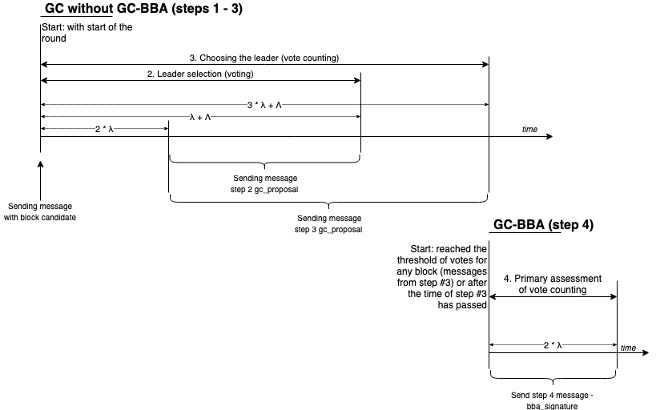

# Overview

`team@echo.org`

March 2019 WORKING DRAFT

## Abstract

EchoRand is the consensus mechanism used by the Echo protocol to provide fast and final consensus on which set of transactions to append to a distributed ledger. By randomly selecting validators for each block rather than forcing every node to validate every block, EchoRand minimizes the resource requirements of running a node without compromising speed or security.

## Introduction

### Prior Work

The ability to reach network-wide agreement about the next suitable set of transactions and adding them to the ledger \(e.g. the blockchain\) is a critical property of any distributed ledger. This property has important implications for the censorship-resistance and resiliency of the network, as an adversary who disrupts this consensus process can prevent any new economic activity from happening on the protocol. The task of determining which actor \(or committee of actors\) in a decentralized network have the right to propose new blocks for addition to the ledger has been addressed by different protocols:

* **Proof of Work \(PoW\)**: The actors with the highest computational power compete for the ability to add blocks, resulting in massive real-world hardware and electricity requirements to participate in block generation \("mining"\). Anyone can permissionlessly join or leave this competition by adding their computing power to the network. The network functions properly as long as 51% of computing power \("hash rate"\) is held by honest actors.
* **Proof of Stake \(PoS\)**: Network actors can lock \("stake"\) some or all of their token balance as a security deposit in order to earn the right to participate in block production. Their participation is proportional to the number of tokens staked, and this token deposit can be destroyed \("slashed"\) if they are proven to harm the network. The network is secure as long as 51% of the locked currency is staked by honest actors.
* **Delegated Proof of Stake \(dPoS\)**: A fixed-size committee of actors has the ability to generate and verify blocks. Actors can only join this committee by a vote of the entire network and votes are weighted by the number of tokens that each network actor holds. This model most clearly parallels a representative democracy, where elected leaders are known publicly and are competing to offer the best service to the network so they will continue to be elected. The security assumption is that at least 51% of the committee members elected by the network votes are honest actors.
* **Proof of Weighted Randomness \(PoWR\)**: A small committee of block producers or block validators are chosen randomly from the entire set of network actors. There is no requirement to lock up or "stake" currency, add computing power, or earn the votes of other users - every network user is eligible. The likelihood of being randomly selected for the committee is proportional to a user's balance of tokens. This committee exists only for a single block, and a new committee is randomly chosen for each new block of transactions. The network remains secure as long as at least 33% of tokens are held by honest actors.

The concept for the **Echo PoWR** algorithm is the [Algorand v9](https://drive.google.com/file/d/1dohyg2LMNxHFzzTc5VpUwm_qjegBPKe2) theoretical work, a Byzantine agreement protocol proposed by Jing Chen, Sergey Gorbunov, Silvio Micali, and Georgios Vlachos. Algorand v9 describes an algorithm for reaching consensus in a decentralized network by with Byzantine fault tolerance. EchoRand combines techniques from early proof of stake blockchains like Bitshares as well as delegated proof of stake blockchains like EOS with the cryptographic sortition of projects like DFINITY and Algorand. EchoRand also introduces a novel incentive and delegation scheme to increase network security.

### Design Goals

In designing any distributed consensus system, one of the biggest challenges is balancing transaction throughput with centralization. On one end of the spectrum, Bitcoin is limited to ~7 transactions per second in order to minimize the resource requirements necessary to run a full validating node. On the other end, EOS requires 21 elected block producers to maintain extremely sophisticated hardware setups, getting high transaction throughput at the cost of increased centralization.

However, this tradeoff between centralization and throughput is not fundamental. Blockchains rely on the assumption that a majority of the network is always honest. If that is the case, it follows that a random sample of the network should also consist mostly of honest nodes \(provided, of course, that the sample is large enough\). That is the principle that Echo relies on.

Rather than forcing every node to verify every transaction, Echo selects a random set of validators for every block. As long as enough of the validators attest that the block is valid, every other node on the network can accept it without needing to conduct their own verification. This allows Echo to achieve high throughput without requiring each individual node to verify every transaction like Bitcoin or compute every virtual machine state change like Ethereum.

Echo operates with a different trust model than Delegated Proof of Stake systems, where only a limited set of selected actors can advance the network, thus bringing an undesired element of centralization and trust into the network. Instead, EchoRand allows for a greater degree of decentralization through the involvement of all users in the consensus process, produces trust through verifiable randomness and delivers performance by limiting the proportion of users required for consensus in each round.

The major goal for creating the EchoRand consensus mechanism is to reduce the amount of explicit synchronization needed for reaching consensus in a distributed ledger. Other design goals include:

* Maximizing network throughput in terms of number of transactions per second for fixed bandwidth
* Minimization of bandwidth and compute resources needed for the optimization of network operations
* Decentralization - all decisions within the network are made by a consensus of the network participants
* High resistance to any malicious actions by any network actors, including failure to propagate messages and sending contradictory messages
* Fast finality, meaning that once a transaction has been successfully added to a block, it cannot be reverted
* Resistance to blockchain forks and reorganizations

Practical requirements, conditions, and goals:

* Source code that is as simple and easy to audit as possible
* Isolation of the consensus algorithm implementation from other aspects of the network
* Programmatic separation of the **Graded Consensus** \(GC\) and **Binary Byzantine Agreement** \(BBA\) steps, to allow each to be changed or replaced independently

## Overview

In EchoRand, as in other distributed consensus systems, sets of network transactions are organized into a **block**, which is logical database unit for storing a transaction set and the related data \(e.g. signatures\), that can be verified by external means.

EchoRand is based on the concept of splitting the process of adding a new block of transactions to the distributed ledger into separate parts and randomly assigning each role to a set of nodes. A **network node** is a server running the `echo_node` process \(with a local configuration and database\), connected to other Echo network nodes and running an instance of EchoRand consensus.

There are three distinct roles in EchoRand consensus:

* **Producers** are a set of nodes responsible for the construction of a new block from unconfirmed transactions. Producers propose the next block to be added to the distributed ledger.
* **Verifiers** are a set of nodes responsible for validating a block proposed by the producers and reaching Byzantine agreement among the set of verifiers about which proposed block to add to the distributed ledger. There is a different set of verifiers for each consensus step.
* **Acceptors** are all other network nodes. They play a passive role, simply accepting an approved block signed by verifiers and appending the block to their own local instance of the distributed ledger.

EchoRand consensus is performed in **rounds**, with either a new block of transactions or an empty block being appended to the distributed ledger after each round. Each EchoRand round consists of three main steps:

1. Cryptographic Sortition
2. Block Generation
3. Best Block Voting and Application

### Cryptographic Sortition {.counter-reset}

At each round, a new set of producers and verifiers is selected from all nodes in the network in such a way that:

* The distribution of roles for the round is not known to any node in the network before the round begins.
* The assignment of roles for the round can be computed independently by every network node, without the need for any explicit communication or network-wide coordination to occur.
* The distribution of roles for any future round cannot be predicted in advance by any network node.

To accomplish this deterministic yet random assignment of roles, EchoRand uses a **verifiable random function \(VRF\)** , which is a pseudo-random function that provides publicly verifiable proofs of its outputs' correctness, originally introduced by Micali, Rabin, and Wadhan. Using a VRF, each network node can independently check if it is assigned the role of a producer or verifier for a given round and send cryptographically proof of that assignment to other network nodes along with the proposed next block \(for producers\) or signed next block \(for verifiers\).

The size of sets of producers and verifiers is globally-known and configurable. It can be dynamically adjusted to accomplish the best trade-off between security and performance. As a safeguard against Sybil attacks, each node's probability of becoming a verifier or a producer for the round is directly proportional to that node's account balance.

Each EchoRand block contains a set of proposed transactions and a **randomness seed**, which is a pseudo-random value that changes for each block and round. This seed serves as the basis for generating the sets of block producers and verifiers using the VRF. Every node in the network can verify that seed was generated by a block producer in accordance with network rules and thus it was not manipulated by the producer. However, there is no way to predict what seed should be generated by each producer in advance of receiving that seed from the producer.

A new EchoRand consensus round begins after a node receives the latest signed block and its randomness seed from its peers. That seed is then used to generate secondary random numbers. Using the same publicly known deterministic algorithm on every node of the network and the same seed as an input for that algorithm, the same set of secondary random numbers is independently generated for each round by each node in the network without any explicit communication between nodes. Each node in the EchoRand network maintains special uniformly organized ordered map of accounts and their balances. Using secondary random numbers and publicly known algorithm, each node in the network can independently identify the set of producers and verifiers for the round.

### Block Generation

The distribution of roles for the round is performed before the set transactions received with the last signed block are applied to the ledger of account balances. Therefore, the block producer, who generates both the seed and the set of transactions, is unable to manipulate transactions in the proposed set to affect the distribution of roles for the next round. Similarly, the producer is unable to manipulate the randomness seed for the next round, because its generation is verifiable by every node.

Once each node computes its role at the beginning of a round, the set of producers compile a set of unconfirmed transactions into a newly proposed block and broadcast it to their peers on the network, along with a new randomness seed.

### Best Block Voting and Application

The set of verifiers begin listening for proposed next blocks and begin the process of voting for the best block using a 2 stage Byzantine fault tolerant \(BFT\) consensus process. At the first stage, **Graded Consensus \(GC\)**, each verifier announces their preliminary determination regarding the best block to append to the distributed ledger in a three-step process. The second stage, **Binary Byzantine Agreement \(BBA\)**, Byzantine consensus is reached through the transfer of binary data between the verifiers and a reconciliation of the overall state of the network. At each step of each stage, the protocol selects a new set of verifiers - accounts that must perform an action according to the step of the consensus. The selection of verifiers is similar to the selection process for block producers, using a VRF on input data from a previous block. After BBA is complete, verifiers sign the best block and propagate it to the Echo network, where acceptors verify the signatures by verifiers and append the block to their own local instance of the distributed ledger.

## The EchoRand Mechanism

### Other Terms

* **Executor** - the network account selected in the step of the round for performing a specific consensus action
* **Local configuration** - a certain set of parameters accessible only to the running network node.
* **Base \(database\)** - a blockchain with a certain set of blocks, possibly "lagging behind" the state of most other network nodes. It stores public EDS keys of all the participants of the algorithm operation.
* **Participant** - a set of [EdDSA](https://tools.ietf.org/html/rfc8032) private/public keys and an account balance within the **Echo** network. Basically, an **Echo** network user registered on a specific network node. A user can be registered as a participant only on a single network node at a given time. One network node permits registration of multiple participants.

### Legend

| Symbol | Description |
| :---: | :--- |
| **$$msg$$** | a message transmitted by a participating node to its peers during a specific step |
| **$$sig(x)$$** | the EdDSA signature of $$x$$ |
| **$$H(x)$$** | the SHA-256 hash of $$x$$ |
| **$$r$$** | the current round of the algorithm, which is equivalent to the number of blocks in the database plus one. $$r >= 1$$ |
| **$$s$$** | the current step number of the algorithm in the round. $$s >= 1$$ |
| **$$B_{r}$$** | a block created in round $$r$$, which equals to { **$$r$$**, **$$ID_{producer}$$**, **$$Q_{r}$$**, **$$H(B_{r})$$**, **$$H(B_{r-1})$$**, **$$sig(B)$$**, **$$PAY_{r}$$**, **$$CERT_{Br}$$** } |
| **$$H(B_{r})$$** | the SHA-256 hash of **$$B_{r}$$** |
| **$$PAY_{r}$$** | the set of transactions contained in block **$$B_{r}$$** |
| **$$Q_{r}$$** | the shared randomness seed of round **$$r$$** |
| **$$sig(Q_{r})$$** | the signature of a random vector of the **$$r$$** round |
| **$$sig(B_{r})$$** | the signature of a block of the **$$r$$** round |
| **$$l(r)$$** | the round **$$r$$** leader - determines **$$PAY_{r}$$**, creates **$$B_{r}$$** and determines **$$Q_{r}$$** |
| **$$CERT_{r}$$** | a **$$B_{r}$$** block certificate formed out of a set of `bba_signature` messages |
| **$$VRF(r, s)$$** | the ordered set of participants who act in step **$$s$$** of round **$$r$$** |
| **$$VRFN(r, s)$$** | the ordered set of indexes of **$$VRF(r, s)$$** participants who are registered on the current node and participate in step **$$s$$** of round **$$r$$** |
| **$$id$$** | an account identifier in the blockchain |
| **$$A_s$$** | an array of account identifiers selected as participants in the step **$$s$$** |
| **$$N_s$$** | an array of $$A_s$$ indexes which correspond to the identifiers of users authorized on the current node in the step **$$s$$** |
| **$$l$$** | the id of the producer who is the leader in this round |
| **$$ctx$$** | the context of the current round as an object which contains all received messages for the round |

### Parameters

The following algorithm parameters are set by constants, or configured at the **echo\_node** startup and can potentially be adjusted within certain limits during the process of the algorithm operation.

| Designation | Description |
| :---: | :--- |
| $$Λ$$ | "large" interval, the average time required to distribute a 1 MB message across the network |
| $$λ$$ | "small" interval, the average time required to distribute a 256-bit message across the network |
| $$N_g$$ | the number of block producers in a round, used in the function $$VRF(r, 1)$$ |
| $$N_c$$ | the number of block verifiers in a round, used in the function $$VRF(r, s), s > 1$$ |
| $$t_h$$ | the threshold for making a positive decision when verifying, and can be selected by $$0.69*N_{c}$$ |
| $$μ$$ | $$4 + 3*k, k > 0$$ - maximum number of algorithm steps after which an empty new block is created |

### Cryptographic Primitives

* EdDSA - a digital signature scheme using a variant of Schnorr signatures as a deterministic algorithm for creating and verifying electronic digital signatures
  * public key: 32 bytes \(256 bits\)
  * private key: 32 bytes \(256 bits\)
  * signature: 64 bytes \(512 bits\)
* SHA-256 - a well known secure cryptographic hash algorithm
  * hash: 32 bytes \(256 bits\)
  * sequence function on a hashset \(`std::less<hash_t, hash_t>`\)
* [VRF](https://en.wikipedia.org/wiki/Verifiable_random_function) - verifiable random function

#### VRF

The concept of a verifiable random function \(VRF\) was introduced by Micali, Rabin, and Vadhan. This is a pseudo-random function that provides publicly verifiable evidence for the correctness of its conclusion. For a given input value $x$, the owner of the secret key $SK$ can calculate the value of the function $$y = F_{SK}(x)$$ and the proof $$P_{SK}(x)$$. Using the proof and public key $$PK = g^{SK}$$, everyone can verify that the value of $$y = F_{SK}(x)$$ is indeed calculated correctly, but this information cannot be used to discover the secret key.

The use of VRF in EchoRand is as follows: having a pseudo-random value $$Q_r$$ for each round and the VRF function, each of the network nodes can determine the list of $$VRF(r, s)$$ executors in $$s$$ step of $$r$$ round,and based on it, perform the necessary actions if the authorized account on the node is part of $$VRF(r, s)$$, and additionally verify whether the participants have the right to act at this step.

The function $$VRF_{n}(r, s)$$ returns a list of participants of a given length of round **$$r$$** and step **$$s$$**, which is the same for all the nodes in the network. It should be noted that the function uses a fixed state of the blockchain database to calculate the participants' balances. In the general case, this function can use a state of the round **$$max({0, r - k})$$**, where **$$k = 1$$**. To calculate the function, a random vector $$Q_{r-k}$$ from round $$r-k$$ is required.

**Identification of Active Roles**

The checked random function at each **r** round and **s** step is built iteratively, as follows:

$$VRF_{0}(r, s) = H(Q_{r-1}, r, s)$$ 

$$VRF_{1}(r, s) = H(VRF_{0}(r, s))$$ 

$$VRF_{2}(r, s) = H(VRF_{1}(r, s))$$ 

$$...$$ 

$$VRF_{n}(r, s) = H(VRF_{n-1}(r, s))$$

The result of this function is an array of random values:

$$VRF(r, s) = {[ VRF_{0}(r, s), VRF_{1}(r, s), ... ]}$$

A specific executor is calculated from the $$VRF_i(r, s)$$ hash in such a way, that the probability of the choice of the participant as active, is proportional to his balance in the system at the time of the $$r - 2$$ block.

The set $$VRFN (r,s)$$ is an array of indexes that is different for each node of the network, and if $$i ∈ VRFN (r,s)$$, then the user ID that is the executor for the given round and step at the selected node is calculated using function $$VRF_i (r,s)$$.

In other words, $$VRFN$$ is a selection of participants from $$VRF$$ who act on a particular node, round, and step.

At the same round and step but on different network nodes of the algorithm, the $$VRFN$$ selections will be different, while the $$VRF$$ selection will be the same.

**Generation of Randomness Seed**

The starting seed **$Q\_{0}$** is selected randomly at blockchain database initialization.

Then, at the creation of a new block in round **$r$** the **$Q\_{r}$** vector is calculated. For a non-empty block **$B\_{r}$**:

$$Q_{r} = H( sig(Q_{r-1}), r )$$

In this case, the signature is generated using the EdDSA private key of the producer that created the block. In case **$B\_{r}$** block is empty:

$$Q_{r} = H( Q_{r-1}, r )$$

**Generating a Random Value During BBA Steps**

At each step of the BBA algorithm, all network nodes сan be divided into two sets:

* nodes that have received a sufficient number of messages during the previous round\(s\) from their peers \(with a certain equal value\), allowing them to be certain about the value that will be chosen by the network
* nodes that have received a significant number of messages with two solution variants, meaning the nodes are uncertain about the value that will be chosen by the network

In the latter case, all uncertain nodes use a **$VRF$** to generate a shared random value from the set `{0, 1}` for deciding between the two valid alternatives and relay their decision to the rest of the network. Since the random value will be the same for all uncertain nodes, each will arrive at the same decision.

A random value for uncertain nodes is generated according to the formula:

$$BBA\_RAND(s) = lsb\ \{ SHA256( Q_{r-1}, r ) \}$$

Where $lsb$ is the least significant bit.

### Step 1 - Block Generation

For each block, a new list of possible **producers** is determined with the help of a verifiable random function $VRF\(r, s\)$ as described above. As a result, each network node receives a $VRF\(r, s\)$ set and a $VRFN\(r, s\)$ subset - a list of accounts authorized at this node. If $VRFN\(r, s\)$ is not empty, the node issues a block proposal based on the transactions that are in the node mempool.

Since all input data for the VRF is already included in the previous blocks, each node in the network determines the list of producers independently, and it is the same for everyone \(deterministic\).

The mechanism is as follows: for block **$B$** from round **$r$**, we have a hash **$H\(B\_{r}\)$**, which is the result of the producer's signature $sig\(H\(B_{r-1}\)\)$ of the previous block hash. Since the producer can’t manipulate the result of the hash function \(as the data that is hashed and the private key are strictly defined\), and the hashing is checked using the producer's public key, we receive a new pseudo-random number in each block. This number \(hash\) from the block \*\*$B_{r}$\*\* is used as a random index to select the first producer on the list to generate a block. The index of this producer is used to get the next producer on the list, etc. until a complete list of those who will generate a block is created.

Each network node generates a list of producers for the current block and if the authorized account on the node is a member of the list, it generates and sends a block to the network using the following mechanism:

#### Input Data

* **$H\(B\_{r-1}\)$** from **$CERT\_{r-1}$**
* **$A\_{1}$**, **$N\_{1}$** from the context of the round

**Start**

Right after determining $CERT\_{r-1}$

#### Steps

1. **Verification**:
   1. If **$N\_{1}=∅$**, complete the step
   2. Select participant index with **$n = N\_{1}\[0\]$** as a creator of this block on the node
   3. Get actual ID of the the participant in the blockchain: **$id**_**{1} = A**_**{1}\[n\]$**
   4. Through **$id\_{1}$** get all the private keys of a participant
2. **Block assembly**:
   1. If all the previous blocks **$B\_{k}$** where $k=1, 2, 3, ..., r-1$ are available, build **$PAY\_{r}$**
   2. If at least one of the previous blocks is unavailable, build **$PAY\_{r} = ∅$**
   3. If **$PAY\_{r} != ∅$**, create a new block **$B**_**{r} = { r, PAY**_**{r}, Q**_**{r-1}, sig\(Q**_**{r-1}\), H\(B\_{r-1}\) }$**
3. **Communication, generation, signature and a simultaneous broadcast:**
   1. Sign with the key **$id\_{1}$** and send message `gc_block` = { $r, id_{1}, B_{r}, sig\(B\_{r}\)$ }
   2. Sign with the key **$id\_{1}$** and send `gc_signature` = { $r, id_{1}, sig\(Q_{r-1}\), H\(B\_{r}\)$ }

### Graded Consensus \(GC\)

This stage consists of three steps. At this stage, the goal of the verifiers is to vote and announce to the network which of the potential next blocks broadcast by producers they consider to be the best candidate for addition to the network.

#### Step 2 - Voting

Each of the selected verifiers tells the network which of the blocks they consider preferable for the current round.

**Input Data**

* $H\(B_{r-1}\)$, $Q_{r-1}$ from $CERT\_{r-1}$
* $A_{1}$, $A_{2}$, $N\_{2}$ from the context of the round

**$v$** is a local structure of a step that stores the hash of the block and the ID of the producer which created the block. The empty set symbol assigned to the elements **$v$** means "empty block" and "unknown leader". In the application, it can be a predefined constant or a separate flag in the data structure.

**Start**

Right after determining $CERT\_{r-1}$

**Steps**

1. **Timer**: schedule the timer after the time equal to **$2 \* λ$**, by a trigger:
   1. To define $l$, as $id$ from the received messages in **$ctx\[id\]$** with a minimum index of **$A\_{1}$**
   2. If the local cache for $l$ has the block **$B\_{r}$**
      1. **$v = { ctx\[l\].HB, l }$**
      2. Go to **Communication**
2. **Timer**: schedule the timer after the time equal to **$λ + Λ$**, by a trigger:
   1. **$v == { ∅, ∅ }$**
   2. go to **Communication**
3. **Network**: subscribe to network messages `gc_block`, `gc_signature` at the start of a step
   1. After receiving a message `gc_block` of the round **$r$**
      1. Verify the round number in the message
      2. Verify the message step equals **1**
      3. Verify that **$msg.id ∈ A\_{1}$** and get the user's public key
      4. Verify the signature of the whole message
      5. Verify that **msg.block** is correct
         1. Verify the block's round for equality to the current
         2. Verify **$ID**_**{producer} ∈ A**_**{1}$**
         3. Verify **$Q\_{r}$** from the block, if it already has the `gc_signature`
         4. Verify the block signature using **producer-id** of the block
         5. Verify **$H\(B\_{r-1}\)$** from the block for equality to the local one from **$CERT\_{r-1}$**
         6. Verify the correctness of **$PAY\_{r}$** in the block
      6. If **$ctx\[msg.id\]$** already exists
         1. Verify **$ctx\[msg.id\].HB == H\(msg.block\)$**
      7. If it does not exist, save **msg.id, msg.block** in the context of the round:
         1. **$ctx\[msg.id\].B = msg.block$**
         2. **$ctx\[msg.id\].HB = H\(msg.block\)$**
      8. If $l$ and $l == id$ are installed:
         1. **$v = { ctx\[l\].HB, l }$**
         2. Go to **Communication**
   2. After receiving a message `gc_signature` of the round **$r$**
      1. Verify the round number in the message
      2. Verify that **$msg.id ∈ A\_{1}$** and get the user's public key
      3. Verify the signature of the whole message
      4. **$msg.block\\_hash = ∅$**: verify **msg.rand** for equality to the local one from **$CERT\_{r-1}$**
      5. **$msg.block\\_hash != ∅$**: verify the signature **msg.rand** using **$Q\_{r-1}$** from **$CERT\_{r-1}$**
      6. Save **$msg.id =&gt; ∅$** in the context of the round if it’s not saved yet:
         1. **$ctx\[msg.id\].B = ∅$**
         2. **$ctx\[msg.id\].HB = msg.block\\_hash$**
         3. **$ctx\[msg.id\].rand = msg.rand$**
4. **Communication**: generating, signing and sending of messages
   1. Stop timers, **do not** unsubscribe from network messages
   2. If **$N\_{2} = ∅$**, end the step
   3. **$∀n**_**{2} ∈ N**_**{2}$**:
      1. Get real user’s ID in the blockchain: **$id**_**{2} = A**_**{2}\[n\_{2}\]$**
      2. Sign with the key **$id\_{2}$** and send
         1. if **$v != ∅$**: `gc_proposal` = **${ r, 2, id\_{2}, v }$**
         2. if **$v == ∅$**: `gc_proposal` = **${ r, 2, id\_{2}, ∅ }$**

#### Step 3 - Vote Counting

Based on the messages received from other verifiers in step 1, each verifier tallies the votes to determine which of the potential blocks got the most votes and announces the results of their count to the entire network.

**Input Data**

* $A_{2}$, $A_{3}$, $N\_{3}$ from the context of the round

**Start**

Right after determining $CERT\_{r-1}$

**Steps**

1. **Timer**: schedule the timer after the time equal to $3 \* λ + Λ$, by a trigger:
   1. **$v == { ∅, ∅ }$**
   2. Go to **Communication**
2. **Network**: subscribe to network messages `gc_proposal` at the start of a step, after receiving 1. Verify the round number and the step number in the message 2. Verify that **$msg.id ∈ A\_{2}$** and get the user's public key 3. Verify the signature of the whole message 4. Verify that **$msg.v = { msg.block\\_hash, msg.leader }$** is in the context of the round.

   It should be collected in the context in the previous step, as a result of `gc_block` and `gc_signature` message processing.

   1. **$∃ ctx\[msg.leader\]$** - a record for such a potential leader exists in the context
   2. **$ctx\[msg.leader\].HB == msg.block\\_hash$** - the block hash coincides
   3. **$ctx\[msg.leader\].v3.push\(msg.id\)$**, where **$v3$** is an _unordered\_set_
   4. If the counter is more than the threshold **$t\_{h}$**: **$ctx\[msg.leader\].v3.size\(\) &gt; t\_{h}$**
      1. **$v = { msg.block\\_hash, msg.leader }$**
      2. Go to **Communication**

3. **Communication**: generating, signing and sending of messages
   1. Stop timers, unsubscribe from network messages
   2. If **$N\_3 = ∅$**, end the step
   3. **$∀n\_3 ∈ N\_3$**:
      1. Get real user’s ID in the blockchain: **$id**_**{3} = A**_**{3}\[n\_{3}\]$**
      2. Sign with the user’s key **$id\_{3}$** and send `gc_proposal` = { $r, 3, id\_{3}, v$ }

#### Step 4 - Primary evaluation of the vote count

After receiving the voting results of the previous steps, all nodes know whether the verifiers were able to agree on the choice of the best block for the current round. Each verifier creates a message including information on the outcome \(whether an agreement was reached or not\) and the details of the block agreement and broadcasts this message to the network.

After this step, all nodes in the network have a preliminary idea of whether the best block has been determined or not. In an honest network, this would be enough to complete the round and append the block to the existing ledger. But since we allow the possibility of unscrupulous participants, the network needs an additional step to verify the data. This is the objective of the next stage.

**Input Data**

* $A_{3}$, $A_{4}$, $N\_{4}$ from the context of the round

**Start**

Immediately after completing step 3.

**Steps**

1. **Timer**: schedule the timer after the time equal to **2 \* λ**, by a trigger:
   1. if $∃l \| ctx\[l\].v4.size\(\) &gt; t\_{h}/2: v = { ctx\[l\].HB, l }$
      1. otherwise: $v = { ∅, ∅ }$
   2. **$b = 1$**
   3. Go to **Communication**
2. **Network**: subscribe to network messages `gc_proposal` at the start of a step, after receiving
   1. Verify the round number and the step number in the message
   2. Verify that **$id ∈ A{3}$** and get the user's public key
   3. Verify the signature of the whole message
   4. **$msg.v$** = { $msg.block\\_hash, msg.leader$ }
   5. **$msg.v != { ∅, ∅ }$**: verify that **$msg.v$** is in the context of the round \(should be collected in step 2\)
      1. **$∃ ctx\[msg.leader\]$** - a record for such a potential leader exists in the context
      2. **$ctx\[msg.leader\].HB == msg.block\\_hash$** - the block hash coincides
      3. **$ctx\[msg.leader\].v4.push\(msg.id\)$**, **$v4$** is an _unordered\_set_
      4. if **$ctx\[msg.leader\].v4.size\(\) &gt; t\_{h}$**
         1. **$v = { msg.block\\_hash, msg.leader }$** , **$b = 0$**
         2. Go to **Communication**
   6. **$msg.v == { ∅, ∅ }$**
      1. **$ctx.ve4.push\(msg.id\)$**, **$ve4$** is an _unordered\_set_ \(**v**alue **e**mpty\)
      2. if **$ctx.ve4.size\(\) &gt; t\_{h}$**
         1. **$v = { ∅, ∅ }$**, **$b = 1$**
         2. Go to **Communication**
3. **Communication**: generating, signing and sending of messages
   1. Stop timers, unsubscribe from network messages
   2. If **$N\_4 = ∅$**, end the step
   3. **$∀ n\_4 ∈ N\_4$**:
      1. Get real user’s ID in the blockchain: $id_{4} = A_{4}\[n\_{4}\]$
      2. Sign with the user’s key **$id\_{4}$** and send `bba_signature` = { $r, 4, id\_{4}, b, v, sig\(0, v\)$ }

### Binary Byzantine Agreement \(BBA\)

At each step of the algorithm work, all nodes in the network can be divided into two groups:

1. Nodes that have received a sufficient number of messages in the previous rounds with identical values, allowing them to settle on this message value as the correct one.
2. Nodes that have received messages with two different solutions which are unable to determine which is correct \("unsure" nodes\).

In the latter case, undecided nodes again use a VRF to generate a shared random number from the set of {0, 1} \(e.g. a coin flip\) to make a decision about which message to apply. Since the random number will be the same for all “unsure” nodes, all these nodes will reach the same decision on the outcome.

The stage consists of rounds, which include 3 steps each. At each step in the cycle, a new set of verifiers chosen by VRF sends their determination of the voting result in binary form. If, as a result of the round, 2/3rds + 1 \(~67%\) of verifiers agree on the outcome, the block is considered valid and appended to the chain. If consensus is not met, a new round begins.

If over 4 rounds \(which involves 4 rounds x 3 verifiers = 12 unique, random sets of verifiers\) the network is unable to come to consensus about which block to add, an empty block is applied by the network and the entire consensus mechanism begins again from the very first step - cryptographic sortition for new block producers.

### Block application by the network participants

All network nodes receive all messages sent by producers and verifiers at all stages of the consensus. All the network nodes perform the round steps. Messages are sent to the network only by the nodes that have already been selected for participation at a given step using the **$VRFN\(r,s\)$** algorithm.

Accordingly, each node individually determines when consensus has been reached on the next block and understands which block to apply and add to its own local copy of the distributed ledger. Thus, all the network nodes reach the end of the round at one of the stages of the **BBA** algorithm and get a formed **$CERT\_{r}$**. Therefore, a final message with the resulting information isn’t broadcast by any node, as each node has already determined this information independently.

If the value **$ctx\[l\].B != ∅$**, then the block is received. If the value **$ctx\[l\].B == ∅$**, then:

* **$ctx\[l\].signQ == Q\_{r-1}$** means that an empty block has been created.
* **$ctx\[l\].signQ != Q\_{r-1}$** means that a non-empty block has been created and the node has not received it.

## Network Communication

### Message Format {.counter-reset}

Each message broadcast by nodes is entirely signed with the [EdDSA](https://tools.ietf.org/html/rfc8032) key of the participant who creates the message, i.e there is always a `message_signature` field included with a broadcast message.

Separate fields or groups of fields are also signed with an [EdDSA](https://tools.ietf.org/html/rfc8032) key of the participant who creates the message.

Such a "double" signature is essential, since the signatures of certain groups of fields are later used in [VRF](https://en.wikipedia.org/wiki/Verifiable_random_function) to generate a random round value, and in the signature set **$CERT\_{r}$**.

#### 1. Candidate Block: `gc_block`

This message is sent in step **1** by producers to propose a newly created block with a non-empty set of transactions for addition to the distributed ledger.

| Field | Description |
| :--- | :--- |
| **round** | the current round |
| **step** | the current step |
| **id** | the ID of the participant who created the block |
| **signature** | the signature of the message with the participant’s key corresponding to the **id** |
| **block** | a valid block containing the current round, the participant's ID, the block signature, etc. |

#### 2. Random Value Signature: `gc_signature`

This message is sent during step **1** if there is at least one participant for the node for this step.

| Field | Description |
| :--- | :--- |
| **round** | the current round |
| **step** | the current step |
| **id** | the ID of the participant who created the block |
| **signature** | the signature of the message with the participant’s key **id** |
| **rand** | **$sig\(Q\_{r}\)$**, the signature of a previous randomness seed with the participant’s key **id** |
| **block\_hash** | the new block hash |
| **prev\_rand** | **$sig\(Q\_{r}\)$**, the signature of the randomness seed from the previous block |
| **prev\_block\_hash** | the previous block hash |

#### 3. Selection of a Leader and a Block: `gc_proposal`

This message is sent during step **2** and step **3** if there is at least one participant for the node for this step.

| Field | Description |
| :--- | :--- |
| **round** | the current round |
| **step** | the current step |
| **id** | the ID of the participant who created the block |
| **signature** | the signature of the message with the participant’s key **id** |
| **block\_hash** | the selected block hash |
| **leader** | the ID of a selected leader who created the block |

#### 4. BBA Consensus Result: `bba_signature`

This message is sent during step **4** and all the subsequent steps of the algorithm if there is at least one participant for the node for this step.

| Field | Description |
| :--- | :--- |
| **round** | the current round |
| **step** | the current step |
| **id** | the ID of the participant who created the message |
| **value** | the result of the **BBA** algorithm, either 0 or 1 |
| **block\_hash** | the selected block hash |
| **leader** | the ID of a selected leader, who created the block |
| **\_bba\_sign** | the signature for the fields **round**, **step**, **value**, **block\_hash**, **leader** with the participant’s key **id** |
| **signature** | the signature for the fields **value**, **block\_hash**, **leader** with the participant’s key **id** |

### Message Processing

Network message processing begun in step **2** does not stop at the completion of the step but continues until the completion of the round.

Network message processing for steps **BBA** \(**s = 5, ...**\) is practically the same and does not depend on the step number. For these steps, the messaging process differs based on a subsequent analysis of the internal counters of the round. Consequently, network processing for these steps can be effectively implemented in the base class.

### Messages Distribution via Gossip

Each node always forwards the first `gc_block` message received to its peers, followed by a `gc_signature` by that node.

For each subsequent `gc_block` messages received \(along with a `gc_signature`\), the node checks the participant **id** included. This message is only forwarded by the if the **id** of the participant in this message has the smallest index in array **$A\_{step}$**, among all the `gc_block` messages already received by the node. In this way, a candidate is chosen among many blocks proposed by producers.

The rest of the round messages are processed and forwarded to peers by a node only in the case that:

* The node is receiving the message for the first time
* The message passes all the verification steps

### Network Protocol Optimization

To reduce the number of messages with information about the proposed block, the following optimizations are implemented in the protocol:

* If the network node receives a block proposal that is not the first for the round and is not better than the previous one, the node does not pass this message and block proposal to its peers.
* If several participants are authorized on the node for the block generation round, the node itself determines which of the blocks is the best candidate and sends a block proposal only for the best block.

### Exceptional Situations

#### Fork Prioritization

The number of steps of the algorithm and dependence on the state of the whole account database makes the possibility of forks unlikely. However, EchoRand still has a mechanism for choosing between diverging chains. The fork selection takes place according to one of the following scenarios:

1. To switch to the longest chain \(with the highest number of completed non zero rounds\) in the presence of several chains.
2. If there is more than one long chain, to follow the one, in which the last block is not empty. If all of them have empty blocks in the end, to check the second and subsequent blocks from the end to the first non-empty block.
3. If there is more than one long chain with non-empty blocks at the end of a $r$-length chain, to follow the one in which the $r$ block has the smallest hash value.

This process is based on [algorand-v9](https://drive.google.com/file/d/1dohyg2LMNxHFzzTc5VpUwm_qjegBPKe2) \(9. Handling Forks, page 70\).

#### Network Unreachable

In the case a node is not able to communicate with peers or stops receiving message broadcast, the node's internal state of the current round and step will only advance when the timer is triggered.

Since the conclusion of the current round at the moment occurs only upon receiving a successful BBA message from peers, the node will continue executing the BBA steps in a loop until reaching the **μ** constant. As a result, an empty block will be generated.

#### Network Restored

Nodes that receive messages only from the middle of a consensus round, as a result of an interrupted network connection, will possess incomplete data about the context and progress of the round. As a consequence, they will reach either an _incorrect_ evaluation for the best block or vote for an _empty block_.

In either case, the node will act as if it was a malicious node, passing incorrect information to the network. Consequently, the information coming from such nodes will be filtered by the **BBA** algorithm. Once the node realizes that its view of the ledger is inconsistent with the rest of network, a reconciliation will occur automatically, when the rest of the network goes forwards in the process of generating new blocks.

#### Incomplete Local Block Database

The scenario occurs when the local database of the node is syncing or reconciling with the global distributed ledger. During this sync process, the node cannot participate in the consensus algorithm due to the fact that it lacks knowledge of the values:

* $H\(B\_{r-1}\)$, the hash of the last created block
* $Q\_{r-1}$, the randomness seed of the last round of the algorithm

The syncing node must determine the moment when its local database will be in sync with the rest of the network and begin the steps of the consensus algorithm at that time.

#### Block Producer Influence on VRF

Account balances formed as a result of the $r$ round will be used in the VRF only when assigning a set of producers and verifiers for the round $r + 2$. However, the randomness seed for the round $r + 2$ will be affected by the outcome of the round $r + 1$.

So since the producer cannot predict the seed that will be received as a result of the round $r + 1$, he cannot predict how the choice of performers will be affected by manipulating account balances on the $r$ round.

#### Insufficient Node Participation

Given that each network node must independently use the VRF to determine their role in each consensus round, the distribution of roles does not depend on the availability or actual participation of each node. The VRF distributes roles based on the entire set of network nodes and registered accounts, not merely the active ones. Because of this, there exists the possibility that for some step of the consensus algorithm, none of the nodes selected for that role are online or available.

In this case, the timeout threshold will be reached for that step of the round, and the active nodes will simply proceed to the next step or append an empty block to the ledger \(in case this occurs at the final step\), triggering the distribution of a new set of roles.

Network simulations suggest that:

* When **70%** of accounts are active, the network generates 4% empty blocks and a 5.5s efficient block generation time
* When **65%** of accounts are active, the network generates 16% empty blocks and a 14s efficient block generation time
* When **60%** of accounts are active, the network generates 30% empty blocks and a 32s efficient block generation time
* When **50%** of accounts are active, the network generates 70%+ empty blocks and a 120s+ efficient block generation time

#### Delegating Consensus Participation

Given that a high participation rate in the consensus mechanism \(through block production and verification\) is important in order to maintain maximum network throughput and avoid the generation of empty blocks, the protocol provides two levels of delegating this participation.

**Level One - Explicit Delegation**

Account `A` can designate for itself a trusted account `B` with a running node on the network and thus provide account `B` with the opportunity to issue consensus messages at the moment when account `A` was selected to participate in some step. In this case, the message from account `B` will be considered only if the node did not receive the message from the original verifier, i.e. from account `A`.

By default, the trusted account `B` for the account `A` becomes the account that registered the account `B`. This delegation mechanism is accomplished through the use of a specific delegation key that account `A` can provide to account `B` to authorize it to participate on the behalf of `A`.

**Second Level - Automatic Delegation for Offline Nodes**

The protocol provides a second, fallback level of delegators who are authorized to participate in consensus on behalf of account `A` in the case that `A` or another account that `A` has delegated to is offline or non-responsive.

Through this mechanism, at each step of the consensus for each verifier \(but not block producers\), a fallback delegate is determined from the list of active committee members. As a result, each of the active members of the committee receives its set of accounts delegated to him at a particular step of consensus. The important criteria for these delegates is that the messages from the committee member \(on behalf of account `A`\) is considered when counting votes only if during the full time interval allocated for the current step, the node has not received any messages from the verifier selected for the round `A` or from his explicit delegate `B`.

The committee member corresponding to the $VRF\_{n}\(r, s\)$ account at step $s$ round $r$ is determined by the following formula:

$$C_{n} = ceil\{\ n * K / N_{c}\ \}$$

where $K$ is the number of active committee members.

## Security and Performance

Because the selection of block producers and verifiers is weighted by the accounts balance, EchoRand transforms the typical Byzantine fault tolerance requirement of 2/3rd of honest nodes to a more Sybil-resistant requirement that **2/3rds of balances** are held by honest nodes. This assumption is also improved because the nodes with the highest balances have the most "skin in the game", and thus the most economic value to lose of the network is attacked. As long as 2/3rds of balances are held by honest nodes participating in consensus, the network will run at maximum performance, with no loss of capacity.

In the case that **less than 2/3rds of balances are held by honest users** participating in consensus, the network will begin to suffer from degraded performance in the form of empty blocks being added to the ledger. As this honest participation rate declines from 67% to 33%, the statistical probability of empty blocks being added to the ledger increases linearly from 0 to 100%.

With more than 67% of tokens held by an attacker, the attacker could continually disrupt the consensus mechanism and prevent new blocks from being added to the ledger or censor transactions, just as an attacking miner with 51% of the total hash rate in a proof of work-based currency.

## Incentives

EchoRand introduced a formal incentive scheme to reward accounts for participating in the consensus process either by running an active node or delegating to another active node. This incentive scheme is designed to balance the optimal security and performance of EchoRand network by incentivizing more accounts to participate in consensus whenever performance drops below optimal levels while maintaining adequate security and decentralization.

Under this incentive mechanism, the block producers which generate a block which is successfully added to the ledger are reward with some newly generated balance, similar to a block reward in Bitcoin. Additionally, all verifiers who participated in the voting and validation process of a successful block are also rewarded with a smaller balance. In the case that an empty block is added to the network, no nodes receive a block reward.

When the network begins to generate empty blocks due to a failure of consensus \(whether because of an attacker or through low participation in consensus by honest users\), the protocol increases the block reward through inflation in order to incentivize more rational users to participate in consensus. When the performance returns to the acceptable threshold, the block reward is decreased over time until it returns to the minimum inflation rate. Research is ongoing into the idea rate of change and limits for the inflation rate.

## Conclusion

EchoRand is the consensus mechanism used by the Echo protocol to provide fast and final consensus. In EchoRand consensus, every account is automatically able to participate in the block production and validation process, either by running a node or delegating to an existing node. Each new block of transactions is generated by a committee randomly chosen from the set of all network accounts. There is no requirement to lock up or "stake" currency, add computing power, or earn the votes of other users - every network user is eligible. However, the task of securely choosing this committee out of the pool of all users would typically require a large coordination, communication, or computation overhead for the network. In addition, when this committee of block producers is announced by the network, the chosen actors could become the subject of bribe or DDoS attacks.

By randomly selecting validators for each block rather than forcing every node to validate every block, EchoRand minimizes the resource requirements of running a node without compromising speed or security.

