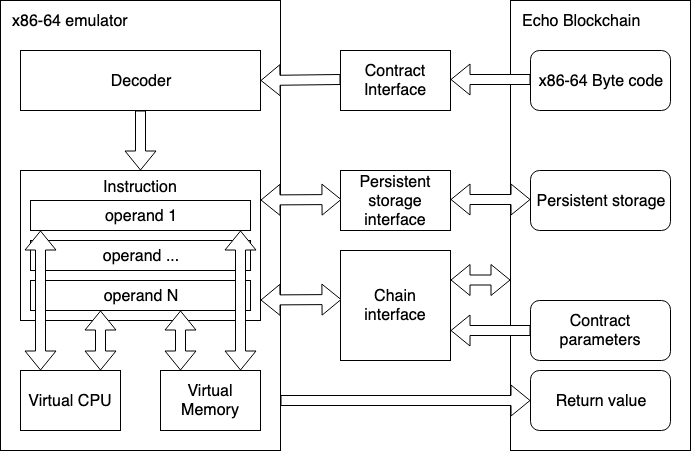

\newpage

# Echo x86-64 virtual machine


## Virtual machines


Virtual machine concept is well known in modern software development. It’s an abstraction layer for the application to be able to run on the machine and environment it is implemented for.
Virtual machine can manage the resources used by application, control and limit access to physical memory, provide security checks, etc. For example VM-s on the user side allows third party applications from the web to run securely on the local machine, independent of the OS on the user machine. 
The set of virtual machines varies from fully emulated environments like Android emulators for Windows, bytecode interpreters like Python, JVM, .NET runtime, which allows parts of the code to run on the hardware for better performance (JIT for example), and OS virtualisation which allows application to run on hardware, but controls interaction with operating system.

Blockchain industry adapts this concept to allow users to run programs on a blockchain in a secure and isolated environment. During the time this programs become more and more complex and the set of languages used to develop these programs become wider and more higher level languages get involved in this area.
VM-s in blockchains 

Modern blockchains allows to implement and run scripts or contracts which can alter the state of the blockchain in a trackable and irreversible manner. Depending on the blockchain the supported operations can be limited to stack based machine operations or to be as rich as x86-64 instruction set.

* Bitcoin is supporting a stack based machine with a limited set of operations.
* Ethereum virtual machine allows to use high level programming language as Solidity which is compiled into the EVM bytecode.
* EOS supports high level programming languages that can be compiled into webassembly bytecode. 


## Echo blockchain


Echo has embedded two virtual machines, one for contracts in EVM bytecode and the other allowing to run x86-64 executable. Contracts written in Solidity can be easily ported and used in the Echo blockchain. In addition to that x86-64 VM allows to develop contracts in any language which can be compiled into x86-64 instructions set. These two VM-s are allowing the developers to port the existing Ethereum contracts to run and interact with Echo blockchain, from the other side allowing to implement new contracts using the rich set of features provided by the high level programming languages.


## Comparison


There are several advantages of using the Echo blockchain compared to alternatives from the VM-s point of view.

* Bitcoin
    * Scripts support limited set of instructions and are limited in supported operations and size.
* Ethereum
    * Echo blockchain support’s both contracts that can be compiled into EVM bytecode and contracts in x86-64 instruction set.
    * From the performance perspective x86-64 contracts run up to 50 times faster than the contract with the same functionality in EVM bytecode.
* EOS
    * Echo blockchain support contracts in EVM bytecode.
    * Echo x86-64 virtual machine can support wider set of languages, not limited to the contracts developed using languages which can be compiled to webassembly through llvm or directly.
    * Standard set of tools used to generate the executable contract.
    * Emulating instructions from the executable compiled and optimized for the x86-64 machine can possibly be faster than emulating webassembly instructions which are generated to be run on different platforms and machines.


## Echo X86-64 VM


Echo x86-64 VM approach is to directly emulate x86-64 instructions in the ELF format executable which is compiled and linked with appropriate toolset. This approach allows to support wide range of high level programming languages and standard tool sets which can generate ELF format executables.
Only one additional step is required in addition to the standard development flow, a tool stripping out unused code sections from the ELF executable, making the x86-64 smart contract smaller than the original ELF executable.
This flow also allows to use the compiler optimization flags, thus shrinking the smart contract more and possibly make it run faster on the blockchain.


## X86-64 and EVM comparison


In order to compare the performance of the EVM and X86-64 VM contracts following functions were deployed into the blockchain and run with different parameters. X86-64 contract compiled with gcc optimizations enabled performed calculations ~50 times faster (Intel core i7-8700, 32 GB memory). 


* C++ contract

```cpp
  std::uint64_t fib(std::uint64_t n)
   {
       if (n <= 1)
           return n;
       else
           return fib(n - 1) + fib(n - 2);
   }
```

Results:
    fib(25):70 ms
    fib(20):6 ms
    fib(15):1 ms
    fib(10):0 ms


* Ethereum contract


```cpp
   function fib(uint n) public view returns(uint) {
        if (n <= 1) {
           return n;
        } else {
           return this.fib(n - 1) + this.fib(n - 2);
        }
    }
```

Results:
    fib(25):3550 ms
    fib(20):325 ms
    fib(15):31 ms
    fib(10):3 ms


## x86-64 implementation details


x86-64 virtual machine consists of main instruction decoder, instruction decoders for each type of instruction (add, mov, logical, etc), set of instructions, different type of operands and emulators of hardware (memory and CPU). Operands are CPU registers, memory location or immediate value stored in the instruction. VM emulates the bytecode received from the Echo blockchain and return the result which is recorded back to Echo blockchain.


{ width=400px }


Smart contract is running in an isolated environment, no system calls or system memory addresses are available, all interactions with the outside world are performed through the VM via special instructions. For that interaction VM requires the following interfaces:

* Contract interface is required to get the start address and ELF executable bytecode

* Echo blockchain interface is required for interaction with blockchain, retrieving the contract parameters, read/write into the blockchain, etc.

* Persistent storage interface is required to store and get values that are persisted between the contract calls.

In addition to this VM provides special functions for memory allocation on the heap.

The flow of the VM executing the smart contract is as follows:

* Loading the bytecode into memory. Set up stack and heap in the memory.
* Starting emulation from the start address.
* For every instruction VM does the following :
  * Decoding of the instruction 
    * Prefixes are decoded by main decoder \(unused prefixes, REX prefix, operand size prefix\)
    * Instruction opcode is decoded by main decoder 
    * Appropriate instruction decoder is called which reads the rest of the instruction (MODRM and SIB bytes, immediate values) and creates operands 
      * Instructions are divided into groups based on the instruction operation codes (one byte, two bytes, one byte with additional 3 bits in MODRM, three bytes), hash maps are created for each group and instruction decoders are stored there for fast access
      * Operands are created based on values of the MODRM and SIB byte and instruction code itself, please see [https://wiki.osdev.org/X86-64\_Instruction\_Encoding](https://wiki.osdev.org/X86-64_Instruction_Encoding) for a brief description or [https://software.intel.com/sites/default/files/managed/39/c5/325462-sdm-vol-1-2abcd-3abcd.pdf](https://software.intel.com/sites/default/files/managed/39/c5/325462-sdm-vol-1-2abcd-3abcd.pdf) for the detailed Intel x86-64 instructions set specification.
  * Executing decoded instruction 
    * Operands read from memory/CPU registers or immediate values encoded in the instruction, taking into account the size of operands specified by prefixes or instruction itself.
    * Instruction does appropriate calculations 
    * Operands write back the result(s) to memory and/or CPU registers including the flag register for some of the instructions.
  * Interrupt instruction is used to communicate with the VM from running script. Based on the value provided with the interrupt instruction the following is performed: 
    * access to parameters and returning result of the smart contract 
    * interaction with the ECHO blockchain 
    * heap memory allocation. This is required as the script is running in a isolated environment without access to system  memory 
    * debug output 
    * set of different functions used by contract developer (cryptography functions, math functions, etc)
* Finish the execution after the ret instruction push the null value into the RIP register 
* Return value can be retrieved from the VM as a byte array


## Further development


Further development of the x86-64 VM includes different directions:

* Enhance support of the x86-64 instructions set, including SSE instructions. This can result in a smaller and faster contracts, as compiler can generate these instructions when optimization flags are enabled.
* Add support for different languages and toolsets which can be used to generate x86-64 compatible executable will be supported.
* Enhance the interaction of the VM with the blockchain for developer of the smart contract to gain access to the rich set of Echo blockchain functionality.
